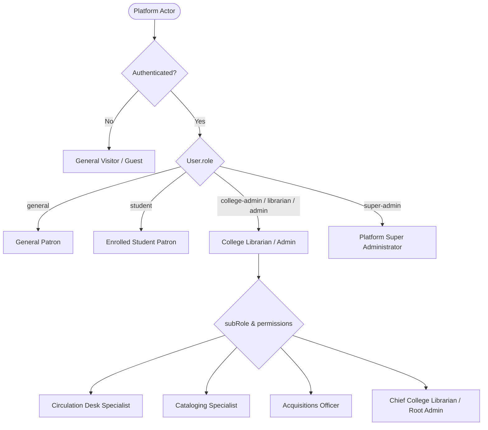
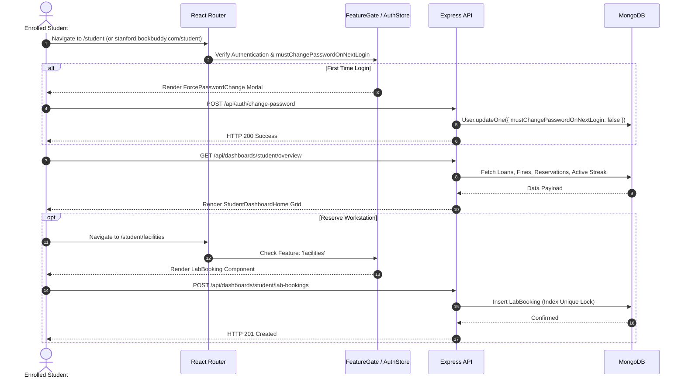
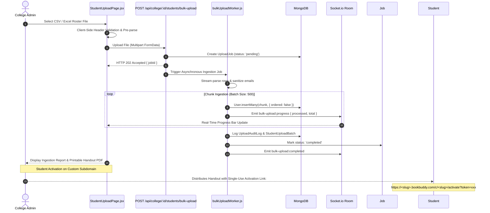
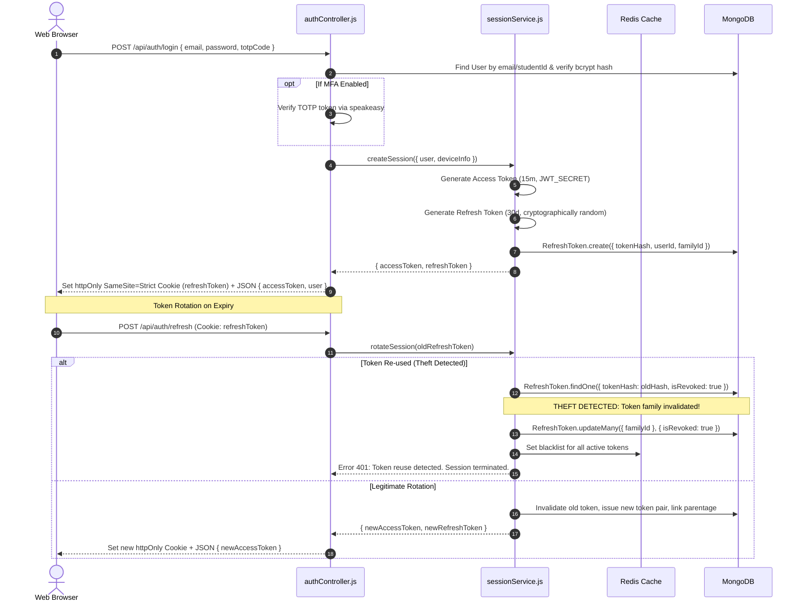
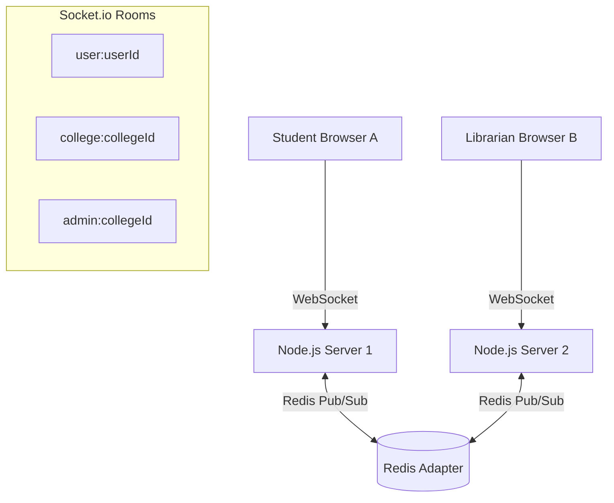
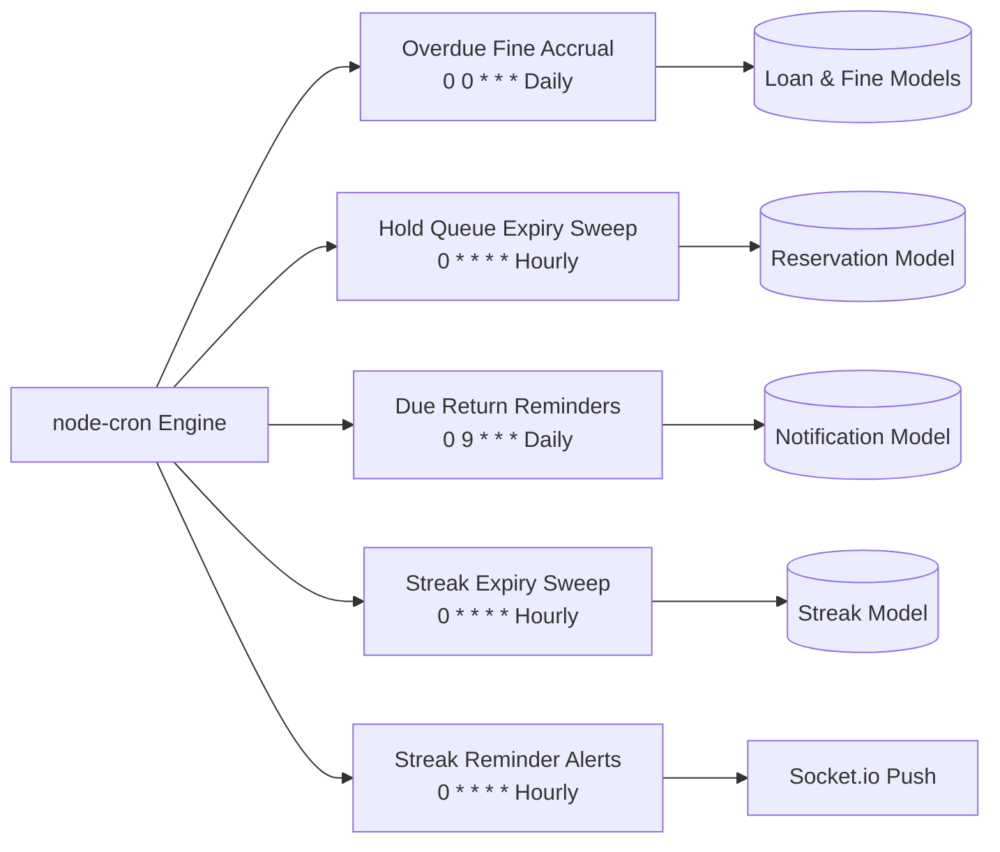
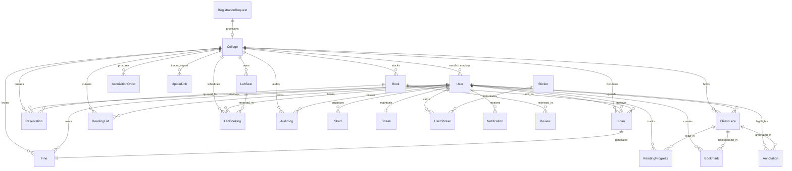

# BookBuddy — Comprehensive Technical & Functional Architecture Reference

> **Document Version:** 2.0.0 (Production Release)  
> **Target Audience:** Engineering Architects, Full-Stack Developers, Product Managers, Security Engineers, AI Agents  
> **Source Code Basis:** Verified against the current repository state (`frontend/`, `backend/`, `tests/`, `database/`, `deployment/`)  

---

## Table of Contents

1. [Application Overview](#1-application-overview)
   - [1.1 Core Mission & Purpose](#11-core-mission--purpose)
   - [1.2 User Personas & Authorization Taxonomy](#12-user-personas--authorization-taxonomy)
   - [1.3 Multi-Tenant Logical Architecture](#13-multi-tenant-logical-architecture)
   - [1.4 Complete Technology Stack](#14-complete-technology-stack)
2. [Per-Dashboard Deep Dive](#2-per-dashboard-deep-dive)
   - [2.1 General / Public Discovery Dashboard](#21-general--public-discovery-dashboard)
   - [2.2 Student Dashboard & Learning Portal](#22-student-dashboard--learning-portal)
   - [2.3 College Admin Dashboard (12 Desk Modules)](#23-college-admin-dashboard-12-desk-modules)
   - [2.4 Super Admin Dashboard (Platform Command Center)](#24-super-admin-dashboard-platform-command-center)
3. [Cross-Cutting Systems](#3-cross-cutting-systems)
   - [3.1 Authentication, Session Rotation & Theft Detection](#31-authentication-session-rotation--theft-detection)
   - [3.2 Multi-Tenant Isolation & Subdomain Routing](#32-multi-tenant-isolation--subdomain-routing)
   - [3.3 Real-Time Architecture (Socket.io & Redis Adapter)](#33-real-time-architecture-socketio--redis-adapter)
   - [3.4 Caching Strategy & Redis Topology](#34-caching-strategy--redis-topology)
   - [3.5 Background Jobs, Workers & Scheduled Tasks](#35-background-jobs-workers--scheduled-tasks)
   - [3.6 Security Posture, RBAC & MFA-Gated Impersonation](#36-security-posture-rbac--mfa-gated-impersonation)
4. [Data Architecture & Entity Reference](#4-data-architecture--entity-reference)
   - [4.1 Complete Entity-Relationship (ER) Diagram](#41-complete-entity-relationship-er-diagram)
   - [4.2 Core Domain Models & Schemas](#42-core-domain-models--schemas)
   - [4.3 Database Indexing & Concurrency Controls](#43-database-indexing--concurrency-controls)
5. [Setup & Deployment Runbook](#5-setup--deployment-runbook)
   - [5.1 Validated Environment Variable Reference](#51-validated-environment-variable-reference)
   - [5.2 Local Development Setup](#52-local-development-setup)
   - [5.3 Database Seeding & Schema Migrations](#53-database-seeding--schema-migrations)
   - [5.4 Production Infrastructure & Wildcard SSL Proxy](#54-production-infrastructure--wildcard-ssl-proxy)
6. [Testing Overview & Quality Assurance](#6-testing-overview--quality-assurance)
   - [6.1 Backend Jest Integration Suite](#61-backend-jest-integration-suite)
   - [6.2 Frontend Vitest & React Testing Library Suite](#62-frontend-vitest--react-testing-library-suite)
   - [6.3 Load Testing (k6 & Artillery)](#63-load-testing-k6--artillery)
   - [6.4 Automated Deployment Verification Telemetry](#64-automated-deployment-verification-telemetry)

---

## 1. Application Overview

### 1.1 Core Mission & Purpose

**BookBuddy** is an enterprise-grade, multi-tenant Integrated Library System (ILS) and Digital Learning Hub designed for higher education institutions, academic consortia, and university campus networks.

Modern academic libraries face a dual challenge: traditional physical inventory operations (circulation counters, physical book cataloging, fine management, reading room seats) remain essential, yet modern students expect an engaging, Spotify-like digital discovery portal (e-books, EPUB reading in browser, offline caching, reading streaks, campus bulletin boards, and inter-library loan networks).

BookBuddy solves this by providing a single full-stack platform that delivers:
1. **Multi-Tenant SaaS Operations**: A single multi-tenant backend cluster serving hundreds of colleges with isolated data, custom subdomains (`<slug>.bookbuddy.com`), custom policies, and institution-specific feature toggles.
2. **Four Specialized Role-Based Dashboards**: Fine-tuned workflows for public visitors, enrolled students, library staff, and platform super-administrators.
3. **Hybrid Physical + Digital Operations**: Real-time physical inventory checkout alongside in-browser EPUB/PDF digital reading with CFI progress tracking and annotation sync.
4. **Gamified Student Engagement**: Daily reading streaks, streak-freeze buffers, achievement stickers, milestone badges, and campus reading leaderboards.

---

### 1.2 User Personas & Authorization Taxonomy

BookBuddy classifies all platform traffic into four explicit user roles, complemented by administrative sub-role permissions:



| Role Key | Primary Portal | Description & Access Scope |
| :--- | :--- | :--- |
| **`general`** (or unauthenticated) | `/general-dashboard` / `/` | Public exploration, open catalog search, guest previews, local browser bookmarks, and dual self-registration. Has no college-specific physical circulation privileges. |
| **`student`** | `/student` (or `<slug>.bookbuddy.com/student`) | Enrolled students belonging to a verified college tenant. Accesses physical catalog loans, renewals, hold queue position tracking, digital patron card barcode, lab workstation reservations, e-resources, Epub.js reader, reading lists, campus feed, cross-college ILL, and streaks. |
| **`college-admin`** (aliases: `admin`, `librarian`) | `/college-admin` (or `<slug>.bookbuddy.com/college-admin`) | Staff librarians and college IT administrators. Operates all 12 institutional desk modules (Patrons, Circulation, Cataloging, Inventory, Acquisitions, Digital Assets, Facilities, Finances, Helpdesk, Feature Management, Analytics) and bulk roster ingestion. |
| **`super-admin`** | `/admin-portal` | Global platform administrators. Operates platform-wide Command Center, tenant provisioning, onboarding approval queue, global content moderation, cross-tenant data oversight, user directory with MFA-gated impersonation, and disaster recovery. |

---

### 1.3 Multi-Tenant Logical Architecture

BookBuddy adopts a **Shared Application Server + Shared Database with Logical Collection Partitioning** multi-tenancy model:

```mermaid
graph TD
    ClientReq[Client HTTP / WebSocket Request] --> SubdomainGate[subdomainTenantResolver.js]
    SubdomainGate -->|Extract Host / Slug| HostCheck{Host matches *.bookbuddy.com or x-tenant-subdomain?}
    
    HostCheck -->|Tenant Subdomain Detected| TenantMatch[Resolve College by slug]
    TenantMatch --> InjectSubdomain[Inject req.subdomainTenant & req.tenantCollegeId]
    HostCheck -->|Root Domain / Main Host| DirectAuth[Proceed to Route Handlers]
    
    InjectSubdomain --> AuthGuard[protect Middleware]
    DirectAuth --> AuthGuard
    
    AuthGuard --> CrossTenantCheck{User collegeId matches Subdomain?}
    CrossTenantCheck -->|Mismatch| Block403[HTTP 403 Cross-Tenant Access Violation]
    CrossTenantCheck -->|Match or Super Admin| ScopeTenant[scopeToTenant Middleware]
    
    ScopeTenant --> InjectFilter[req.tenantFilter = { collegeId }]
    InjectFilter --> QueryDB[(MongoDB Collections: books, loans, users, etc.)]
```

1. **Logical Tenant Partitioning**: Every tenant-bound document carries a mandatory `collegeId` attribute referencing the `College` collection.
2. **Subdomain Ingress Routing**: The backend dynamically extracts tenant slugs from incoming HTTP requests (`Host: stanford.bookbuddy.com`, `mit.localhost:5000`, or `x-tenant-subdomain: mit`).
3. **Boundary Integrity Enforcement**: The `subdomainTenantResolver` middleware cross-checks incoming request headers, query parameters, and JSON payloads against the resolved tenant slug, blocking cross-tenant tampering attempts with HTTP 403 Forbidden.
4. **Automated Query Scoping**: The `scopeToTenant` middleware automatically builds `req.tenantFilter = { collegeId: req.user.collegeId }`. All controller read and write operations merge `req.tenantFilter`.
5. **Transitive Scoping**: Personal student documents (such as `Bookmark`, `ReadingProgress`, and `UserSticker`) are transitively scoped by `userId`, which naturally binds to the student's home tenant without redundant query keys.

---

### 1.4 Complete Technology Stack

```
┌────────────────────────────────────────────────────────────────────────────────────────────────┐
│                                     FRONTEND CLIENT LAYER                                      │
│  React 19.2.6  │  Vite 8.0.12  │  Tailwind CSS v4.3  │  Zustand 5.0  │  TanStack Query v5.101  │
│  React Router v7  │  Epub.js 0.3  │  PDF.js 6.2  │  Framer Motion 12  │  Recharts 3.10  │  i18next │
└────────────────────────────────────────────────┬───────────────────────────────────────────────┘
                                                 │ HTTPS / WSS (REST APIs + WebSockets)
┌────────────────────────────────────────────────▼───────────────────────────────────────────────┐
│                                     BACKEND CLUSTER LAYER                                      │
│  Node.js 24 LTS  │  Express 5.2.1  │  Socket.io 4.8.3  │  node-cron 4.4.1  │  Zod 4.4.3        │
│  Helmet 8.3  │  express-rate-limit 8.5  │  rate-limiter-flexible 11.2  │  Passport  │  Sentry   │
└───────────────────────┬────────────────────────────────────────┬───────────────────────────────┘
                        │ Mongoose 9.7 (ODBC/TCP)                │ ioredis 5.11 (TCP)
┌───────────────────────▼───────────────┐        ┌───────────────▼───────────────────────────────┐
│          MONGODB 6.21+                │        │                 REDIS 7+                      │
│  - 72 Relational Collections          │        │  - Token Revocation Blacklist                 │
│  - Compound Multi-Tenant Indexes      │        │  - Tenant Feature Flag Caches                 │
│  - Partial Unique Concurrency Locks   │        │  - Rate Limit Sliding Windows                 │
│  - Text Indexes for Global Search     │        │  - Socket.io Horizontal Pub/Sub Adapter       │
└───────────────────────────────────────┘        └───────────────────────────────────────────────┘
```

---

## 2. Per-Dashboard Deep Dive

---

### 2.1 General / Public Discovery Dashboard

#### Purpose
The **General Discovery Dashboard** serves unauthenticated public visitors, prospective students, and general patrons. It acts as a digital storefront and OPAC (Open Public Access Catalog), allowing instant catalog exploration, subject browsing, sample digital reading, and self-service student or institution onboarding.

```
┌────────────────────────────────────────────────────────────────────────────────────────┐
│ [Logo] BookBuddy Global Discovery       [Search Books, Authors, ISBN...]      [Sign In] │
├────────────────────────────────────────────────────────────────────────────────────────┤
│ Live Availability Ticker: Open: 08:00 AM - 08:00 PM  |  2,450 Volumes Ready on Shelves  │
├────────────────────────────────────────────────────────────────────────────────────────┤
│ HERO CAROUSEL: [New Arrivals] ── [Popular Literature] ── [Academic Journals]            │
├────────────────────────────────────────────────────────────────────────────────────────┤
│ QUICK ACTIONS:                                                                         │
│  [Explore Catalog]   [Digital E-Resources]   [Campus Workstations]   [Student Login]   │
├────────────────────────────────────────────────────────────────────────────────────────┤
│ OPAC CARD GRID (Zero-Scroll Internal Container):                                       │
│  ┌──────────────────┐  ┌──────────────────┐  ┌──────────────────┐  ┌─────────────────┐ │
│  │ Book Cover       │  │ Book Cover       │  │ Book Cover       │  │ Book Cover      │ │
│  │ "Calculus Vol 1" │  │ "Clean Code"     │  │ "Physics Hall"   │  │ "Organic Chem"  │ │
│  │ Shelf: A-12-04   │  │ Shelf: CS-04-10  │  │ Shelf: P-02-01   │  │ Shelf: C-01-08  │ │
│  │ [Available: 4]   │  │ [Checked Out]    │  │ [Available: 2]   │  │ [Available: 8]  │ │
│  └──────────────────┘  └──────────────────┘  └──────────────────┘  └─────────────────┘ │
└────────────────────────────────────────────────────────────────────────────────────────┘
```

#### Core Features
1. **Single-Round-Trip Aggregation**: Loads library stats, new arrivals, popular books, announcements, and operating hours via a single unified endpoint (`/api/dashboards/general/home-data` or `/api/dashboards/general/:id/dashboard`), minimizing network latency.
2. **OPAC Catalog Search**: Debounced search input with autocomplete suggestions, genre filtering, and real-time physical copy counters (`copiesAvailable` vs `totalCopies`).
3. **Interactive Carousels**: Framer Motion kinetic carousels for "New Arrivals" and "Popular Books" with book cover lazy-loading and fallback generative SVG artwork.
4. **In-Browser Digital Reader Modal**: Unauthenticated sample reading preview of public-domain literature (Project Gutenberg proxies and open-access PDFs) rendered inside `DigitalReaderModal`.
5. **Local Storage Bookmark Sync**: Guest users can bookmark catalog items locally via `useLocalBookmarks` hook without requiring an active account.
6. **Live Book Availability Listener**: Real-time availability updates delivered via WebSocket (`useBookAvailability`) to update card badges dynamically when books are checked out or returned at circulation counters.

#### User Flow
1. Visitor navigates to root domain `/` or `/general-dashboard`.
2. Client queries `/api/dashboards/general/home-data` using TanStack React Query.
3. Visitor explores titles using debounced search bar; clicks a book card to open a modal with metadata, physical shelf address, and copy status.
4. If the title has digital assets, the visitor clicks "Preview" to read directly in the embedded reader modal.
5. If the visitor wants to reserve, borrow, or track loans, clicking "Sign In" or "Enroll" routes them to the Dual Registration/Login portal.

#### Key Files & Components
- Page Component: [`frontend/src/pages/dashboards/general/GeneralDashboardHome.jsx`](file:///c:/Users/naikw/OneDrive/Desktop/project/BookBuddy/frontend/src/pages/dashboards/general/GeneralDashboardHome.jsx)
- Search View: [`frontend/src/pages/dashboards/general/GeneralSearch.jsx`](file:///c:/Users/naikw/OneDrive/Desktop/project/BookBuddy/frontend/src/pages/dashboards/general/GeneralSearch.jsx)
- E-Resource Catalog: [`frontend/src/pages/dashboards/general/GeneralEResources.jsx`](file:///c:/Users/naikw/OneDrive/Desktop/project/BookBuddy/frontend/src/pages/dashboards/general/GeneralEResources.jsx)
- Guest Bookmarks: [`frontend/src/pages/dashboards/general/GeneralSaved.jsx`](file:///c:/Users/naikw/OneDrive/Desktop/project/BookBuddy/frontend/src/pages/dashboards/general/GeneralSaved.jsx)
- Digital Reader Modal: [`frontend/src/components/general/DigitalReaderModal.jsx`](file:///c:/Users/naikw/OneDrive/Desktop/project/BookBuddy/frontend/src/components/general/DigitalReaderModal.jsx)
- Data Hooks: [`frontend/src/hooks/useBookData.js`](file:///c:/Users/naikw/OneDrive/Desktop/project/BookBuddy/frontend/src/hooks/useBookData.js), [`frontend/src/hooks/useLocalBookmarks.js`](file:///c:/Users/naikw/OneDrive/Desktop/project/BookBuddy/frontend/src/hooks/useLocalBookmarks.js)

#### Backend Endpoints & Methods
- `GET /api/dashboards/general/home-data` — Aggregated public landing metrics, popular books, announcements.
- `GET /api/dashboards/general/:id/dashboard` — Aggregated dashboard scoped to a specific college tenant ID.
- `GET /api/dashboards/general/college/:id/dashboard` — Alias for tenant-scoped general dashboard.
- `GET /api/catalog/search` — Public OPAC text search and category filter.

#### Database Models Involved
`Book`, `College`, `EResource`, `Announcement`, `LibrarySettings`.

#### Known Constraints & Limitations
- Read-only operations: General visitors cannot check out books, place reservation holds, or book computer lab seats.
- Bookmarks saved by guest users persist in the browser's `localStorage` and will not synchronize across devices until the user registers an account.

---

### 2.2 Student Dashboard & Learning Portal

#### Purpose
The **Student Dashboard** is the primary day-to-day workspace for enrolled university students. It combines physical library circulation services with digital reading tools, study space scheduling, campus collaboration, and gamified engagement.

#### Core Features
1. **Subdomain Tenant Ingress**: Students access their portal through institutional subdomains (`https://<slug>.bookbuddy.com/student`). Session validation ensures cross-college credential theft is blocked.
2. **Forced Password Change Enforcement**: Bulk-imported accounts carry `mustChangePasswordOnNextLogin: true`. Upon first login, access to dashboard routes is blocked until the student supplies an 8+ character password via `POST /api/auth/change-password`.
3. **Dynamic Feature-Gated Navigation**: The client checks `FeatureFlagContext`. If the college administrator disables a module (e.g. `facilities_booking` or `crossCollegeILL`), the sidebar route is hidden, and direct URL entry is blocked via `<FeatureGate isPageGate>`.
4. **Circulation & Hold Tracking**:
   - Active loan ledger with due date countdown badges and one-click renewals (`renewStudentLoan`).
   - Hold queue placement with real-time queue position display (`queuePosition`).
5. **Fine Management & Payment**: Real-time debt tracking with fee breakdown by overdue loan. Supports Razorpay checkout or in-person cash settlement at the circulation desk.
6. **Facility Workstation Reservations**:
   - Computer lab seat selection with hardware specs (RAM, GPU, OS, dual monitors).
   - Hourly timeslot booking protected against double-booking via partial unique MongoDB indexes.
   - Self check-in via QR code or student card scanning.
7. **Digital Asset Reading & Offline Storage**:
   - In-browser reading powered by `Epub.js` with CFI progress synchronization (`ReadingProgress`).
   - Personal text highlight annotations (`Annotation`).
   - Service Worker offline asset downloads stored in browser `IndexedDB` (`idb`).
8. **Gamification & Daily Streaks**:
   - Consecutive daily reading streaks tracked with timezone awareness.
   - Automatic consumption of freeze tokens (`freezesAvailable`) to prevent streak loss during exam breaks.
   - Milestone achievement stickers unlocked via real-time Socket.io triggers (`Achievements.jsx`).
9. **Campus Community & Inter-Library Loans**:
   - Campus feed bulletin board (`Feed.jsx`) for student discussions and reading recommendations.
   - Cross-College Catalog (`CrossCollegeCatalog.jsx`) enabling Inter-Library Loan (ILL) requests across participating university consortia.

#### User Flow


#### Key Files & Components
- Dashboard Home: [`frontend/src/pages/dashboards/student/StudentDashboardHome.jsx`](file:///c:/Users/naikw/OneDrive/Desktop/project/BookBuddy/frontend/src/pages/dashboards/student/StudentDashboardHome.jsx)
- Circulation: [`frontend/src/pages/dashboards/student/MyLoans.jsx`](file:///c:/Users/naikw/OneDrive/Desktop/project/BookBuddy/frontend/src/pages/dashboards/student/MyLoans.jsx), [`frontend/src/pages/dashboards/student/Fines.jsx`](file:///c:/Users/naikw/OneDrive/Desktop/project/BookBuddy/frontend/src/pages/dashboards/student/Fines.jsx)
- Catalog & Holds: [`frontend/src/pages/dashboards/student/Catalog.jsx`](file:///c:/Users/naikw/OneDrive/Desktop/project/BookBuddy/frontend/src/pages/dashboards/student/Catalog.jsx)
- Workstation Booking: [`frontend/src/pages/dashboards/student/LabBooking.jsx`](file:///c:/Users/naikw/OneDrive/Desktop/project/BookBuddy/frontend/src/pages/dashboards/student/LabBooking.jsx)
- Digital Reader: [`frontend/src/pages/dashboards/student/EbookReader.jsx`](file:///c:/Users/naikw/OneDrive/Desktop/project/BookBuddy/frontend/src/pages/dashboards/student/EbookReader.jsx), [`frontend/src/pages/dashboards/student/EResources.jsx`](file:///c:/Users/naikw/OneDrive/Desktop/project/BookBuddy/frontend/src/pages/dashboards/student/EResources.jsx)
- Personalization: [`frontend/src/pages/dashboards/student/ReadingLists.jsx`](file:///c:/Users/naikw/OneDrive/Desktop/project/BookBuddy/frontend/src/pages/dashboards/student/ReadingLists.jsx), [`frontend/src/pages/MyShelves.jsx`](file:///c:/Users/naikw/OneDrive/Desktop/project/BookBuddy/frontend/src/pages/MyShelves.jsx)
- Gamification: [`frontend/src/pages/dashboards/student/Achievements.jsx`](file:///c:/Users/naikw/OneDrive/Desktop/project/BookBuddy/frontend/src/pages/dashboards/student/Achievements.jsx)
- Community: [`frontend/src/pages/Feed.jsx`](file:///c:/Users/naikw/OneDrive/Desktop/project/BookBuddy/frontend/src/pages/Feed.jsx), [`frontend/src/pages/CrossCollegeCatalog.jsx`](file:///c:/Users/naikw/OneDrive/Desktop/project/BookBuddy/frontend/src/pages/CrossCollegeCatalog.jsx)
- Digital Card: [`frontend/src/pages/dashboards/student/PatronCard.jsx`](file:///c:/Users/naikw/OneDrive/Desktop/project/BookBuddy/frontend/src/pages/dashboards/student/PatronCard.jsx)

#### Backend Endpoints & Methods
- `GET /api/dashboards/student/overview` — Aggregated student metrics (loans, fines, bookings, streak).
- `GET /api/dashboards/student/catalog` — Tenant-scoped catalog search with availability indicators.
- `GET /api/dashboards/student/loans` — List active, returned, and overdue loans.
- `POST /api/dashboards/student/loans/:id/renew` — Request loan renewal extension.
- `POST /api/dashboards/student/reservations` — Place item on hold queue.
- `GET /api/dashboards/student/reservations/queue` — Fetch active position sequence in hold queue.
- `GET /api/dashboards/student/fines` — Retrieve outstanding unpaid fine ledger.
- `GET /api/dashboards/student/eresources` — List accessible institutional digital assets.
- `PUT /api/dashboards/student/reading-progress/:eresourceId` — Upsert CFI reading progress percentage.
- `GET /api/dashboards/student/labs/availability` — Query open timeslots for lab workstations.
- `POST /api/dashboards/student/lab-bookings` — Reserve lab seat timeslot.
- `GET /api/dashboards/student/streak` — Retrieve daily streak count, record, and freeze balances.
- `GET /api/dashboards/student/stickers` — List unlocked badges and achievement progress.

#### Database Models Involved
`User`, `College`, `Book`, `Loan`, `Reservation`, `Fine`, `LabSeat`, `LabBooking`, `EResource`, `ReadingProgress`, `Bookmark`, `Annotation`, `ReadingList`, `Shelf`, `Streak`, `Sticker`, `UserSticker`, `FeedPost`, `ILLRequest`, `Notification`.

#### Known Constraints & Limitations
- Maximum loan capacity is governed by tenant configuration (`maxBorrowLimit`). Attempting to exceed this returns HTTP 400.
- Unpaid fines exceeding `UNPAID_FINE_LIMIT` (default: ₹100 / $100) automatically block loan renewals and new hold reservations.
- Lab reservations are strictly limited to 1 active reservation per student per timeslot.

---

### 2.3 College Admin Dashboard (12 Desk Modules)

#### Purpose
The **College Admin Dashboard** is a full-featured Integrated Library System (ILS) designed for head librarians, circulation clerks, catalogers, and institutional library administrators. It provides complete operational control over a college's physical holdings, student accounts, facility spaces, serial acquisitions, financial collections, and feature toggles.

```
┌────────────────────────────────────────────────────────────────────────────────────────┐
│ [College Logo] Stanford University Library ── Staff ILS Portal        [Admin: Sarah]   │
├────────────────────────────────────────────────────────────────────────────────────────┤
│ Active Loans: 1,240  |  Catalog: 45,200 Titles  |  Patrons: 12,500  |  Unpaid: ₹4,200  │
├────────────────────────────────────────────────────────────────────────────────────────┤
│                                THE 12 DESK MODULES                                     │
│  [1. Features Desk]     [2. Patrons Roster]      [3. Bulk CSV Upload]                  │
│  [4. Circulation Desk]  [5. Cataloging Desk]     [6. Inventory Overview]               │
│  [7. Acquisitions Desk] [8. Digital Assets Desk] [9. Finances Desk]                    │
│  [10. Facilities Desk]  [11. Helpdesk Desk]      [12. Analytics Overview]              │
└────────────────────────────────────────────────────────────────────────────────────────┘
```

#### Detailed Breakdown of All 12 Desk Modules

1. **Feature Module Settings (`/college-admin/features`)**:
   - *File*: [`FeatureManagerSettings.jsx`](file:///c:/Users/naikw/OneDrive/Desktop/project/BookBuddy/frontend/src/pages/dashboards/college-admin/FeatureManagerSettings.jsx)
   - *Functionality*: Toggle campus services on/off (`catalog_management`, `facilities_booking`, `gamification`, `digital_assets`, `crossCollegeILL`, `bulletinBoard`). Configure institutional borrowing policies: loan period days, renewal limits, fine accrual rates (₹/day), and unpaid fine thresholds. Automatically invalidates the tenant's Redis feature cache.
2. **Patron Roster & Accounts (`/college-admin/patrons`)**:
   - *File*: [`PatronsDesk.jsx`](file:///c:/Users/naikw/OneDrive/Desktop/project/BookBuddy/frontend/src/pages/dashboards/college-admin/PatronsDesk.jsx)
   - *Functionality*: Comprehensive student directory search by name, email, or Student ID. View active borrowing history, unpaid fines, and reservation holds. Manually enroll new patrons or modify membership status (`active`, `suspended`, `expired`).
3. **Bulk Patron CSV Upload (`/college-admin/bulk-upload`)**:
   - *File*: [`StudentUploadPage.jsx`](file:///c:/Users/naikw/OneDrive/Desktop/project/BookBuddy/frontend/src/pages/dashboards/college-admin/StudentUploadPage.jsx)
   - *Functionality*: High-speed student roster onboarding supporting thousands of records. Includes CSV template download, column mapping, preview parsing, chunked database ingestion, error report generation, and printable single-use credential handouts.
4. **Circulation & Hold Desk (`/college-admin/circulation`)**:
   - *File*: [`CirculationDesk.jsx`](file:///c:/Users/naikw/OneDrive/Desktop/project/BookBuddy/frontend/src/pages/dashboards/college-admin/CirculationDesk.jsx)
   - *Functionality*: Physical checkout desk with barcode scanner input. Executes atomic copy decrements (`copiesAvailable - 1`). Check-in return processing automatically computes overdue days and accrues fines into the `Fine` ledger. Manages ready-for-pickup hold queues.
5. **Cataloging & Metadata Desk (`/college-admin/cataloging`)**:
   - *File*: [`CatalogingDesk.jsx`](file:///c:/Users/naikw/OneDrive/Desktop/project/BookBuddy/frontend/src/pages/dashboards/college-admin/CatalogingDesk.jsx)
   - *Functionality*: Add or edit book catalog records. Integrates with the Google Books API for auto-filling title, author, publisher, cover image, and description via ISBN lookup. Assigns physical location shelves (e.g. `Shelf A-12-04`) and total physical copy quantities.
6. **Branch & Inventory Overview (`/college-admin/inventory`)**:
   - *File*: [`InventoryOverview.jsx`](file:///c:/Users/naikw/OneDrive/Desktop/project/BookBuddy/frontend/src/pages/dashboards/college-admin/InventoryOverview.jsx)
   - *Functionality*: High-level audit of physical library stock. Highlights low-inventory warnings, missing or damaged items, and inventory distributions across academic departments.
7. **Acquisitions & Serials Desk (`/college-admin/acquisitions`)**:
   - *File*: [`AcquisitionsDesk.jsx`](file:///c:/Users/naikw/OneDrive/Desktop/project/BookBuddy/frontend/src/pages/dashboards/college-admin/AcquisitionsDesk.jsx)
   - *Functionality*: Manage library procurement pipelines. Create purchase orders, track vendor supplier quotes, record ISBN receiving batches, monitor annual departmental budgets, and log serial subscription renewals. (Gated by permission: `canManageAcquisitions`).
8. **Digital Assets & Moderation (`/college-admin/digital-assets`)**:
   - *File*: [`DigitalAssetsDesk.jsx`](file:///c:/Users/naikw/OneDrive/Desktop/project/BookBuddy/frontend/src/pages/dashboards/college-admin/DigitalAssetsDesk.jsx)
   - *Functionality*: Upload institutional PDF papers, thesis archives, and e-books. Review and moderate digital lecture notes and study guides submitted by campus students (`EResourceSubmission`).
9. **Finances & Fine Collections (`/college-admin/finances`)**:
   - *File*: [`FinancesDesk.jsx`](file:///c:/Users/naikw/OneDrive/Desktop/project/BookBuddy/frontend/src/pages/dashboards/college-admin/FinancesDesk.jsx)
   - *Functionality*: Financial audit trail of library penalties. Record counter cash payments, issue receipts, and grant fine waivers with required justification notes logged to `AuditLog`.
10. **Facilities & Lab Seat Desk (`/college-admin/facilities`)**:
    - *File*: [`FacilitiesDesk.jsx`](file:///c:/Users/naikw/OneDrive/Desktop/project/BookBuddy/frontend/src/pages/dashboards/college-admin/FacilitiesDesk.jsx)
    - *Functionality*: Workstation registry management. Add or bulk-generate computer stations, assign hardware specifications (RAM, GPU, dual monitors), toggle maintenance modes (`operational` vs `under_maintenance`), and view live hourly seat occupancy.
11. **Helpdesk & Patron Feedback (`/college-admin/helpdesk`)**:
    - *File*: [`HelpdeskDesk.jsx`](file:///c:/Users/naikw/OneDrive/Desktop/project/BookBuddy/frontend/src/pages/dashboards/college-admin/HelpdeskDesk.jsx)
    - *Functionality*: Support ticketing queue. Resolve student library complaints (`Complaint`), respond to catalog purchase suggestions (`BookSuggestion`), and review patron service ratings.
12. **Campus Usage Analytics (`/college-admin/analytics`)**:
    - *File*: [`AnalyticsOverview.jsx`](file:///c:/Users/naikw/OneDrive/Desktop/project/BookBuddy/frontend/src/pages/dashboards/college-admin/AnalyticsOverview.jsx)
    - *Functionality*: Visual ILS reporting. Circulation velocity graphs, top borrowed books leaderboard, departmental borrowing distributions, peak lab usage hours, and CSV report export (`/reports/:type`).

#### Bulk Upload → Subdomain Provisioning Flow


#### Backend Endpoints & Methods
- `POST /api/college/:id/students/bulk-upload` — Submit roster CSV for asynchronous processing.
- `GET /api/college/:id/students/upload/:jobId` — Query ingestion job status and progress percentage.
- `GET /api/dashboards/college-admin/patrons` — List and filter college patrons.
- `POST /api/dashboards/college-admin/circulation/checkout` — Issue book checkout with atomic copy lock.
- `POST /api/dashboards/college-admin/circulation/return` — Process book return and compute overdue fees.
- `GET /api/dashboards/college-admin/circulation/queue` — View hold queue allocations.
- `POST /api/dashboards/college-admin/catalog` — Create new catalog item.
- `PUT /api/dashboards/college-admin/catalog/:id` — Update book copy counts or shelf location.
- `GET /api/dashboards/college-admin/fines` — Query all active fines for tenant.
- `POST /api/dashboards/college-admin/fines/:id/pay` — Record fine settlement.
- `GET /api/dashboards/college-admin/lab-seats` — List all registered computer workstations.
- `POST /api/dashboards/college-admin/lab-seats/bulk` — Bulk generate workstation seats.
- `GET /api/dashboards/college-admin/analytics/summary` — Aggregate circulation metrics.

#### Database Models Involved
`User`, `College`, `Book`, `Loan`, `Reservation`, `Fine`, `LabSeat`, `LabBooking`, `EResource`, `AcquisitionOrder`, `Complaint`, `BookSuggestion`, `UploadJob`, `StudentUploadBatch`, `UploadAuditLog`, `AuditLog`.

#### Known Constraints & Limitations
- All operations are strictly locked to `req.tenantFilter = { collegeId: req.user.collegeId }`. College admins have zero read or write visibility into other tenants' records.
- Acquisitions desk requires the specific permission `canManageAcquisitions` in `user.permissions`.

---

### 2.4 Super Admin Dashboard (Platform Command Center)

#### Purpose
The **Super Admin Dashboard** (Admin Portal) is the multi-tenant control plane for platform operators. It provides total operational oversight over institutional onboardings, subscription tiers, content moderation, cross-tenant auditing, system infrastructure health, and emergency user impersonation.

#### Core Features
1. **Platform Command Center (`/admin-portal`, `/admin-portal/overview`)**:
   - Comprehensive telemetry: active tenant count, aggregate users by role, global circulation volume, total digital assets, and system health status (`/api/dashboards/admin-portal/system/health`).
   - Predictive demand forecasting using moving averages to project system-wide database storage growth.
   - Background cron job execution history (`CronRunLog`).
2. **Tenant Provisioning & College Admin Manager (`/admin-portal/college-admins`)**:
   - Create new institutional tenants (`College`).
   - Assign custom institutional subdomains (`slug`, e.g. `stanford` -> `stanford.bookbuddy.com`).
   - Provision root Chief College Librarian accounts.
   - Modify institution subscription tiers (`Free`, `Standard`, `Enterprise`) and toggle platform status (`active`, `suspended`, `archived`).
3. **Onboarding Review Queue (`/admin-portal/registration-queue`)**:
   - Review pending self-registered institution applications (`RegistrationRequest`).
   - Inspect accreditation documents, expected student rosters, and contact details.
   - One-click approval automatically provisions the `College` document, sets up default borrowing policies, seeds initial services, creates the admin user, and dispatches a welcome email.
4. **Global Content Moderation (`/admin-portal/moderation`)**:
   - Cross-tenant review queue for uploaded digital e-resources (`EResource`).
   - Inspect content for copyright compliance or policy violations.
   - Ability to promote institutional assets to the global open-access catalog accessible to all tenants.
5. **Cross-Tenant Data Oversight (`/admin-portal/data-oversight`)**:
   - Search books, loans, and fines across all colleges simultaneously to audit platform health.
6. **Global User Directory & MFA-Gated Impersonation (`/admin-portal/users`)**:
   - Search every user registered across all colleges by email, name, or student ID.
   - Change user status (`active`, `disabled`) or reassign roles.
   - Trigger password reset email links.
   - **MFA-Gated User Impersonation**: Temporarily sign into any student or college-admin account to troubleshoot issues. If the target user holds an administrative role (`college-admin`, `librarian`), the super-admin must supply a valid TOTP MFA code (`totpCode`).
7. **Immutable Platform Audit Logs (`/admin-portal/audit-logs`)**:
   - Searchable, structured audit log stream (`AuditLog`) capturing every administrative mutation, impersonation event, fee waiver, and tier modification with actor IDs, target IDs, IP addresses, and JSON diffs.
8. **System Settings, Maintenance & Backup (`/admin-portal/settings`)**:
   - Toggle global maintenance mode (cached instantly in Redis, returning HTTP 503 to non-super-admins).
   - Configure global rate limits and default fine amounts.
   - Trigger manual database backup snapshots (`triggerManualBackup`).

#### User Flow: Tenant Provisioning & Onboarding Approval

```mermaid
sequenceDiagram
    autonumber
    actor SuperAdmin as Platform Super Admin
    participant UI as AdminPortal UI
    participant API as adminPortalRoutes.js
    participant Svc as registrationService.js
    participant DB as MongoDB
    participant Redis as Redis Cache

    SuperAdmin->>UI: View Onboarding Review Queue (/admin-portal/registration-queue)
    UI->>API: GET /api/dashboards/admin-portal/onboardings/pending
    API->>DB: RegistrationRequest.find({ status: 'pending' })
    DB-->>UI: Return Pending Applications List
    
    SuperAdmin->>UI: Click "Approve Onboarding" (Slug: 'columbia')
    UI->>API: POST /api/dashboards/admin-portal/onboardings/:id/approve
    API->>Svc: approveTenantOnboarding(requestId)
    
    rect rgb(30, 41, 59)
        Note over Svc,DB: Atomic Institutional Provisioning
        Svc->>DB: College.create({ name, slug: 'columbia', status: 'active' })
        Svc->>DB: Seed Default CollegeFeatureConfig
        Svc->>DB: User.create({ role: 'college-admin', email, collegeId })
        Svc->>DB: RegistrationRequest.updateOne({ status: 'approved' })
    end
    
    Svc->>Redis: Invalidate college list caches
    Svc->>DB: AuditLog.create({ action: 'tenant_onboarding.approve' })
    API-->>UI: HTTP 200 Approved { college, adminUser }
    UI-->>SuperAdmin: Success Toast & Subdomain Provisioned (columbia.bookbuddy.com)
```


#### Key Files & Components
- Command Center: [`frontend/src/pages/dashboards/admin-portal/AdminDashboardHome.jsx`](file:///c:/Users/naikw/OneDrive/Desktop/project/BookBuddy/frontend/src/pages/dashboards/admin-portal/AdminDashboardHome.jsx), [`SystemOverview.jsx`](file:///c:/Users/naikw/OneDrive/Desktop/project/BookBuddy/frontend/src/pages/dashboards/admin-portal/SystemOverview.jsx)
- Tenant Provisioning: [`CollegeAdminManager.jsx`](file:///c:/Users/naikw/OneDrive/Desktop/project/BookBuddy/frontend/src/pages/dashboards/admin-portal/CollegeAdminManager.jsx)
- Onboarding Review: [`OnboardingReviewQueue.jsx`](file:///c:/Users/naikw/OneDrive/Desktop/project/BookBuddy/frontend/src/pages/dashboards/admin-portal/OnboardingReviewQueue.jsx)
- Moderation: [`GlobalContentModeration.jsx`](file:///c:/Users/naikw/OneDrive/Desktop/project/BookBuddy/frontend/src/pages/dashboards/admin-portal/GlobalContentModeration.jsx)
- Data Oversight: [`GlobalDataOversight.jsx`](file:///c:/Users/naikw/OneDrive/Desktop/project/BookBuddy/frontend/src/pages/dashboards/admin-portal/GlobalDataOversight.jsx)
- User Management & Impersonation: [`UserManagement.jsx`](file:///c:/Users/naikw/OneDrive/Desktop/project/BookBuddy/frontend/src/pages/dashboards/admin-portal/UserManagement.jsx), [`ImpersonationBanner.jsx`](file:///c:/Users/naikw/OneDrive/Desktop/project/BookBuddy/frontend/src/components/ImpersonationBanner.jsx)
- Audit Logs: [`AuditLogs.jsx`](file:///c:/Users/naikw/OneDrive/Desktop/project/BookBuddy/frontend/src/pages/dashboards/admin-portal/AuditLogs.jsx)
- System Settings: [`SystemSettings.jsx`](file:///c:/Users/naikw/OneDrive/Desktop/project/BookBuddy/frontend/src/pages/dashboards/admin-portal/SystemSettings.jsx)

#### Backend Endpoints & Methods
- `GET /api/dashboards/admin-portal/overview` — Platform-wide aggregation metrics.
- `GET /api/dashboards/admin-portal/colleges` — List all institutions with tier and status filters.
- `POST /api/dashboards/admin-portal/colleges` — Provision new institution and admin.
- `PUT /api/dashboards/admin-portal/colleges/:id/tier` — Update tenant subscription tier.
- `PATCH /api/dashboards/admin-portal/colleges/:id/status` — Suspend or reactivate college tenant.
- `GET /api/dashboards/admin-portal/onboardings/pending` — List pending institutional registration applications.
- `POST /api/dashboards/admin-portal/onboardings/:requestId/approve` — Approve tenant application.
- `POST /api/dashboards/admin-portal/onboardings/:requestId/reject` — Reject tenant application.
- `GET /api/dashboards/admin-portal/users` — Global user directory search.
- `POST /api/dashboards/admin-portal/users/:id/impersonate` — Generate impersonation session token.
- `POST /api/dashboards/admin-portal/users/revoke-impersonation` — Terminate impersonation session.
- `GET /api/dashboards/admin-portal/audit-logs` — Query system audit trail.
- `GET /api/dashboards/admin-portal/system/health` — Deep infrastructure probe (DB, Redis, memory).
- `POST /api/dashboards/admin-portal/settings/trigger-backup` — Initiate manual MongoDB backup.

#### Database Models Involved
`College`, `User`, `RegistrationRequest`, `EResource`, `AuditLog`, `SystemSetting`, `CronRunLog`, `PlatformMetricSnapshot`.

#### Known Constraints & Limitations
- Super-admin operations bypass `scopeToTenant` and have unrestricted read/write access to the database.
- Nested impersonation is strictly prohibited: an impersonated session cannot impersonate another account.
- Impersonation of another super-admin or a disabled account is rejected by the controller.

---

## 3. Cross-Cutting Systems

---

### 3.1 Authentication, Session Rotation & Theft Detection

BookBuddy employs a **Dual-Token Cryptographic Session Architecture**:



1. **Access Tokens**: Short-lived (15 minutes), signed with `JWT_SECRET`. Contains claims: `sub` (User ID), `role`, `collegeId`, `permissions`, and optional `isImpersonated`.
2. **Refresh Tokens**: Long-lived (30 days), cryptographically secure tokens stored in `httpOnly`, `SameSite: strict`, `secure` cookies.
3. **Automatic Rotation**: Every call to `/api/auth/refresh` invalidates the submitted refresh token and generates a new token pair linked to the session family tree.
4. **Theft Reuse Detection**: If an attacker intercepts and attempts to reuse an old, already-rotated refresh token, the system detects a token reuse attack, instantly revokes all tokens within that token family tree, and blacklists the user's active access tokens in Redis.
5. **Multi-Device Logout**: The logout endpoint supports `allDevices: true`, which invalidates every active session in the database and adds current access tokens to the Redis revocation blacklist.

---

### 3.2 Multi-Tenant Isolation & Subdomain Routing

Multi-tenancy is enforced through a strict five-tier isolation funnel:

```
[Layer 1: DNS / Wildcard SSL]     *.bookbuddy.com resolves to Nginx / Cloudflare
            │
[Layer 2: Nginx Reverse Proxy]    Captures $subdomain and sets X-Tenant-Subdomain header
            │
[Layer 3: Subdomain Resolver]     subdomainTenantResolver.js queries College by slug
            │                     Validates status, blocks payload & query parameter tampering
            │
[Layer 4: Auth Boundary Gate]     auth.js verifies User.collegeId === Subdomain.collegeId
            │
[Layer 5: Database Query Gate]    scopeToTenant.js injects req.tenantFilter = { collegeId }
                                  Merged into all Mongoose queries
```

- **Cross-Tenant Parameter Tampering Guard**: If an authenticated student belonging to College A sends a request to College B's subdomain (`college-b.bookbuddy.com`), or attaches a payload `{ collegeId: "COLLEGE_B_ID" }`, `subdomainTenantResolver` intercepts the request and terminates it with HTTP 403 Forbidden.
- **Transitive Scoping**: Collections like `ReadingProgress`, `Bookmark`, and `UserSticker` do not require a redundant `collegeId` column. They scope to `userId`. Because user accounts are strictly bound to one tenant, data isolation is mathematically preserved.

---

### 3.3 Real-Time Architecture (Socket.io & Redis Adapter)

Real-time capabilities are powered by **Socket.io 4.8** with the **`@socket.io/redis-adapter`**, enabling seamless horizontal scaling across multiple Node.js worker processes or serverless instances:



#### Socket Room Taxonomy & Event Catalog

| Room Identifier | Target Audience | Dispatched Events | Business Trigger |
| :--- | :--- | :--- | :--- |
| **`user:${userId}`** | Individual student or patron | `streak:updated`<br>`notification:new`<br>`hold:ready` | Reading check-in, overdue loan notice, or hold book ready for shelf pick-up. |
| **`college:${collegeId}`** | All active users within an institution | `book:availability_changed`<br>`announcement:broadcast` | Circulation checkout/return changing copy counts, or librarian publishing a campus notice. |
| **`admin:${collegeId}`** | Staff librarians and admins | `bulk-upload:progress`<br>`bulk-upload:completed`<br>`circulation:alert` | Asynchronous student CSV ingestion batch progress, or inventory threshold warning. |

---

### 3.4 Caching Strategy & Redis Topology

BookBuddy utilizes **Redis** for distributed, latency-critical caching and state management:

```
┌────────────────────────────────────────────────────────────────────────────────────────┐
│                                 REDIS KEY TOPOLOGY                                     │
├───────────────────────────────┬──────────────────────┬─────────────┬───────────────────┤
│ Key Pattern                   │ Stored Data          │ TTL         │ Invalidation      │
├───────────────────────────────┼──────────────────────┼─────────────┼───────────────────┤
│ `college:features:${id}`      │ Resolved feature set │ 1 hour      │ FeatureManager    │
│ `college:status:${id}`        │ Status (active/susp) │ 60 seconds  │ Admin toggle      │
│ `blacklist:${accessToken}`    │ Revoked token flag   │ Token exp   │ Automatic TTL     │
│ `system:setting:maintenance`  │ Boolean maintenance  │ Persistent  │ Settings toggle   │
│ `rl:auth:${ip}:${identifier}` │ Rate limit bucket    │ 15 minutes  │ Sliding window    │
│ `rate:user:${userId}`         │ Per-user request cnt │ 1 minute    │ Sliding window    │
└───────────────────────────────┴──────────────────────┴─────────────┴───────────────────┘
```

- **Feature Flag Resolution**: The backend resolves transitive dependencies (e.g. `gamification` requires `catalog_management`) and caches the effective feature array in Redis.
- **Fail-Open Fallback**: If the Redis cluster experiences network partition, the application logs a warning and falls back to MongoDB queries without crashing the process.

---

### 3.5 Background Jobs, Workers & Scheduled Tasks

Background processing is orchestrated using **node-cron** (`backend/src/services/cronService.js`). Every execution is wrapped in an observability logger that records start time, duration, processed records, and errors in the `CronRunLog` collection.



1. **Overdue Fine Accrual (`0 0 * * *` - Daily at Midnight)**: Identifies all loans where `status: 'active'` and `dueDate < now()`. Computes overdue days and upserts a record in the `Fine` collection. The unique index on `Fine.loanId` guarantees idempotency.
2. **Hold Queue Expiry Sweep (`0 * * * *` - Hourly)**: Identifies reservations where `status: 'ready_for_pickup'` and `readyAt` exceeds `HOLD_PICKUP_WINDOW_HOURS` (default: 48h). Cancels expired holds and invokes `promoteNextHold` to alert the next student in line.
3. **Due Return Reminders (`0 9 * * *` - Daily at 9:00 AM)**: Queries loans expiring within `DUE_REMINDER_DAYS_BEFORE` (default: 2 days) and dispatches reminder notifications.
4. **Streak Expiry Sweep (`0 * * * *` - Hourly)**: Timezone-aware audit. Evaluates each student's local midnight. If no qualifying reading action was logged:
   - If `freezesAvailable > 0`, decrements 1 freeze token and preserves the streak.
   - If `freezesAvailable === 0`, resets `currentStreak` to 0.
5. **Streak Reminders (`0 * * * *` - Hourly)**: Dispatches real-time alerts to students 3 hours before their local midnight if they have not yet checked in.

---

### 3.6 Security Posture, RBAC & MFA-Gated Impersonation

#### Defensive Middleware Pipeline
1. **Helmet**: Enforces strict Content Security Policy (CSP), HTTP Strict Transport Security (`max-age=63072000; includeSubDomains; preload`), X-Frame-Options (`DENY`), and MIME-sniffing prevention.
2. **express-mongo-sanitize**: Strips `$` and `.` characters from incoming request bodies and query parameters to neutralize NoSQL injection vectors.
3. **HPP (HTTP Parameter Pollution)**: Sanitizes query string arrays to prevent parameter injection attacks.
4. **Tiered Distributed Rate Limiting**:
   - *Global*: 100 requests/minute (NAT-safe: keyed by User ID if authenticated, else IP).
   - *Auth Strict*: 5 attempts / 15 minutes per combination of (IP + email).
   - *Expensive Routes*: 10 requests/minute for heavy full-text catalog queries and analytics export.

#### MFA-Gated Impersonation Architecture
To prevent rogue administrative actions, BookBuddy implements **MFA Step-Up Verification** on session impersonation:

```
[Super Admin requests /users/:id/impersonate]
                     │
         Target user is Admin/Librarian?
                    / \
                  YES  NO
                  /     \
    Super Admin has MFA?   Issue Impersonation Token directly
                / \
              YES  NO
              /     \
   Validate totpCode  Issue Impersonation Token
   via otplib / speakeasy
         │
   Valid: Issue Access Token { isImpersonated: true, originalSuperAdminId }
   Log action to AuditLog with justification & IP
```

- **Frontend Impersonation Banner**: When an impersonated token is active, a persistent, high-visibility amber warning banner (`<ImpersonationBanner />`) is fixed to the top of the viewport with an "Exit Impersonation" button that invalidates the temporary token and returns the super-admin to the Admin Portal.

---

## 4. Data Architecture & Entity Reference

---

### 4.1 Complete Entity-Relationship (ER) Diagram



---

### 4.2 Core Domain Models & Schemas

#### Domain 1: Platform Infrastructure
- **`College`**: The tenant entity. Holds `name`, unique `slug` (used for subdomain routing), `code`, `status` (`active`, `suspended`, `archived`), `tier` (`Free`, `Standard`, `Enterprise`), `selectedServices`, and borrowing policy limits.
- **`User`**: Core identity model. Holds `studentId` (scoped per college), `name`, `email`, `password` (bcrypt hash), `role` (`student`, `college-admin`, `super-admin`, `general`), `subRole`, `permissions`, `mustChangePasswordOnNextLogin`, `isMfaEnabled`, and `mfaSecret`.
- **`RegistrationRequest`**: Institutional onboarding queue. Stores prospective college details, accreditation files, contact information, and approval status.
- **`AuditLog`**: Immutable security audit trail. Stores `actorId`, `actorRole`, `action`, `targetType`, `targetId`, `collegeId`, `metadata` (diff values), and `ipAddress`.
- **`UploadJob` / `StudentUploadBatch`**: Asynchronous student CSV ingestion tracking. Records processed counts, success counts, failed counts, and error CSV paths.

#### Domain 2: Physical Library Operations
- **`Book`**: Physical inventory item. Stores `isbn`, `title`, `author`, `publisher`, `totalCopies`, `copiesAvailable`, `locationShelf`, and full-text indexed metadata.
- **`Loan`**: Borrowing transaction. Stores `collegeId`, `userId`, `bookId`, `checkoutDate`, `dueDate`, `returnDate`, `renewalsCount`, and `status` (`active`, `returned`, `overdue`).
- **`Reservation`**: Out-of-stock hold request. Stores `collegeId`, `userId`, `bookId`, `status` (`pending`, `ready_for_pickup`, `completed`, `cancelled`, `expired`), `queuePosition`, and `readyAt`.
- **`Fine`**: Financial penalty. Stores `collegeId`, `userId`, `loanId` (unique), `amount`, `overdueDays`, and `status` (`unpaid`, `paid`).
- **`AcquisitionOrder`**: Serial and book purchasing orders. Stores purchase order number, vendor details, budget codes, line items, and invoice payment status.

#### Domain 3: Digital Learning & Personalization
- **`EResource`**: Digital book or research paper. Stores `title`, `author`, `fileUrl`, `coverUrl`, `format` (`epub`, `pdf`), `source` (`internal`, `gutenberg`), and `moderationStatus` (`pending`, `approved`, `rejected`).
- **`ReadingProgress`**: Reading telemetry. Stores `userId`, `eresourceId`, `progressPercent`, `lastReadCfi`, and `lastReadAt`.
- **`Annotation`**: In-text user highlight. Stores `userId`, `eresourceId`, `cfiRange`, `text`, `color`, and optional personal notes.
- **`Bookmark`**: Quick-jump digital marker. Stores `userId`, `eresourceId`, `cfi`, and bookmark label.
- **`ReadingList` / `Shelf`**: User-curated book collections with public/private visibility toggles.

#### Domain 4: Facilities, Community & Gamification
- **`LabSeat`**: Physical study workstation. Stores `collegeId`, `labName`, `seatNumber`, hardware specs (RAM, GPU, OS), and `maintenanceStatus`.
- **`LabBooking`**: Workstation reservation. Stores `collegeId`, `userId`, `seatId`, `date`, `timeslot` (e.g. `10:00-11:00`), and `status` (`booked`, `cancelled`).
- **`Streak`**: Gamified check-in tracker. Stores `userId` (unique), `currentStreak`, `maxStreak`, `freezesAvailable`, and `lastQualifyingActionAt`.
- **`Sticker` / `UserSticker`**: Achievement badges and unlock logs.
- **`Complaint` / `Feedback`**: Student support tickets and satisfaction ratings.
- **`FeedPost`**: Campus community bulletin board discussions.
- **`ILLRequest`**: Inter-Library Loan sharing requests between participating colleges.

---

### 4.3 Database Indexing & Concurrency Controls

To guarantee high throughput and prevent race conditions, BookBuddy utilizes specialized MongoDB indexing patterns:

| Targeted Collection | Index Declaration | Index Attributes | Primary Business Function Served |
| :--- | :--- | :--- | :--- |
| **`users`** | `{ collegeId: 1, email: 1 }` | Compound, Unique | Multi-tenant login resolution; ensures unique email per college. |
| **`users`** | `{ collegeId: 1, studentId: 1 }` | Compound, Unique | Prevents duplicate student registration numbers within the same institution. |
| **`colleges`** | `{ slug: 1 }` | Single-field, Unique | Fast subdomain resolution (`subdomainTenantResolver.js`). |
| **`books`** | `{ collegeId: 1, isbn: 1 }` | Compound | Fast barcode / ISBN lookup within an institution's catalog. |
| **`books`** | `{ title: "text", author: "text" }` | Text Index | Full-text search across catalog titles and authors. |
| **`loans`** | `{ collegeId: 1, status: 1, dueDate: 1 }` | Compound | Overdue loan background cron sweep and librarian circulation queues. |
| **`fines`** | `{ loanId: 1 }` | Single-field, Unique | **Concurrency Lock**: Guarantees exactly one fine record per loan; makes fine cron idempotent. |
| **`reservations`**| `{ bookId: 1, status: 1, queuePosition: 1 }` | Compound | Efficient hold queue promotion when physical copies are returned. |
| **`labbookings`** | `{ seatId: 1, date: 1, timeslot: 1, status: 1 }`| Compound, Unique, Partial: `{ status: 'booked' }` | **Concurrency Lock**: Prevents double-booking of workstations while permitting re-booking of cancelled slots. |
| **`readingprogresses`** | `{ userId: 1, eresourceId: 1 }` | Compound, Unique | High-frequency CFI reading progress upserts. |
| **`streaks`** | `{ userId: 1 }` | Single-field, Unique | Daily check-in updates and cron streak sweeps. |

#### Concurrency Code Pattern: Atomic Copy Decrement
Standard read-then-write operations risk overselling physical book copies. The backend enforces atomic inventory locks via `loanService.js`:

```javascript
// Atomically decrement copiesAvailable ONLY if copies are strictly greater than 0
const book = await Book.findOneAndUpdate(
  { _id: bookId, collegeId, copiesAvailable: { $gt: 0 } },
  { $inc: { copiesAvailable: -1 } },
  { new: true }
);

if (!book) {
  throw new AppError('No copies available for checkout. Item is fully lent out.', 400);
}
```

---

## 5. Setup & Deployment Runbook

---

### 5.1 Validated Environment Variable Reference

All backend environment variables are strictly validated at startup using Zod (`backend/src/config/env.js`). If any required variable is missing or invalid, the process aborts with an informative diagnostics block.

```bash
# ==============================================================================
# BOOKBUDDY CORE APPLICATION ENVIRONMENT SPECIFICATION
# ==============================================================================

# Server Runtime Configuration
NODE_ENV=development                       # 'development' | 'production' | 'test'
PORT=5000                                 # HTTP Port (default: 5000)
HOST=0.0.0.0                              # Host binding (default: 0.0.0.0)

# Database Connection (MongoDB Atlas or Local replica set)
MONGO_URI=mongodb://127.0.0.1:27017/bookbuddy

# Redis Cache & Socket.io Topology (Required for multi-instance pub/sub)
REDIS_URL=redis://127.0.0.1:6379

# Cryptographic Token Signatures
JWT_SECRET=your-secure-access-token-secret-min-8-chars
JWT_REFRESH_SECRET=your-secure-refresh-token-secret-min-8-chars
JWT_ACCESS_EXPIRY=15m                     # Short-lived access token lifetime
JWT_REFRESH_EXPIRY=7d                     # Session cookie lifetime

# CORS Ingress Controls
CLIENT_ORIGIN=http://localhost:5173        # Allowed CORS origins (comma-separated in prod)

# External API Integrations (Optional in dev, required in production)
GOOGLE_BOOKS_API_KEY=AIzaSy...             # For ISBN metadata auto-fill in Cataloging Desk
RAZORPAY_KEY_ID=rzp_test_...              # Payment gateway credentials
RAZORPAY_KEY_SECRET=...                   # Payment gateway secret

# Business Policy Defaults
LOAN_PERIOD_DAYS=14                       # Default book borrow duration
MAX_RENEWALS=2                            # Maximum renewals permitted per loan
UNPAID_FINE_LIMIT=100                     # Fine threshold blocking new loans
FINE_RATE_PER_DAY=5                       # Fine currency units accrued per overdue day
HOLD_PICKUP_WINDOW_HOURS=48               # Hours reserved book stays on hold shelf
```

---

### 5.2 Local Development Setup

#### Prerequisites
- **Node.js**: Version `24.x` (or `>= 22.0.0`)
- **MongoDB**: Version `6.0+` running locally on port `27017`
- **Redis**: Version `7.0+` running locally on port `6379`
- **Package Manager**: `npm`

#### Step-by-Step Initialization

```bash
# 1. Clone the repository
git clone https://github.com/Aditya-Naikwadi/BookBuddy.git
cd BookBuddy

# 2. Install workspace dependencies
npm run build:server
cd frontend && npm install --legacy-peer-deps && cd ..

# 3. Configure backend environment file
cp backend/.env.example backend/.env
# Verify MONGO_URI and REDIS_URL are active

# 4. Seed system services, achievement badges, and Super Admin account
npm run --prefix backend seed:superadmin
node backend/src/scripts/seedServices.js
node backend/src/scripts/seedBadges.js

# 5. Launch development cluster concurrently
# Terminal 1: Backend Express & Socket.io server
npm run dev:server

# Terminal 2: Frontend React 19 + Vite client
npm run dev:client
```

Client will be accessible at `http://localhost:5173`.  
Backend API will be live at `http://localhost:5000/api`.

---

### 5.3 Database Seeding & Schema Migrations

The repository contains standalone database migration and seeding utilities under `backend/src/scripts`:

- **`seedSuperAdmin.js`**: Creates the root platform Super Admin (`admin@bookbuddy.com` / `Admin@12345`) if one does not exist.
- **`seedServices.js`**: Populates the canonical service catalog master table (`Service`) with dependencies (`catalog_management`, `facilities_booking`, `gamification`, etc.).
- **`seedBadges.js`**: Seeds achievement badges and milestones (`First Checkout`, `Bookworm Streak`, `Night Owl`).
- **`migrateIndicesAndDefaults.js`**: Audits and generates compound, unique, and partial indexes across all MongoDB collections.
- **`migrateProductionHardening.js`**: Normalizes legacy student email lowercase indexes and seeds default college borrowing configurations.

Run all migrations:
```bash
npm run --prefix backend migrate:db
npm run --prefix backend migrate:hardening
```

---

### 5.4 Production Infrastructure & Wildcard SSL Proxy

In production, BookBuddy is deployed behind an **Nginx Reverse Proxy** or Cloudflare Enterprise edge supporting wildcard subdomain SSL termination (`*.bookbuddy.com`):

```mermaid
graph TD
    UserReq[HTTPS Request: stanford.bookbuddy.com] --> Cloudflare[Cloudflare Edge / SSL Termination]
    Cloudflare --> Nginx[Nginx Reverse Proxy: Port 443]
    
    subgraph Nginx Processing (deployment/nginx-wildcard-ssl.conf)
        Nginx --> CaptureSubdomain[Extract $subdomain regex]
        CaptureSubdomain --> SetHeader[Set-Header X-Tenant-Subdomain $subdomain]
        SetHeader --> ProxyPass[proxy_pass http://bookbuddy_backend_upstream]
    end

    ProxyPass --> PM2[PM2 Node.js Cluster (Port 5000)]
    PM2 --> ExpressApp[Express / subdomainTenantResolver.js]
```

- **Nginx Configuration**: Located at [`deployment/nginx-wildcard-ssl.conf`](file:///c:/Users/naikw/OneDrive/Desktop/project/BookBuddy/deployment/nginx-wildcard-ssl.conf).
- **Process Management**: Managed via PM2 using [`deployment/ecosystem.config.js`](file:///c:/Users/naikw/OneDrive/Desktop/project/BookBuddy/deployment/ecosystem.config.js) in cluster mode (`instances: 'max'`).
- **Serverless Fallback**: Serverless deployment entrypoint provided via [`api/index.js`](file:///c:/Users/naikw/OneDrive/Desktop/project/BookBuddy/api/index.js) and configured in [`vercel.json`](file:///c:/Users/naikw/OneDrive/Desktop/project/BookBuddy/vercel.json).

---

## 6. Testing Overview & Quality Assurance

BookBuddy adheres to strict multi-layer automated testing standards. All test suites are consolidated and maintained without redundancy.

---

### 6.1 Backend Jest Integration Suite

Located in `backend/src/tests/` (executed via `npm test --prefix backend`). Comprises **25 consolidated integration test suites** containing **428+ passing tests**:

```
backend/src/tests/
├── adminDashboardAndILS.test.js             # College admin desks & circulation queue tests
├── authLifecycle.test.js                    # Dual registration, bcrypt login, token refresh
├── authSecurityHardening.test.js            # Brute force protection, theft detection, MFA
├── catalogAndBooks.test.js                  # OPAC search, ISBN resolution, copy counts
├── e2eAndMasterRoadmap.test.js              # Complete patron checkout-to-return journey
├── facilityBooking.test.js                  # Workstation scheduling & anti-double-booking locks
├── gamificationAndStreaks.test.js           # Streak increments, freeze deductions, badges
├── interCollegeSharing.test.js              # Cross-college ILL requests and sharing approvals
├── mediaAndAssets.test.js                   # Cloudinary & multer file asset uploads
├── onboardingLifecycle.test.js              # Tenant registration request approval pipeline
├── payments.test.js                         # Razorpay webhook and cash fine settlement
├── readerAndReadingLists.test.js            # Reading lists, custom shelves, bookmark sync
├── readingProgress.test.js                  # High-frequency CFI progress tracking upserts
├── realtimeAndWebSockets.test.js            # Socket.io room joins & real-time event dispatch
├── recommendationsAndPersonalization.test.js# Machine learning & heuristic book recommendations
├── reviewsAndDiscussions.test.js            # Patron book ratings, reviews, and campus feed
├── rosterBulkIngestion.test.js              # Stream-parsed CSV batch import & error reports
├── scheduledTasksAndWorkers.test.js         # node-cron scheduled jobs & CronRunLog entries
├── securityAndAppProtection.test.js         # Helmet headers, NoSQL sanitize, rate limiters
├── socialFeedAndInventoryWatch.test.js      # Campus bulletin board & inventory watch alerts
├── superAdminDashboard.test.js              # Command center metrics & user management
├── systemDashboardHardening.test.js         # Memory bounds, timeout handlers, health probes
├── systemResilienceAndInfrastructure.test.js# Redis failover & MongoDB connection retry loops
└── tenantIsolation.test.js                  # Subdomain routing & cross-tenant tampering defense
```

---

### 6.2 Frontend Vitest & React Testing Library Suite

Located in `frontend/src/tests/` (executed via `npm test --prefix frontend`). Uses **Vitest + jsdom + Testing Library** to verify UI components, store mutations, and role route guards:

- **`frontend/src/tests/pages/GeneralDashboard.test.jsx`**: Validates OPAC search filtering, carousels, book preview modal opening, and role-based quick action navigation.
- **`frontend/src/tests/pages/ShelvesAndLanding.test.jsx`**: Validates virtual shelf management, drag-and-drop mechanics, and public landing CTA redirects.
- **`frontend/src/tests/components/BookEngagement.test.jsx`**: Tests reading progress tracking, star ratings, and review form submissions.
- **`frontend/src/tests/components/PatronWidgets.test.jsx`**: Validates digital patron card barcode rendering, active loans counter, and streak widget micro-animations.
- **`frontend/src/tests/readingProgressAndOffline.test.js`**: Tests Service Worker caching and `IndexedDB` reading progress persistence.
- **`frontend/src/tests/i18nAndAccessibility.test.js`**: Validates multi-language translation strings and ARIA live region announcements.

---

### 6.3 Load Testing (k6 & Artillery)

Located in `tests/load/`:
1. **k6 Load Suite (`tests/load/k6/k6-load-test.js`)**: Simulates 500 concurrent virtual users executing catalog searches, borrowing books, and reading EPUB CFI progress streams.
2. **Bulk Upload 10,000 Roster Ingestion (`tests/load/bulk-upload-10k-and-logins.loadtest.js`)**: Generates a 10,000-row student roster, submits it via multipart form upload, monitors asynchronous chunk ingestion via Socket.io, and executes a 1,000-student concurrent login storm under subdomain tenant resolution.
3. **Artillery Flow Test (`tests/load/user-flow.yml`)**: Multi-phase user journey simulating unauthenticated search -> login -> workstation reservation -> checkout -> logout.

---

### 6.4 Automated Deployment Verification Telemetry

BookBuddy includes an automated post-deployment health verification script ([`scripts/multi-layer-verifier.js`](file:///c:/Users/naikw/OneDrive/Desktop/project/BookBuddy/scripts/multi-layer-verifier.js)) that probes live production deployments:
1. **Commit SHA Verification**: Validates that `/version` matches the expected deployment Git commit SHA.
2. **Deep Component Health Inspection**: Queries `/health` to verify active connections across API, MongoDB replica set, and Redis cluster.
3. **Security Challenge Validation**: Probes `/api/v1/auth/me` without credentials to confirm HTTP 401 Unauthorized challenges are enforced.
4. **Database Query Probe**: Queries `/api/v1/colleges/slug-check` to verify database query execution under live network conditions.
5. **JSONL Audit Logging**: Structured execution logs are appended to `logs/multi-layer-verification.jsonl`.

---

## 7. Summary & Architectural Invariants

For all engineers and AI coding assistants working on the BookBuddy repository, the following **Canonical Invariants** must always be preserved:

1. **Multi-Tenant Isolation**: Never bypass `req.tenantFilter` or omit `collegeId` on database mutations for non-super-admin routes.
2. **Environment Variable Integrity**: Always import validated environment variables from [`backend/src/config/env.js`](file:///c:/Users/naikw/OneDrive/Desktop/project/BookBuddy/backend/src/config/env.js). Never use raw `process.env` directly in controller or service files.
3. **Concurrency Safety**: Always use atomic MongoDB update filters (`{ copiesAvailable: { $gt: 0 } }` or partial unique compound indexes) for physical assets and facility reservations.
4. **Real-Time & Scheduled Task Reliability**: Do not break Socket.io event emissions or background node-cron schedules. Ensure all background jobs log to `CronRunLog`.
5. **Verification Before Push**: Always verify changes by running `npm test` inside both `backend/` and `frontend/` workspaces, and run `npm run build` inside `frontend/` to confirm rollup chunk compatibility.
