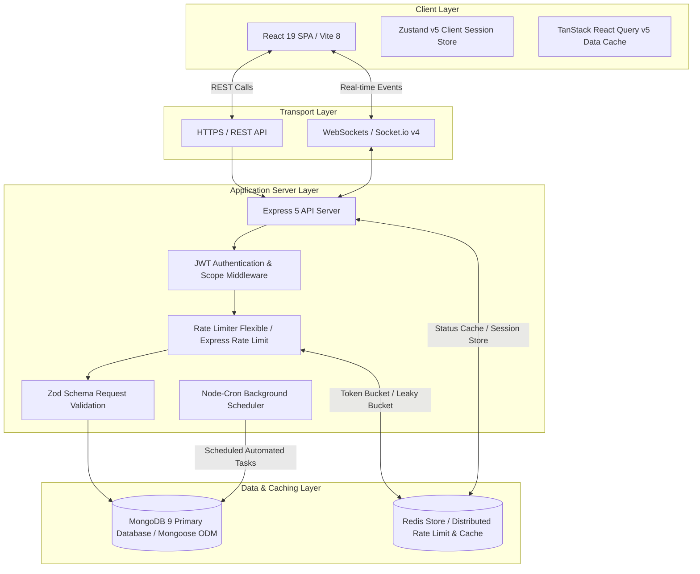
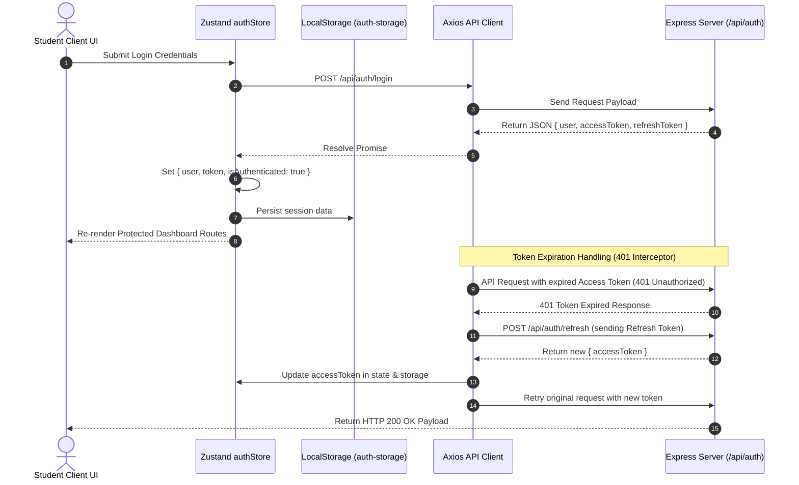
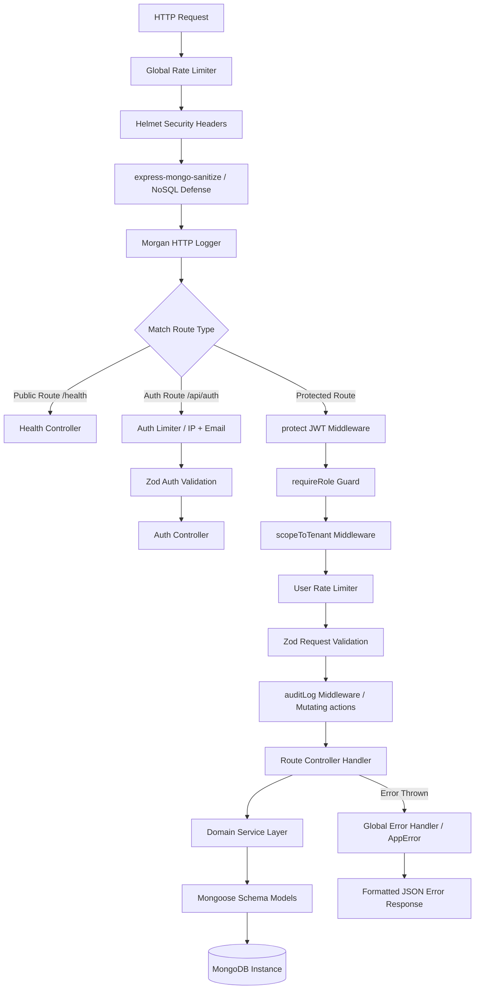
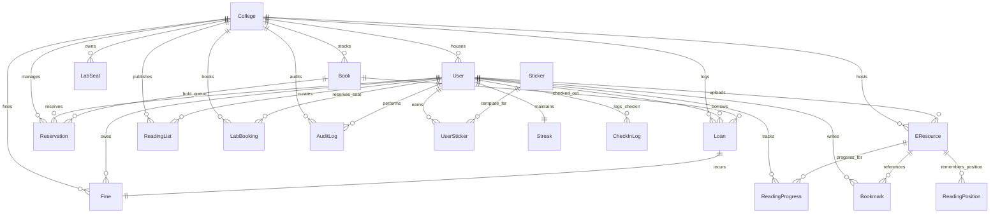
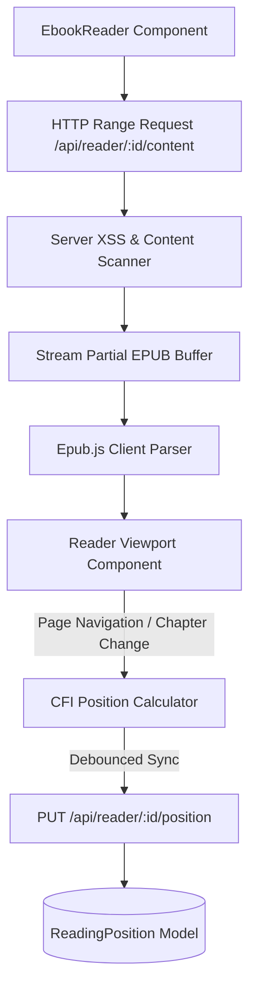
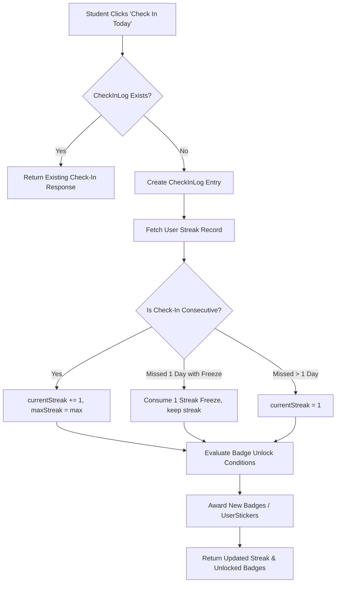

# 📚 BookBuddy

### A modern, multi-tenant campus library management, digital e-resource hosting, facility reservation, and student engagement platform featuring gamified reading streaks, inline EPUB reading, and real-time operations.

---

[](https://github.com/Aditya-Naikwadi/BookBuddy/actions/workflows/ci.yml)


---

## 📋 Table of Contents

- [📖 Overview & Key Differentiators](#-overview--key-differentiators)
- [🏛️ System Architecture](#️-system-architecture)
- [🎨 Frontend Architecture & State Flow](#-frontend-architecture--state-flow)
- [⚙️ Backend Architecture & Pipeline](#️-backend-architecture--pipeline)
- [🔒 Multi-Tenancy & Data Isolation](#-multi-tenancy--data-isolation)
- [🛡️ Security Architecture & Rate Limiting](#️-security-architecture--rate-limiting)
- [🗄️ Database Architecture, ERD & Indexing](#️-database-architecture-erd--indexing)
- [⚡ Concurrency Integrity & Race Condition Protection](#-concurrency-integrity--race-condition-protection)
- [✨ Portal Feature Matrix](#-portal-feature-matrix)
  - [🎓 Student Portal](#-student-portal)
  - [🏛️ College Admin Portal](#️-college-admin-portal)
  - [🌐 Super Admin Portal](#-super-admin-portal)
- [📖 Inline EPUB Ebook Reader Architecture](#-inline-epub-ebook-reader-architecture)
- [🎮 Gamification & Engagement Subsystem](#-gamification--engagement-subsystem)
- [⏰ Background Scheduled Cron Jobs](#-background-scheduled-cron-jobs)
- [🔌 Complete API Reference](#-complete-api-reference)
- [⚙️ Environment Configuration Reference](#️-environment-configuration-reference)
- [🚀 Quick Start & Installation Guide](#-quick-start--installation-guide)
  - [Prerequisites](#prerequisites)
  - [Local Setup](#local-development-setup)
  - [Docker Compose Launch](#docker-compose-launch)
  - [Testing & Coverage](#running-tests)
- [📁 Repository Structure](#-repository-structure)
- [📄 License & Maintenance](#-license--maintenance)

---

## 📖 Overview & Key Differentiators

Traditional library systems act as static catalogs, neglecting modern student expectations for real-time collaboration, digital accessibility, and academic engagement. **BookBuddy** re-imagines the college library as an integrated digital campus hub.

BookBuddy bridges the gap between platform super-administrators, campus librarians, and students by consolidating:
1. **Multi-Tenant Physical Inventory Management**: Multi-branch physical book tracking, hold queue reservations, and automated overdue fine calculations.
2. **Computer Lab Workstation Reservations**: Real-time seat grid visualization and concurrency-locked time-slot bookings.
3. **Digital E-Resource Repository & Inline Reader**: In-browser EPUB ebook parsing with HTTP range streaming, Stored-XSS injection scanning, and CFI position syncing across devices.
4. **Gamified Student Engagement**: Idempotent daily reading check-ins, streak calculations with freeze log buffers, and unlockable achievement stickers and badges.
5. **Real-Time Communication**: Socket.io WebSocket alerts for instant checkout notifications, queue position updates, and administrative broadcasts.

---

## 🏛️ System Architecture

BookBuddy uses a decoupled, event-driven architecture designed for scalability, tenant isolation, and low-latency client updates.



---

## 🎨 Frontend Architecture & State Flow

### Technical Stack & Rationale
- **React 19 & Vite 8**: Direct JSX rendering with instantaneous HMR dev server build cycles.
- **Tailwind CSS v4**: Utility-first styling utilizing CSS native variables and PostCSS integration.
- **Zustand v5 & TanStack React Query v5**: Zustand persists critical user session state (`auth-storage` in `localStorage`), while React Query handles server state caching, background re-fetching, and optimistic UI updates.
- **Epub.js**: Client-side parsing and rendering of public domain or uploaded EPUB ebooks without external plugins.
- **Framer Motion**: Smooth micro-interactions, page transitions, and streak check-in celebratory animations.

### Authentication & Session Persistence Flow



---

## ⚙️ Backend Architecture & Pipeline

Incoming HTTP requests pass through an isolated sequence of middleware gates to sanitize inputs, enforce rate limits, verify JWT signatures, and filter by tenant ID before invoking controller logic.



---

## 🔒 Multi-Tenancy & Data Isolation

BookBuddy enforces multi-tenancy at the middleware layer using `scopeToTenant`. For non-super-admin users, `scopeToTenant` extracts `req.user.collegeId` from the verified JWT and attaches `req.tenantFilter = { collegeId: req.user.collegeId }`. Controllers use this object in all Mongoose queries to prevent cross-tenant data leaks.

```mermaid
sequenceDiagram
    autonumber
    actor Admin as College Admin
    participant Server as Express App
    participant Auth as protect Middleware
    participant Scope as scopeToTenant Middleware
    participant Controller as collegeAdminController
    participant Service as loanService
    participant DB as MongoDB

    Admin->>Server: POST /api/dashboards/college-admin/circulation/checkout
    Server->>Auth: Verify JWT Token Signature & Claims
    Auth-->>Server: Attach req.user = { id, role: "college-admin", collegeId: "COLLEGE_123" }
    Server->>Scope: Check role requirement
    Scope-->>Server: Set req.tenantFilter = { collegeId: "COLLEGE_123" }
    Server->>Controller: Invoke checkoutBookHandler(req, res)
    Controller->>Service: checkoutBook(patronId, bookId, req.tenantFilter)
    
    rect rgb(15, 23, 42)
        Note over Service,DB: Enforce Tenant Scoped Query
        Service->>DB: Book.findOne({ _id: bookId, collegeId: "COLLEGE_123" })
        DB-->>Service: Book Record
        Service->>DB: User.findOne({ _id: patronId, collegeId: "COLLEGE_123" })
        DB-->>Service: User Record
        Service->>DB: Book.findOneAndUpdate({ _id: bookId, collegeId: "COLLEGE_123", copiesAvailable: { $gt: 0 } }, { $inc: { copiesAvailable: -1 } })
        DB-->>Service: Success Response
    end

    Service-->>Controller: Checkout Complete
    Controller-->>Admin: HTTP 201 Created (JSON Response)
```



---

## 🛡️ Security Architecture & Rate Limiting

1. **Authentication**: JWT Access Tokens (short-lived: 15 mins) and Refresh Tokens (long-lived: 7 days, HTTP-only cookie capable).
2. **Password Hashing**: Passwords stored using `bcrypt` with salt factor 10.
3. **NoSQL Injection Defense**: `express-mongo-sanitize` strips `$` and `.` characters from incoming `req.body`, `req.query`, and `req.params`.
4. **HTTP Header Hardening**: `helmet` sets X-Content-Type-Options, X-Frame-Options, Strict-Transport-Security, and Content Security Policies.
5. **Input Validation**: All POST/PUT request bodies are validated against strict `Zod` schemas before touching controllers.
6. **Multi-Tier Rate Limiting** (`express-rate-limit` / `rate-limiter-flexible` backed by Redis):

| Tier | Window | Max Requests | Key / Identifier | Targeted Endpoints |
| :--- | :--- | :--- | :--- | :--- |
| **Global Limiter** | 1 Minute | 100 | IP Address | All API routes (`/api/*`) |
| **Auth Strict Limiter** | 15 Minutes | 5 | IP + Email Combo | `/api/auth/login`, `/api/auth/register` |
| **Auth IP Fallback** | 15 Minutes | 20 | IP Address | `/api/auth/*` |
| **User Limiter** | 1 Minute | 100 | User ID / JWT Sub | Protected routes |
| **Expensive Routes** | 1 Minute | 10 | User ID / IP | Analytics, catalog text search, reports |

---

## 🗄️ Database Architecture, ERD & Indexing

### Entity-Relationship Diagram (ERD)



### Collection Schema Indexes

| Target Collection | Index Definition | Index Type | Target Query Path / Purpose |
| :--- | :--- | :--- | :--- |
| `users` | `{ email: 1 }` | Single-Field, Unique | Fast user login & authentication lookup |
| `users` | `{ studentId: 1, collegeId: 1 }` | Compound, Unique | Patron ID identification within college |
| `books` | `{ collegeId: 1, title: "text", author: "text", isbn: "text" }` | Compound Text Index | Full-text catalog search scoped to college |
| `loans` | `{ collegeId: 1, status: 1 }` | Compound | College Admin active/overdue loans queue |
| `loans` | `{ userId: 1, status: 1 }` | Compound | Student active borrowed books dashboard |
| `fines` | `{ userId: 1, status: 1 }` | Compound | Outstanding fine balance aggregation |
| `fines` | `{ loanId: 1 }` | Single-Field, Unique | Fine accrual idempotency (blocks duplicate fines) |
| `reservations` | `{ bookId: 1, status: 1, queuePosition: 1 }` | Compound | Fast hold-queue promotion on book return |
| `labseats` | `{ collegeId: 1, labName: 1, seatNumber: 1 }` | Compound, Unique | Workstation seat registry validation |
| `labbookings` | `{ seatId: 1, date: 1, timeslot: 1, status: 1 }` | Compound, Partial Unique | Concurrency lock (prevents double bookings) |
| `readingprogresses`| `{ userId: 1, eresourceId: 1 }` | Compound, Unique | E-resource progress upserts |
| `readingpositions` | `{ userId: 1, eResourceId: 1 }` | Compound, Unique | Ebook CFI bookmark position lookup |
| `userstickers` | `{ userId: 1, stickerId: 1 }` | Compound, Unique | Prevents duplicate badge/sticker rewards |
| `streaks` | `{ userId: 1 }` | Single-Field, Unique | Direct streak status lookup and daily update |
| `checkinlogs` | `{ userId: 1, checkInDate: 1 }` | Compound, Unique | Enforces single check-in per day |

---

## ⚡ Concurrency Integrity & Race Condition Protection

1. **Atomic Inventory Decrement**:
   Checkouts decrease `copiesAvailable` only if `copiesAvailable > 0`, avoiding negative inventory levels under concurrent checkouts:
   ```js
   const updatedBook = await Book.findOneAndUpdate(
     { _id: bookId, collegeId, copiesAvailable: { $gt: 0 } },
     { $inc: { copiesAvailable: -1 } },
     { new: true }
   );
   if (!updatedBook) throw new AppError('Book is currently out of stock.', 400);
   ```

2. **Partial Unique Index Lock on Lab Bookings**:
   Prevents double bookings for the same seat, date, and timeslot:
   ```js
   // LabBooking Schema Partial Index
   LabBookingSchema.index(
     { seatId: 1, date: 1, timeslot: 1 },
     { unique: true, partialFilterExpression: { status: 'booked' } }
   );
   ```

3. **Idempotent Fine Accrual**:
   Unique constraint on `Fine.loanId` prevents background workers from creating duplicate fines for a late return.

---

## ✨ Portal Feature Matrix

### 🎓 Student Portal
- **Catalog Search**: Full-text physical book & digital asset search with real-time availability.
- **My Borrowed Books & Fines**: View active loans, due dates, renewal options, and fine amounts.
- **Digital Patron Card**: Displays a virtual card with barcode for campus library circulation.
- **Inline EPUB Reader**: Read digital ebooks with dark/light mode, font size toggles, table-of-contents navigation, and auto-synced CFI bookmark positions.
- **Gamification Suite**: Daily check-ins, streak counts, streak freeze protection, and unlockable achievement badges & stickers.
- **Computer Lab Reservations**: View live workstation seat maps and reserve computer lab timeslots.
- **Requests & Feedback**: Submit book purchase recommendations, file complaints, and track resolutions.

### 🏛️ College Admin Portal
- **Circulation Desk**: Atomic book checkouts, check-ins, renewals, and fine collection.
- **Catalog Management**: Add, update, archive, or remove physical books and digital e-resources.
- **Patron Management**: Manage student & faculty accounts, modify access statuses, and review activity history.
- **E-Resource Uploader**: Upload EPUB files with built-in Stored-XSS injection scanning.
- **Lab Workstation Management**: Define lab layouts, add workstation seats, and monitor bookings.
- **Financial & Analytics Hub**: Monitor circulation metrics, popular titles, and revenue collections.

### 🌐 Super Admin Portal
- **Platform Health Overview**: System-wide metrics across all onboarded institutions.
- **College Onboarding**: Create and configure new college tenants and assign primary college admin credentials.
- **E-Resource Moderation**: Review and verify public e-resources before publishing platform-wide.
- **Centralized Security Audit Log**: Read-only access to all system mutations and administrative events.

---

## 📖 Inline EPUB Ebook Reader Architecture

The inline ebook reader provides seamless digital reading directly within the browser:



### Security Measures:
- **Stored-XSS Scanning**: Uploaded EPUB files (ZIP archives) are inspected server-side using `adm-zip`. XHTML, HTML, and SVG files inside the EPUB are parsed to neutralize `<script>` tags, `javascript:` URIs, and inline event handlers (`onload`, `onerror`).
- **SSRF Protection**: External HTTP links inside e-resources are sanitized to prevent server-side request forgery.

---

## 🎮 Gamification & Engagement Subsystem

BookBuddy includes a gamification system designed to encourage consistent reading:



---

## ⏰ Background Scheduled Cron Jobs

Executed automatically via `node-cron` inside `server/src/services/cronService.js`:

| Job Name | Schedule | Purpose / Action Taken |
| :--- | :--- | :--- |
| **Overdue Fine Accrual** | `0 0 * * *` (Midnight) | Evaluates late loans, updates loan status to `overdue`, and creates unpaid `Fine` records. |
| **Hold Reservation Expiry** | `0 * * * *` (Hourly) | Expire uncollected hold reservations exceeding the pickup window and promotes the next patron in line. |
| **Due Date Reminders** | `0 9 * * *` (9 AM Daily) | Dispatches WebSocket & in-app notifications for loans due within 24–48 hours. |
| **Streak Expiry & Reminders** | `0 * * * *` (Hourly) | Resets active reading streaks if no check-in occurred within the user's timezone day (or consumes a streak freeze). Sends reminder notifications 3 hours before midnight to users at risk. |

---

## 🔌 Complete API Reference

### 🔐 Authentication (`/api/auth`)

| Method | Endpoint | Auth Required | Allowed Roles | Description |
| :--- | :--- | :---: | :--- | :--- |
| `POST` | `/api/auth/register` | No | Public | Register a new student account |
| `POST` | `/api/auth/login` | No | Public | Authenticate credentials & return JWT tokens |
| `POST` | `/api/auth/refresh` | No | Public | Issue new Access Token using valid Refresh Token |
| `POST` | `/api/auth/logout` | Yes | All Roles | Revoke current user session |

### 📚 Physical Books & Catalog (`/api/books`, `/api/catalog`)

| Method | Endpoint | Auth Required | Allowed Roles | Description |
| :--- | :--- | :---: | :--- | :--- |
| `GET` | `/api/books` | Yes | `student`, `college-admin` | Search physical books catalog (tenant-scoped) |
| `GET` | `/api/books/:id` | Yes | `student`, `college-admin` | Fetch detailed book information & current holds |
| `POST` | `/api/books` | Yes | `college-admin` | Add a new physical book title to inventory |
| `PUT` | `/api/books/:id` | Yes | `college-admin` | Update book metadata or copy quantities |
| `DELETE` | `/api/books/:id` | Yes | `college-admin` | Remove a book title from the catalog |

### 📖 E-Resources & Inline Reader (`/api/reader`, `/api/eresources`)

| Method | Endpoint | Auth Required | Allowed Roles | Description |
| :--- | :--- | :---: | :--- | :--- |
| `GET` | `/api/eresources` | Yes | All Roles | List digital e-resources (books, PDFs, EPUBs) |
| `POST` | `/api/reader/upload` | Yes | `college-admin`, `super-admin` | Upload EPUB file with automated XSS scanning |
| `GET` | `/api/reader/:resourceId/content` | Yes | All Roles | Stream EPUB content using HTTP range requests |
| `GET` | `/api/reader/:resourceId/position` | Yes | `student` | Fetch user's saved CFI reading position |
| `PUT` | `/api/reader/:resourceId/position` | Yes | `student` | Update saved CFI reading position |

### 🔄 Circulation & Holds (`/api/loans`, `/api/reservations`, `/api/fines`)

| Method | Endpoint | Auth Required | Allowed Roles | Description |
| :--- | :--- | :---: | :--- | :--- |
| `POST` | `/api/dashboards/college-admin/circulation/checkout` | Yes | `college-admin` | Atomic book checkout to student |
| `POST` | `/api/dashboards/college-admin/circulation/return` | Yes | `college-admin` | Atomic book return & automatic hold promotion |
| `POST` | `/api/dashboards/student/reservations` | Yes | `student` | Reserve an out-of-stock physical book |
| `DELETE` | `/api/dashboards/student/reservations/:id` | Yes | `student` | Cancel active reservation |
| `GET` | `/api/fines/my-fines` | Yes | `student` | List student unpaid and paid fine history |
| `POST` | `/api/fines/:id/pay` | Yes | `college-admin` | Record manual payment for student fine |

### 🎮 Gamification & Streaks (`/api/checkin`, `/api/streak`, `/api/badges`)

| Method | Endpoint | Auth Required | Allowed Roles | Description |
| :--- | :--- | :---: | :--- | :--- |
| `POST` | `/api/checkin` | Yes | `student` | Idempotent daily check-in |
| `GET` | `/api/streak` | Yes | `student` | Retrieve current streak, freezes, and stats |
| `GET` | `/api/streak/history` | Yes | `student` | Fetch check-in history logs for calendar view |
| `POST` | `/api/streak/recalculate` | Yes | `student` | Audit & reconstruct streak from check-in logs |
| `GET` | `/api/badges` | Yes | `student` | Fetch all available badges & user unlock status |

### 🖥️ Facility & Lab Workstation Bookings (`/api/lab`)

| Method | Endpoint | Auth Required | Allowed Roles | Description |
| :--- | :--- | :---: | :--- | :--- |
| `GET` | `/api/lab/seats` | Yes | `student`, `college-admin` | Fetch lab workstation seats and availability |
| `POST` | `/api/dashboards/student/lab-bookings` | Yes | `student` | Concurrency-locked seat reservation |
| `DELETE` | `/api/dashboards/student/lab-bookings/:id` | Yes | `student` | Cancel lab seat booking |

---

## ⚙️ Environment Configuration Reference

Create a `.env` file in the `server/` directory:

```env
# Server Configuration
PORT=5000
NODE_ENV=development
MONGO_URI=mongodb://localhost:27017/bookbuddy
CLIENT_ORIGIN=http://localhost:5173

# JWT Secrets & Expiration
JWT_SECRET=your_super_secret_access_key_change_in_production
JWT_REFRESH_SECRET=your_super_secret_refresh_key_change_in_production
JWT_ACCESS_EXPIRY=15m
JWT_REFRESH_EXPIRY=7d

# Redis Configuration (Distributed Rate Limiting & Caching)
REDIS_URL=redis://localhost:6379

# Rate Limiting Parameters
RATE_LIMIT_GLOBAL_MAX=100
RATE_LIMIT_GLOBAL_WINDOW_MS=60000
RATE_LIMIT_AUTH_MAX=5
RATE_LIMIT_AUTH_IP_MAX=20
RATE_LIMIT_AUTH_EMAIL_MAX=5
RATE_LIMIT_AUTH_WINDOW_MS=900000
RATE_LIMIT_USER_MAX=100
RATE_LIMIT_USER_WINDOW_MS=60000
RATE_LIMIT_EXPENSIVE_MAX=10
RATE_LIMIT_EXPENSIVE_WINDOW_MS=60000
```

---

## 🚀 Quick Start & Installation Guide

### Prerequisites
- **Node.js**: `v20.x` or later (`node -v`)
- **MongoDB**: `v6.0` or later running on port `27017`
- **Redis**: Recommended for distributed rate limiting (falls back to in-memory mode if unavailable)

### Local Development Setup

1. **Clone the repository**:
   ```bash
   git clone https://github.com/Aditya-Naikwadi/BookBuddy.git
   cd BookBuddy
   ```

2. **Install Server Dependencies**:
   ```bash
   cd server
   npm install
   ```

3. **Install Client Dependencies**:
   ```bash
   cd ../client
   npm install
   ```

4. **Configure Environment Variables**:
   Copy `.env.example` or create `server/.env` with your settings (see [Environment Configuration](#️-environment-configuration-reference)).

5. **Start the API Server**:
   ```bash
   cd server
   npm run dev
   ```
   *The Express API will listen at `http://localhost:5000`.*

6. **Start the React Frontend**:
   ```bash
   cd client
   npm run dev
   ```
   *Open `http://localhost:5173` in your browser.*

### Docker Compose Launch

Boot MongoDB, Redis, and the Node.js server using Docker Compose:

```bash
cd server
docker-compose up --build
```

### Running Tests

Execute Jest unit, integration, and E2E security test suites:

```bash
cd server
npm test
```

Generate test coverage report:

```bash
cd server
npm test -- --coverage
```

---

## 📁 Repository Structure

```
BookBuddy/
├── .github/
│   └── workflows/
│       └── ci.yml              # GitHub Actions CI/CD Pipeline
├── client/                     # React 19 Frontend Application (Vite 8 / Tailwind v4)
│   ├── src/
│   │   ├── api/                # Axios API client connection & interceptors
│   │   ├── components/         # Shared visual UI primitives & layout elements
│   │   ├── pages/              # Main application views (lazy-loaded)
│   │   │   └── dashboards/     # Student, College Admin, and Super Admin portals
│   │   └── store/              # Zustand global state stores (auth, reader, theme)
│   ├── package.json
│   └── vite.config.js
├── docs/                       # Architectural Specifications & Deep-Dives
│   └── architecture/
│       ├── frontend-design.md  # Client-side routing, state, and rendering details
│       ├── backend-design.md   # Express middleware, handlers, and job scheduling
│       └── database-design.md  # Mongoose schemas, indexes, and concurrency locks
├── server/                     # Express Backend Application (CommonJS / Node 20)
│   ├── src/
│   │   ├── controllers/        # Express request handlers & business rules
│   │   ├── middlewares/        # Auth, scoping, Zod validation, and rate limiters
│   │   ├── models/             # 28 Mongoose models and database index rules
│   │   ├── routes/             # REST API routing definitions
│   │   ├── services/           # Decoupled domain business logic & cron service
│   │   ├── sockets/            # Real-time WebSocket connection handling
│   │   └── tests/              # Jest integration & security test suites
│   ├── docker-compose.yml
│   ├── package.json
│   └── server.js
├── vercel.json                 # Vercel deployment configuration
├── .gitignore
└── README.md
```

---

## 🏗️ Architectural Deep-Dives

For in-depth architectural specifications, refer to the dedicated documentation guides:
- 📖 [Frontend Architecture Guide](docs/architecture/frontend-design.md)
- ⚙️ [Backend Architecture Guide](docs/architecture/backend-design.md)
- 🗄️ [Database Design & Indexing Guide](docs/architecture/database-design.md)

---

## 🤝 Contributing

1. Fork the repository and create your feature branch: `git checkout -b feature/amazing-feature`.
2. Ensure code passes linting and unit tests: `npm run lint` and `npm test`.
3. Commit your changes following standard conventional commits format.
4. Push to the branch and open a Pull Request.

---

## 📄 License & Maintenance

This repository is maintained by the college IT administration team under the **ISC License**. For deployment guidelines, enterprise onboarding, or security vulnerabilities, contact the platform maintainers.

