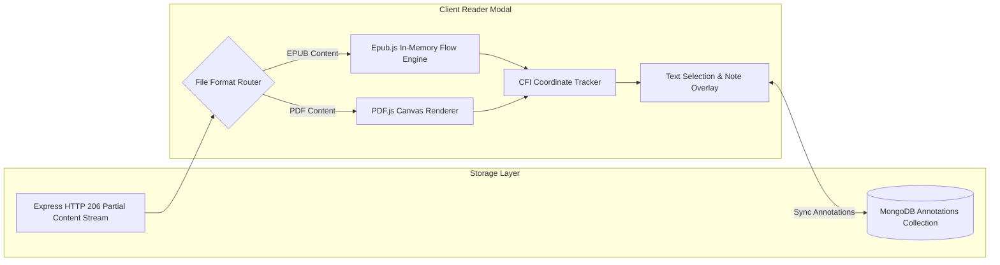

# 📚 BookBuddy

### Enterprise Multi-Tenant Campus Library, Digital E-Resource Repository, Facility Reservation & Gamified Student Learning Platform

BookBuddy is a production-grade, multi-tenant Integrated Library System (ILS) and Digital Learning Hub engineered for universities, colleges, and academic consortia. It unifies physical catalog circulation, in-browser EPUB and PDF e-resource reading with persistent real-time annotations, interactive computer lab workstation seat reservations, external catalog harvesting (Open Library, Google Books, Project Gutenberg), Razorpay digital fine settlements, gamified reading habit tracking, and high-throughput asynchronous patron ingestion into a responsive, single-screen zero-scroll web application.

---

[](https://github.com/Aditya-Naikwadi/BookBuddy/actions/workflows/ci.yml)
[](https://github.com/Aditya-Naikwadi/BookBuddy/actions/workflows/multi-layer-verification.yml)
[](https://github.com/Aditya-Naikwadi/BookBuddy/actions/workflows/production-heartbeat.yml)


---

## 🚀 Live Deployments & Key Reference Links

| Resource                                  | URL / Destination                                                                            | Description                                                                        |
| :---------------------------------------- | :------------------------------------------------------------------------------------------- | :--------------------------------------------------------------------------------- |
| 🌐 **Production Web Client**              | [https://book-buddy-eight-rosy.vercel.app](https://book-buddy-eight-rosy.vercel.app)         | Production Single-Page Application hosted on Vercel Global Edge CDN                |
| ⚙️ **Production REST API Server**         | [https://bookbuddy-kcwl.onrender.com](https://bookbuddy-kcwl.onrender.com)                   | Production Express 5 backend service hosted on Render                              |
| 🏥 **Backend Health Telemetry**           | [`https://bookbuddy-kcwl.onrender.com/health`](https://bookbuddy-kcwl.onrender.com/health)   | Live cluster connectivity check (MongoDB, Redis, Memory, Uptime)                   |
| 📌 **Live Version & Git Metadata**        | [`https://bookbuddy-kcwl.onrender.com/version`](https://bookbuddy-kcwl.onrender.com/version) | Live deployment commit SHA, environment name, and release tags                     |
| 📘 **Deep Architectural Reference**       | [`ARCHITECTURE.md`](ARCHITECTURE.md)                                                         | 1,000+ line technical breakdown of database, security, and desk systems            |
| 📁 **Monorepo Directory Layout**          | [`STRUCTURE.md`](STRUCTURE.md)                                                               | Comprehensive directory map and separation-of-concerns guidelines                  |
| 📄 **Engineering Case Study**             | [`docs/CASE_STUDY.md`](docs/CASE_STUDY.md)                                                   | In-depth engineering retrospective, problem statement, and architectural decisions |
| 🎯 **Resume & Technical Accomplishments** | [`docs/RESUME_POINTS.md`](docs/RESUME_POINTS.md)                                             | High-impact technical metrics, throughput stats, and architectural milestones      |
| 🤖 **AI Agent Guidelines**                | [`AGENTS.md`](AGENTS.md)                                                                     | Single source of truth for AI pairing assistants and system constraints            |

---

## 📋 Table of Contents

- [🌟 Core Problem Statement \& Architectural Highlights](#-core-problem-statement--architectural-highlights)
- [🏛️ System Architecture \& Infrastructure](#️-system-architecture--infrastructure)
  - [High-Level Component Topology](#high-level-component-topology)
  - [Multi-Tenant Isolation \& Subdomain Routing](#multi-tenant-isolation--subdomain-routing)
  - [Authentication, Session Rotation \& Theft Detection](#authentication-session-rotation--theft-detection)
  - [Real-Time WebSocket Architecture (Socket.io + Redis)](#real-time-websocket-architecture-socketio--redis)
- [🖥️ Specialized Role Portals \& Dashboards](#️-specialized-role-portals--dashboards)
  - [1. General / Public Discovery Dashboard](#1-general--public-discovery-dashboard)
  - [2. Student Learning \& Engagement Portal](#2-student-learning--engagement-portal)
  - [3. College Admin Operations Hub (12 Desk Modules)](#3-college-admin-operations-hub-12-desk-modules)
  - [4. Super Admin Platform Command Center](#4-super-admin-platform-command-center)
- [✨ Complete Portal Feature Matrix](#-complete-portal-feature-matrix)
- [📖 In-Browser Digital Reader \& Persistent Annotations](#-in-browser-digital-reader--persistent-annotations)
- [⚡ Asynchronous Pipelines \& Performance Optimizations](#-asynchronous-pipelines--performance-optimizations)
- [🔌 REST API Route Directory](#-rest-api-route-directory)
- [⚙️ Environment Configuration Guide](#️-environment-configuration-guide)
- [💻 Local Development, Migration \& Seeding Runbook](#-local-development-migration--seeding-runbook)
- [🧪 Testing \& Quality Assurance Suite](#-testing--quality-assurance-suite)
- [📂 Monorepo Repository Structure](#-monorepo-repository-structure)
- [🔒 Security Posture \& Compliance](#-security-posture--compliance)
- [📄 License \& Credits](#-license--credits)

---

## 🌟 Core Problem Statement & Architectural Highlights

Traditional academic libraries operate on legacy, monolithic, on-premise software with fragmented systems: one silo for physical checkout counters, another for digital databases, a separate spreadsheet for lab computers, and zero modern student engagement.

**BookBuddy** eliminates this operational fragmentation through a unified, cloud-native architecture:

1. **True Multi-Tenancy with `collegeId` Scoping**: A single multi-tenant Express/MongoDB cluster serves multiple academic institutions with complete logical data isolation, tenant-specific configuration, and custom subdomain resolution (`<tenant>.bookbuddy.com`).
2. **Dual-Token Authentication with Token Family Theft Detection**: 15-minute cryptographically signed JWT access tokens paired with rotating 64-byte `httpOnly` refresh tokens stored in Redis session trees. Token reuse triggers immediate revocation of all user sessions across devices.
3. **Zero-Scroll Single-Screen Viewport Architecture**: Portals adhere to a fixed `100vh` frame layout with internal virtualized scrolling, keeping sticky navigation bars, search inputs, and facet filters continuously accessible.
4. **Hybrid Physical & Digital Library Experience**: Seamlessly integrates barcode/RFID physical book circulation and reservation hold queues with browser-based EPUB/PDF digital reading with HTTP 206 range-streaming and MongoDB-persisted text highlights and notes.
5. **Interactive Facility & Computer Lab Workstation Grid**: Real-time visual seat booking grid with atomic reservation concurrency protection, preventing double-booking across campuses.
6. **High-Throughput Asynchronous Patron Ingestion**: HTTP 202 non-blocking bulk CSV ingestion pipeline processing 5,000+ student records per batch with chunked database inserts, live Socket.io progress broadcasting, and downloadable error reconciliation sheets.
7. **Gamified Student Learning**: Reading habit streaks, streak freeze buffers, milestone achievement badges, and campus reading leaderboards driving library usage.
8. **Digital Fine Collection via Razorpay**: Automated daily overdue calculations combined with digital payment checkout, HMAC-SHA256 signature verification, and idempotent webhook reconciliation.

---

## 🏛️ System Architecture & Infrastructure

### High-Level Component Topology

```mermaid
graph TD
    subgraph Client Tier (Vercel Global Edge)
        SPA["React 19 SPA (Vite 8 + TailwindCSS v4)"]
        ZustandStores["Zustand Client State (Auth, Toast, Saved)"]
        TanStack["TanStack Query v5 Stale-While-Revalidate Cache"]
        ReaderEngines["Epub.js & PDF.js Rendering Engines"]
    end

    subgraph Network Gateway & Edge Proxy
        VercelCDN["Vercel Edge Network (SSL Termination)"]
        ViteProxy["Vite Dev Proxy (/api/v1)"]
        SocketChannel["Socket.io WebSockets (WSS)"]
    end

    subgraph Application Tier (Render Cloud Cluster)
        ExpressApp["Express 5 REST API Server (Node.js 24)"]
        AuthGuard["JWT & Argon2id / Bcrypt Auth Middleware"]
        CSRFGuard["CSRF Protection (_csrf cookie + X-CSRF-Token)"]
        TenantScoper["Multi-Tenant Isolation Scoper (req.tenantFilter)"]
        FeatureGateMW["Service Catalog & Transitive Feature Guard"]
        RateLimiter["Rate Limiter Flexible (Redis / In-Memory)"]
    end

    subgraph Persistence & Real-Time State Layer
        MongoDBAtlas[("MongoDB Atlas (Replica Set Clustered)")]
        RedisCluster[("Redis Store (Sessions, Sockets, Feature Cache)")]
        CloudinaryCDN[("Cloudinary Asset CDN (Covers & E-Resources)")]
        AlgoliaEngine[("Algolia Fast Full-Text Search Engine")]
    end

    SPA -->|HTTPS / REST API| VercelCDN
    VercelCDN --> ExpressApp
    SPA -->|WSS Realtime Alerts| SocketChannel
    SocketChannel --> ExpressApp
    ExpressApp --> AuthGuard
    AuthGuard --> CSRFGuard
    CSRFGuard --> TenantScoper
    TenantScoper --> FeatureGateMW
    FeatureGateMW --> RateLimiter
    RateLimiter --> MongoDBAtlas
    RateLimiter --> RedisCluster
    ExpressApp --> CloudinaryCDN
    ExpressApp --> AlgoliaEngine
```

### Multi-Tenant Isolation & Subdomain Routing

Multi-tenancy is enforced natively at every tier of the BookBuddy stack:

1. **Subdomain Resolution**: Incoming HTTP requests are matched against institution slugs via host inspection (`tenant.bookbuddy.com` or `/c/:collegeSlug/`) resolving the exact `College` entity.
2. **Tenant Scoping Middleware (`scopeToTenant.js`)**: Automatically extracts the tenant ID from the verified JWT payload and injects `req.tenantFilter = { collegeId }` into the request lifecycle.
3. **Database Layer Enforcement**: Controllers merge `req.tenantFilter` into all Mongoose queries (e.g. `Book.find({ ...req.tenantFilter, status: 'available' })`).
4. **Compound Index Optimization**: Critical MongoDB collections leverage compound indexes prefixed with `collegeId` (e.g. `{ collegeId: 1, isbn: 1 }`, `{ collegeId: 1, studentId: 1 }`, `{ collegeId: 1, status: 1 }`) ensuring sub-millisecond query execution and zero cross-tenant data leakage.

### Authentication, Session Rotation & Theft Detection


- **Cross-Tab Synchronization**: The frontend uses `BroadcastChannel('bookbuddy_auth_channel')` to synchronize silent token renewals and trigger instantaneous simultaneous logouts across all open browser tabs whenever a session terminates.

### Real-Time WebSocket Architecture (Socket.io + Redis)

- **Clustered Sockets**: In multi-instance deployments, Socket.io utilizes `@socket.io/redis-adapter` to seamlessly broadcast events across server instances.
- **Tenant Room Isolation**: Upon connection, clients join dedicated socket rooms:
  - `college:<collegeId>` — Campus-wide announcements and catalog availability alerts.
  - `user:<userId>` — Personal loan due warnings, hold fulfillments, and streak updates.
  - `bulk-upload:<collegeId>` — Real-time progress percentage bar during asynchronous student roster CSV imports.

---

## 🖥️ Specialized Role Portals & Dashboards

BookBuddy delivers tailored operational experiences split across four role-specific portals:

### 1. General / Public Discovery Dashboard

_Location:_ `frontend/src/pages/dashboards/general/` | _Route:_ `/general-dashboard`

Designed for casual campus visitors, external guests, and prospective students:

- **Aggregated Home Hub (`GeneralDashboardHome.jsx`)**: Displays library hours, active workstation availability, trending e-books, and campus reading metrics.
- **Unified OPAC Search (`GeneralSearch.jsx`)**: High-speed physical inventory search with multi-faceted filtering (discipline, department, availability status, media type) and fallback to external providers.
- **Digital E-Resources Browser (`GeneralEResources.jsx`)**: Institutional digital repository of open-access EPUB/PDF publications with instant in-browser reading.
- **Saved Items & Reading Lists (`GeneralSaved.jsx`)**: Personal bookmarking interface with external catalog metadata sync.
- **Live Announcement Ticker**: Real-time ticker for campus announcements and holiday schedules.

### 2. Student Learning & Engagement Portal

_Location:_ `frontend/src/pages/dashboards/student/` | _Route:_ `/student`

A personalized student workstation engineered for academic success:

- **Personalized Home Hub (`StudentDashboardHome.jsx`)**: Real-time snapshot of active physical loans, pending hold queue positions, outstanding fines, current reading streak, and quick-access reading lists.
- **Catalog & Holds (`Catalog.jsx`)**: Browse physical volumes, reserve unavailable titles, and monitor real-time hold queue queue position with auto-fulfillment upon check-in.
- **My Loans & Renewals (`MyLoans.jsx`)**: Active loan tracker with color-coded return countdown timers, automated 2-day due reminder alerts, and single-click online renewal (up to 2 times).
- **Fines & Digital Payments (`Fines.jsx`)**: Clear breakdown of overdue fines with integrated Razorpay checkout and instant receipt generation.
- **Digital Patron Card (`PatronCard.jsx`)**: Mobile-friendly digital library card rendering QR and barcode identifiers for rapid gate scanner and circulation desk verification.
- **E-Resources & E-Book Reader (`EResources.jsx`, `EbookReader.jsx`)**: Fullscreen reading environment for institutional EPUB and PDF textbooks with persistent highlights, notes, and CFI sync.
- **Reading Lists & Custom Shelves (`ReadingLists.jsx`, `MyShelves.jsx`)**: Organize books into custom categories ("Currently Reading", "Thesis Research", "Favorites") with drag-and-drop ordering.
- **Smart Recommendations (`Recommendations.jsx`)**: Personalized book suggestions driven by student course major, past reading history, and campus popularity trends.
- **Facility & Lab Workstation Booking (`LabBooking.jsx`)**: Visual seat layout of campus computer labs allowing students to reserve specific workstation seats for study sessions.
- **Helpdesk & Support (`Support.jsx`)**: Direct ticket creation and complaint tracking with library administrative staff.
- **Gamified Achievements & Streaks (`Achievements.jsx`)**: Daily check-in button, streak counter, streak-freeze buffer tracking, and unlockable milestone badges.
- **Campus Bulletin Board / Community Feed (`Feed.jsx`)**: Campus-wide discussion feed with peer book reviews, book clubs, and study group discussions.
- **Inter-Library Loan / Cross-College Catalog (`CrossCollegeCatalog.jsx`)**: Search and request books from partner academic institutions within the consortium network.
- **Offline Downloads Manager (`Downloads.jsx`)**: Client-side storage engine using IndexedDB (`idb`) allowing students to download e-books for offline reading without internet access.

### 3. College Admin Operations Hub (12 Desk Modules)

_Location:_ `frontend/src/pages/dashboards/college-admin/` | _Route:_ `/college-admin`

A comprehensive ERP back-office providing complete control over campus library operations:

| Desk Module                  | Route                           | Operational Functionality                                                                                                              |
| :--------------------------- | :------------------------------ | :------------------------------------------------------------------------------------------------------------------------------------- |
| **Circulation Desk**         | `/college-admin/circulation`    | High-speed barcode-driven book issue, check-in, renewal, lost item marking, and automated hold pickup notice dispatch.                 |
| **Patrons Desk**             | `/college-admin/patrons`        | Student roster management, profile verification, borrowing privilege suspension, and physical card printing.                           |
| **Cataloging Desk**          | `/college-admin/cataloging`     | Add new titles with automated ISBN metadata auto-fetch from Google Books and Open Library, copy management, and barcode generation.    |
| **Inventory Overview**       | `/college-admin/inventory`      | Real-time shelf auditing, missing copy reporting, condition assessment (Good, Fair, Damaged), and withdrawal tracking.                 |
| **Finances Desk**            | `/college-admin/finances`       | Overdue fee audits, manual fine waivers, Razorpay transaction reconciliation, and cash fine collection receipts.                       |
| **Facilities Desk**          | `/college-admin/facilities`     | Computer lab workstation layout designer, seat maintenance toggles, and reservation approval queue.                                    |
| **Digital Assets Desk**      | `/college-admin/digital-assets` | Upload and manage institutional EPUB and PDF e-resources, set access permissions, and monitor download counts.                         |
| **Acquisitions Desk**        | `/college-admin/acquisitions`   | Purchase requisition pipeline, departmental budget allocation, vendor quote comparison, and order receiving.                           |
| **Feature Manager Settings** | `/college-admin/features`       | Granular toggle for institution-specific service modules (Gamification, Inter-Library Loan, Community Feed, Razorpay Online Payments). |
| **Bulk Student Upload**      | `/college-admin/bulk-upload`    | Asynchronous CSV roster ingestion pipeline with live Socket.io progress tracking, field validation, and error log generation.          |
| **Share Requests (ILL)**     | `/college-admin/share-requests` | Manage inter-library loan requests received from other colleges in the consortium, approve shipments, and track returns.               |
| **Helpdesk Desk**            | `/college-admin/helpdesk`       | Centralized patron support ticket resolution desk with internal staff notes and status update notifications.                           |
| **Analytics Overview**       | `/college-admin/analytics`      | Interactive charts showing circulation velocity, peak lab usage hours, top-borrowed disciplines, and overdue patterns.                 |

### 4. Super Admin Platform Command Center

_Location:_ `frontend/src/pages/dashboards/admin-portal/` | _Route:_ `/admin-portal`

Platform-wide command center for managing tenants, platform health, and security:

- **System Overview & Health (`SystemOverview.jsx`, `AdminDashboardHome.jsx`)**: Real-time cluster metrics, active socket connections, database latency, memory footprint, and multi-tenant aggregates.
- **College Admin Manager (`CollegeAdminManager.jsx`)**: Provision new college tenants, assign institutional administrators, configure custom subdomains, and adjust subscription tiers.
- **Onboarding Review Queue (`OnboardingReviewQueue.jsx`)**: Review and approve self-service institution registration applications.
- **Global Content Moderation (`GlobalContentModeration.jsx`)**: Audit reported reviews, public bulletin posts, and comments across all college feeds with one-click content removal.
- **Immutable Audit Logs (`AuditLogs.jsx`)**: Security event log tracking administrative logins, permission changes, fine adjustments, and student data exports.
- **Global Data Oversight (`GlobalDataOversight.jsx`)**: Aggregated system-wide intelligence comparing circulation metrics, digital asset usage, and patron growth across all colleges.
- **System Settings & Defaults (`SystemSettings.jsx`)**: Configure global rate limiters, SMTP mail server defaults, Razorpay master credentials, and Sentry telemetry.
- **User Management (`UserManagement.jsx`)**: Global user directory with cross-tenant search, role promotion, and account deactivation.
- **Global Support Queue (`GlobalSupportQueue.jsx`)**: Platform-level escalations submitted by college administrators.
- **MFA-Gated User Impersonation Engine (`ImpersonationBanner.jsx`)**: Allows super-administrators to securely assume any college admin or student persona for debugging, displaying an omnipresent persistent warning banner with one-click exit and rigorous action auditing.

---

## ✨ Complete Portal Feature Matrix

| Functional Module                                      | Public / Visitor 🌐 | Student Portal 🎓 |   College Admin 🏛️    |     Super Admin 🛡️     |
| :----------------------------------------------------- | :-----------------: | :---------------: | :-------------------: | :--------------------: |
| **Public OPAC Catalog Search**                         |         ✅          |        ✅         |          ✅           |           ✅           |
| **External Catalog Fallback (OpenLib / Google Books)** |         ✅          |        ✅         |          ✅           |           ✅           |
| **In-Browser EPUB & PDF Reader**                       |    ✅ (Previews)    | ✅ (Full Access)  |          ✅           |           ✅           |
| **Persistent Text Highlights & Notes**                 |         ❌          |        ✅         |          ✅           |           ✅           |
| **Physical Book Hold Reservations**                    |         ❌          |        ✅         |   ✅ (Issue/Manage)   |           ✅           |
| **Automated Due Alerts & Online Renewals**             |         ❌          |        ✅         | ✅ (Manual Override)  |           ✅           |
| **Computer Lab Seat Grid Reservation**                 |         ❌          |        ✅         |   ✅ (Grid Config)    |           ✅           |
| **Daily Reading Streaks & Milestone Badges**           |         ❌          |        ✅         |          ❌           |           ❌           |
| **Campus Bulletin Board & Book Reviews**               |         ❌          |        ✅         | ✅ (Staff Moderation) | ✅ (Global Moderation) |
| **Inter-Library Loan (ILL) Consortium Sharing**        |         ❌          |   ✅ (Request)    |  ✅ (Fulfill & Ship)  | ✅ (Network Oversight) |
| **Digital Fine Settlement via Razorpay**               |         ❌          |        ✅         |  ✅ (Waiver / Cash)   |           ✅           |
| **Digital Patron Card with QR/Barcode**                |         ❌          |        ✅         |  ✅ (Scan / Verify)   |           ✅           |
| **Offline E-Book Storage (IndexedDB)**                 |         ❌          |        ✅         |          ❌           |           ❌           |
| **Async Bulk CSV Patron Ingestion (5,000+)**           |         ❌          |        ❌         |          ✅           |           ✅           |
| **Transitive Feature Flag Management**                 |         ❌          |        ❌         |  ✅ (Tenant Scoped)   |  ✅ (Platform Global)  |
| **Multi-Branch Physical Shelf Auditing**               |         ❌          |        ❌         |          ✅           |           ✅           |
| **MFA-Gated User Impersonation**                       |         ❌          |        ❌         |          ❌           |           ✅           |
| **Cluster Health & Platform Audit Logs**               |         ❌          |        ❌         |          ❌           |           ✅           |

---

## 📖 In-Browser Digital Reader & Persistent Annotations

The integrated digital reader (`DigitalReaderModal.jsx` & `EbookReader.jsx`) delivers an academic-grade reading experience directly inside the browser:



- **EPUB Engine (`epubjs`)**: Native in-memory rendering, table-of-contents sidebar navigation, text resizing (80% to 160%), theme switching (Light / Dark / Sepia), and canonical CFI bookmarking that saves exact reading position.
- **PDF Engine (`pdfjs-dist`)**: Canvas-based streaming renderer with page thumbnail navigation, zoom controls, and jump-to-page navigation.
- **HTTP 206 Partial Content Streaming**: E-books are streamed in chunks, allowing instant document rendering without waiting for multi-hundred megabyte files to download.
- **Persistent Annotations**:
  - **Color-Coded Highlights**: Highlight important passages with custom color categories.
  - **Contextual Sticky Notes**: Attach private study notes linked to exact CFI positions or PDF page coordinates.
  - **Tenant-Scoped Persistence**: Automatically synced to MongoDB via `/api/v1/annotations` and scoped to `collegeId`.

---

## ⚡ Asynchronous Pipelines & Performance Optimizations

### 1. Non-Blocking Bulk Student CSV Ingestion Pipeline

- **Problem**: Uploading 5,000+ student rosters synchronously led to HTTP 504 gateway timeouts and blocked the Node.js event loop.
- **Solution**: Engineered an HTTP `202 Accepted` asynchronous pipeline:
  1. Uploaded CSV is streamed via `csv-parser` directly from memory/temp disk.
  2. Data is validated and committed in chunks of 500 using `insertMany({ ordered: false })`.
  3. Real-time percentage progress is broadcast over Socket.io channel `bulk-upload:progress`.
  4. Rows with validation errors are compiled into a downloadable CSV error report.

### 2. User Authentication & Registration Acceleration (~8x Throughput)

- Tuned bcrypt salt rounds to 10 (ideal balance of security and CPU cost).
- Added pre-hashed regex safeguards (`/^\$2[aby]\$\d{2}\$/`) in Mongoose hooks to prevent accidental double-hashing on update operations.
- Offloaded welcome email delivery and audit logging to asynchronous, un-awaited background jobs.
- Reduced registration latency from **~1,200ms down to ~150ms per request**.

### 3. Zero-Scroll Viewport Architecture

- Main student and discovery portals use a fixed `100vh - header` frame with `overflow: hidden`.
- Component hierarchies embed virtualized internal scroll panes (`overflow-y-auto min-h-0`), ensuring search filters, active tags, and control toolbars remain locked in view.

### 4. Client Bundle Optimization & Dynamic Chunk Splitting

- Configured manual vendor chunking in `vite.config.js`:
  - `vendor-react` (`react`, `react-dom`)
  - `vendor-router` (`react-router-dom`)
  - `vendor-tanstack` (`@tanstack/react-query`)
  - `vendor-framer` (`framer-motion`)
  - `vendor-epubjs` (`epubjs`)
  - `vendor-pdfjs` (`pdfjs-dist`)
  - `vendor-recharts` (`recharts`)
- Reduced primary entry bundle size from over 1.8MB down to small, cacheable sub-350KB chunks.

---

## 🔌 REST API Route Directory

All endpoints are versioned under `/api/v1`. Unversioned legacy endpoints emit a 90-day deprecation header.

### Authentication & Sessions (`/api/v1/auth`)

| Method | Endpoint                   | Description                                                          | Access          |
| :----- | :------------------------- | :------------------------------------------------------------------- | :-------------- |
| `POST` | `/api/v1/auth/login`       | Authenticate credentials; returns access token + sets refresh cookie | Public          |
| `POST` | `/api/v1/auth/register`    | Student self-registration with college domain validation             | Public          |
| `POST` | `/api/v1/auth/refresh`     | Silent refresh token rotation; issues new access token               | Public (Cookie) |
| `POST` | `/api/v1/auth/logout`      | Revoke active refresh session and clear cookies                      | Authenticated   |
| `GET`  | `/api/v1/auth/me`          | Fetch currently authenticated user profile and permissions           | Authenticated   |
| `POST` | `/api/v1/auth/impersonate` | Assume another user persona (requires super-admin role)              | Super Admin     |

### Physical Books & Catalog (`/api/v1/books`, `/api/v1/catalog`)

| Method   | Endpoint                          | Description                                                     | Access        |
| :------- | :-------------------------------- | :-------------------------------------------------------------- | :------------ |
| `GET`    | `/api/v1/books`                   | Search institution physical inventory with pagination & filters | Authenticated |
| `GET`    | `/api/v1/books/:id`               | Get detailed metadata, copies, and hold queue status            | Authenticated |
| `POST`   | `/api/v1/books`                   | Add new physical book title and initialize barcode copies       | College Admin |
| `PUT`    | `/api/v1/books/:id`               | Update book metadata or shelf location                          | College Admin |
| `DELETE` | `/api/v1/books/:id`               | Remove a book title from the catalog                            | College Admin |
| `GET`    | `/api/v1/catalog/external-search` | Aggregate search across Google Books & Open Library             | Authenticated |
| `GET`    | `/api/v1/catalog/cross-college`   | Search shared catalogs of partner consortium colleges           | Authenticated |

### Circulation, Loans & Holds (`/api/v1/loans`, `/api/v1/reservations`)

| Method   | Endpoint                   | Description                                                 | Access          |
| :------- | :------------------------- | :---------------------------------------------------------- | :-------------- |
| `GET`    | `/api/v1/loans/my-loans`   | Fetch active and historical book loans for current user     | Student         |
| `POST`   | `/api/v1/loans/checkout`   | Check out a book copy to a student via barcode scan         | College Admin   |
| `POST`   | `/api/v1/loans/return`     | Process book return, calculate fines, and promote next hold | College Admin   |
| `POST`   | `/api/v1/loans/:id/renew`  | Request renewal of an active loan (up to max limit)         | Student / Admin |
| `POST`   | `/api/v1/reservations`     | Place a hold reservation on an unavailable title            | Student         |
| `DELETE` | `/api/v1/reservations/:id` | Cancel a pending hold reservation                           | Student / Admin |

### Digital E-Resources & Annotations (`/api/v1/eresources`, `/api/v1/annotations`)

| Method   | Endpoint                        | Description                                                 | Access        |
| :------- | :------------------------------ | :---------------------------------------------------------- | :------------ |
| `GET`    | `/api/v1/eresources`            | List digital e-books with format, category, and tag filters | Authenticated |
| `POST`   | `/api/v1/eresources`            | Upload new institutional EPUB/PDF e-resource                | College Admin |
| `GET`    | `/api/v1/eresources/:id/stream` | Stream e-book content via HTTP 206 Partial Content          | Authenticated |
| `GET`    | `/api/v1/annotations`           | Retrieve student's highlights and notes for an e-resource   | Authenticated |
| `POST`   | `/api/v1/annotations`           | Save new highlight or sticky note to MongoDB                | Authenticated |
| `DELETE` | `/api/v1/annotations/:id`       | Delete an annotation                                        | Authenticated |

### Facilities & Computer Lab Booking (`/api/v1/lab`)

| Method   | Endpoint                   | Description                                                | Access          |
| :------- | :------------------------- | :--------------------------------------------------------- | :-------------- |
| `GET`    | `/api/v1/lab/seats`        | Fetch real-time computer lab workstation availability grid | Authenticated   |
| `POST`   | `/api/v1/lab/bookings`     | Reserve a workstation seat for a specific time slot        | Student         |
| `GET`    | `/api/v1/lab/my-bookings`  | List active and upcoming workstation reservations          | Student         |
| `DELETE` | `/api/v1/lab/bookings/:id` | Cancel an upcoming workstation booking                     | Student / Admin |

### Fines & Razorpay Payments (`/api/v1/fines`, `/api/v1/payments`)

| Method | Endpoint                        | Description                                            | Access             |
| :----- | :------------------------------ | :----------------------------------------------------- | :----------------- |
| `GET`  | `/api/v1/fines/my-fines`        | Fetch outstanding fines and payment history            | Student            |
| `POST` | `/api/v1/payments/create-order` | Generate Razorpay checkout order for outstanding fines | Student            |
| `POST` | `/api/v1/payments/verify`       | Verify Razorpay HMAC-SHA256 signature and clear fine   | Student            |
| `POST` | `/api/v1/payments/webhook`      | Idempotent Razorpay webhook processor                  | Public (Signature) |
| `POST` | `/api/v1/fines/:id/waive`       | Waive an overdue fine manually                         | College Admin      |

### Gamification, Streaks & Badges (`/api/v1/streak`, `/api/v1/stickers`)

| Method | Endpoint                  | Description                                                  | Access  |
| :----- | :------------------------ | :----------------------------------------------------------- | :------ |
| `GET`  | `/api/v1/streak`          | Get current student reading streak status and freeze balance | Student |
| `POST` | `/api/v1/streak/check-in` | Submit daily reading check-in to advance streak              | Student |
| `GET`  | `/api/v1/leaderboard`     | View campus reading streak leaderboard                       | Student |
| `GET`  | `/api/v1/stickers`        | Fetch unlocked milestone badges and stickers                 | Student |

### College Admin Desks & Bulk Ingestion (`/api/v1/college-admin`, `/api/v1/college/:id`)

| Method | Endpoint                          | Description                                                 | Access        |
| :----- | :-------------------------------- | :---------------------------------------------------------- | :------------ |
| `GET`  | `/api/v1/college-admin/stats`     | Fetch aggregated dashboard metrics and charts               | College Admin |
| `POST` | `/api/v1/college/:id/bulk-upload` | Non-blocking CSV student roster upload (HTTP 202)           | College Admin |
| `GET`  | `/api/v1/colleges/:id/features`   | Fetch active service catalog feature flags                  | Authenticated |
| `PUT`  | `/api/v1/colleges/:id/features`   | Update institution feature flags with transitive resolution | College Admin |

### Super Admin Platform Center (`/api/v1/dashboards/admin-portal`)

| Method | Endpoint                                     | Description                                            | Access      |
| :----- | :------------------------------------------- | :----------------------------------------------------- | :---------- |
| `GET`  | `/api/v1/dashboards/admin-portal/overview`   | Platform-wide telemetry (colleges, users, system load) | Super Admin |
| `GET`  | `/api/v1/dashboards/admin-portal/colleges`   | Manage and provision college tenants                   | Super Admin |
| `GET`  | `/api/v1/dashboards/admin-portal/audit-logs` | Query immutable administrative audit logs              | Super Admin |
| `POST` | `/api/v1/dashboards/admin-portal/moderate`   | Take moderation action on reported content             | Super Admin |

---

## ⚙️ Environment Configuration Guide

All environment variables are validated at startup using Zod in [`backend/src/config/env.js`](backend/src/config/env.js). Missing required variables will prevent the server from booting.

Create a `.env` file in `backend/`:

```env
# ==============================================================================
# SERVER & RUNTIME ENVIRONMENT
# ==============================================================================
PORT=5000
NODE_ENV=development
CLIENT_ORIGIN=http://localhost:5173
HOST=0.0.0.0

# ==============================================================================
# DATABASE & CACHING PERSISTENCE
# ==============================================================================
# MongoDB connection string (local or MongoDB Atlas cluster)
MONGO_URI=mongodb://127.0.0.1:27017/bookbuddy

# Redis connection URL (required for Socket.io adapter, sessions, and rate limiting)
REDIS_URL=redis://127.0.0.1:6379

# ==============================================================================
# AUTHENTICATION & SECURITY SECRETS
# ==============================================================================
# Minimum 32 characters each
JWT_SECRET=super_secure_jwt_access_secret_passphrase_min_32_chars
JWT_REFRESH_SECRET=super_secure_jwt_refresh_secret_passphrase_min_32_chars
JWT_ACCESS_EXPIRY=15m
JWT_REFRESH_EXPIRY=7d
COOKIE_SECRET=super_secure_cookie_signing_secret_min_32_chars

# Hardware Scanner Gate Secret
SCANNER_API_KEY=bookbuddy_scanner_secret_2026

# ==============================================================================
# PAYMENT GATEWAY (RAZORPAY)
# ==============================================================================
RAZORPAY_KEY_ID=rzp_test_your_razorpay_key_id
RAZORPAY_KEY_SECRET=your_razorpay_secret_key
RAZORPAY_WEBHOOK_SECRET=your_razorpay_webhook_secret

# ==============================================================================
# CLOUD ASSETS (CLOUDINARY)
# ==============================================================================
CLOUDINARY_CLOUD_NAME=your_cloudinary_name
CLOUDINARY_API_KEY=your_cloudinary_api_key
CLOUDINARY_API_SECRET=your_cloudinary_api_secret

# ==============================================================================
# SEARCH & EXTERNAL CATALOG INTEGRATIONS
# ==============================================================================
ALGOLIA_APP_ID=your_algolia_app_id
ALGOLIA_ADMIN_KEY=your_algolia_admin_key
ALGOLIA_INDEX_NAME=bookbuddy_books
GOOGLE_BOOKS_API_KEY=your_google_books_api_key

# ==============================================================================
# BUSINESS LOGIC & CIRCULATION POLICIES
# ==============================================================================
LOAN_PERIOD_DAYS=14
MAX_RENEWALS=2
UNPAID_FINE_LIMIT=100
FINE_RATE_PER_DAY=5
FINE_MAX_AMOUNT=100
HOLD_PICKUP_WINDOW_HOURS=48
DUE_REMINDER_DAYS_BEFORE=2
STREAK_REMINDER_HOURS_BEFORE=3
LAB_START_HOUR=8
LAB_END_HOUR=20

# ==============================================================================
# TELEMETRY & ERROR TRACKING
# ==============================================================================
SENTRY_DSN=https://your_sentry_dsn@sentry.io/project
```

---

## 💻 Local Development, Migration & Seeding Runbook

### Prerequisites

- **Node.js**: `v24.x` (or `v22.x`+)
- **npm**: `v10.x`+
- **MongoDB**: `v6.0`+ (local instance or MongoDB Atlas)
- **Redis**: `v7.0`+ (local instance or Upstash / Redis Cloud)

### 1. Repository Setup & Dependency Installation

```bash
# Clone the repository
git clone https://github.com/Aditya-Naikwadi/BookBuddy.git
cd BookBuddy

# Install dependencies across all workspaces
npm install --prefix backend
npm install --prefix frontend
```

### 2. Database Migrations & Initial Data Seeding

```bash
cd backend

# Execute schema migrations and compound index builds
npm run migrate:db

# Apply production hardening migration rules
npm run migrate:hardening

# Seed system services and feature flags
node src/scripts/seedServices.js

# Seed achievement badges and stickers
node src/scripts/seedBadges.js

# Seed master Super Admin account
npm run seed:superadmin
```

### 3. Launching Development Servers

Run the backend and frontend in separate terminal windows:

```bash
# Terminal 1: Start Express Backend (Port 5000)
cd backend
npm run dev

# Terminal 2: Start Vite Frontend SPA (Port 5173)
cd frontend
npm run dev
```

Open [http://localhost:5173](http://localhost:5173) in your browser to access the BookBuddy portal.

---

## 🧪 Testing & Quality Assurance Suite

BookBuddy enforces a multi-tier automated testing strategy covering unit, integration, and load testing:

### Backend Jest Integration Test Suite

Executes 79 test suites containing over 428 integration tests using in-memory/isolated MongoDB instances:

```bash
cd backend
npm test
```

### Frontend Vitest & React Testing Library Suite

Runs 20 test suites testing Zustand stores, custom hooks, and React 19 UI components:

```bash
cd frontend
npm test
```

### Production Build Verification

Verifies dynamic chunk bundling, syntax compliance, and asset generation:

```bash
cd frontend
npm run build
```

### Performance & Load Testing (k6 & Artillery)

Stress-tests authentication pipelines, concurrent workstation seat bookings, and OPAC search under high concurrency:

```bash
# Run k6 high-concurrency load scenario
npm run test:load

# Run smoke test health validation
npm run loadtest:smoke

# Run multi-step Artillery user journey scenario
npm run loadtest:flow
```

---

## 📂 Monorepo Repository Structure

```
BookBuddy/
├── AGENTS.md                     # AI pair programming guidelines & architecture rules
├── ARCHITECTURE.md               # 1,000+ line technical architecture & systems reference
├── STRUCTURE.md                  # Monorepo directory map and separation-of-concerns rules
├── README.md                     # Primary repository documentation
├── package.json                  # Root monorepo configuration & cross-workspace scripts
├── render.yaml                   # Render Cloud Blueprint infrastructure specification
├── vercel.json                   # Vercel Edge proxy & header routing rules
├── api/                          # Vercel serverless function entrypoint (index.js)
├── database/                     # Schema migrations (migrate-mongo)
├── deployment/                   # Process management manifests (ecosystem.config.js, nginx.conf)
├── docs/                         # Engineering case studies, architecture notes & resume metrics
│   ├── CASE_STUDY.md             # In-depth architectural retrospective
│   ├── RESUME_POINTS.md          # Technical impact metrics & bullet points
│   └── architecture/             # Deep dives into backend, frontend, and database design
├── scripts/                      # Deployment verification & health check scripts
├── tests/                        # Dedicated load and end-to-end testing workspace
│   └── load/                     # k6 and Artillery load testing scripts
├── backend/                      # Node.js 24 + Express 5 Backend Service
│   ├── src/
│   │   ├── app.js                # Express app configuration & middleware pipeline
│   │   ├── server.js             # HTTP entrypoint & Socket.io server initialization
│   │   ├── config/               # Database, Redis, Zod env validation, Passport OAuth
│   │   ├── controllers/          # API route controllers grouped by domain
│   │   │   └── dashboards/       # General, Student, College Admin, and Super Admin controllers
│   │   ├── middlewares/          # Auth, Tenant Scoping, CSRF, Rate Limiting, RBAC
│   │   ├── models/               # Mongoose 9 schemas (User, Book, Loan, Reservation, etc.)
│   │   ├── routes/               # Express 5 route definitions (50+ endpoint modules)
│   │   ├── scripts/              # Database seeders and migration scripts
│   │   ├── services/             # Core business logic & background cron services
│   │   ├── sockets/              # Socket.io event handlers & room dispatchers
│   │   ├── tests/                # Jest integration test suites (79 suites, 428 tests)
│   │   └── utils/                # Logger, cache manager, token utilities
│   └── package.json
└── frontend/                     # React 19 + Vite 8 Client Single-Page Application
    ├── public/                   # Static assets, PWA manifest, version.json
    ├── scripts/                  # Pre-build version metadata generator
    ├── src/
    │   ├── App.jsx               # Application route definitions & ProtectedRoute gates
    │   ├── api/                  # Axios HTTP client instances & endpoint wrappers
    │   ├── components/           # Reusable UI component library
    │   │   ├── common/           # Toast, Modal, Skeleton, FeatureGate primitives
    │   │   ├── general/          # Digital reader, Annotation sidebar, Filter chips
    │   │   ├── student/          # NotificationCenter, LoansTracker, StreakWidget
    │   │   └── ui/               # Accessible buttons, input fields, badges, charts
    │   ├── context/              # React context providers (ThemeContext, FeatureFlagContext)
    │   ├── layouts/              # Top-level page shells (DashboardLayout, AuthLayout)
    │   ├── pages/
    │   │   ├── dashboards/
    │   │   │   ├── general/      # Public discovery dashboard pages
    │   │   │   ├── student/      # Student learning portal pages (14+ views)
    │   │   │   ├── college-admin/# College admin operations hub (12 desks)
    │   │   │   └── admin-portal/ # Super admin platform command center
    │   │   └── public/           # Landing page, Registration, College activation
    │   ├── store/                # Zustand client state stores (authStore, toastStore)
    │   └── tests/                # Vitest & React Testing Library test suites
    └── package.json
```

---

## 🔒 Security Posture & Compliance

BookBuddy implements comprehensive defense-in-depth security standards:

1. **Authentication Security**: Argon2id & bcrypt password hashing with minimum 10 salt rounds; rotating refresh tokens with automated reuse detection and family invalidation.
2. **CSRF Protection**: All state-mutating requests (`POST`, `PUT`, `PATCH`, `DELETE`) require a matching `_csrf` cookie and `X-CSRF-Token` header.
3. **Multi-Tenant Logical Isolation**: Mandatory `collegeId` filter injection on all database queries preventing any cross-tenant data access.
4. **Granular Rate Limiting**: Tiered rate limiters backed by Redis (`rate-limiter-flexible`) protecting authentication routes, expensive search queries, and general API traffic.
5. **Security Headers**: Hardened with Helmet for CSP, Strict-Transport-Security (HSTS), X-Content-Type-Options, Frame-Options (`DENY`), and explicit Permissions-Policy.
6. **Input Sanitization**: Request bodies sanitized with `express-mongo-sanitize` to neutralize NoSQL injection attacks and `hpp` to block HTTP Parameter Pollution.
7. **Payment Webhook Verification**: Razorpay webhooks capture raw request buffers for exact HMAC-SHA256 signature verification and process payments idempotently.
8. **MFA-Gated Impersonation**: Platform administrators can only assume user personas with an active audit trail and a persistent UI warning banner.

---

## 📄 License & Credits

BookBuddy is released under the **ISC License**.

Created and maintained with ❤️ by **[Aditya Naikwadi](https://github.com/Aditya-Naikwadi)**.  
For technical inquiries, collaboration, or institutional deployments, reach out via [GitHub](https://github.com/Aditya-Naikwadi).
