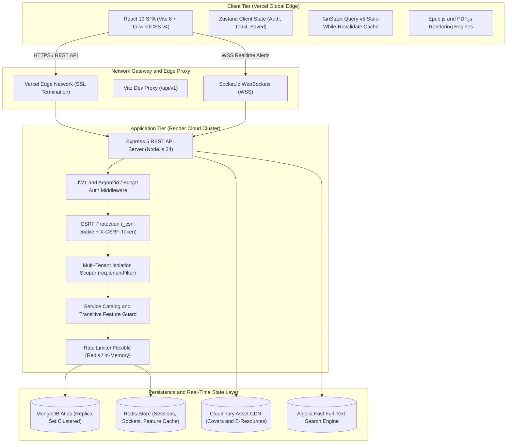
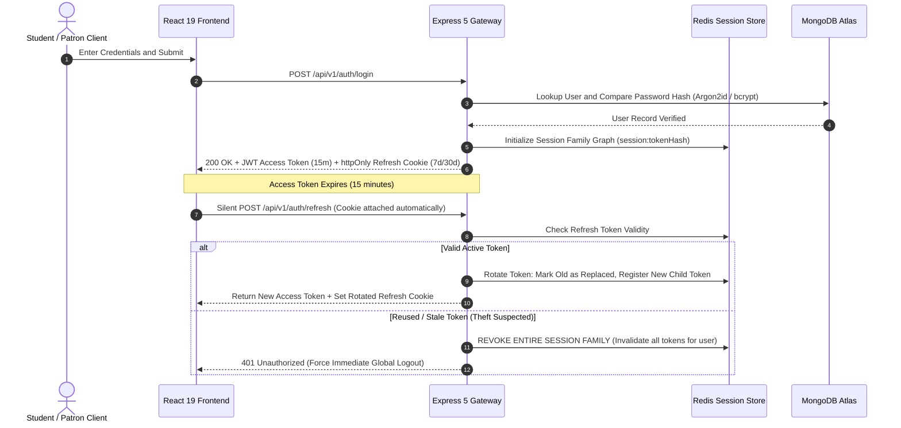
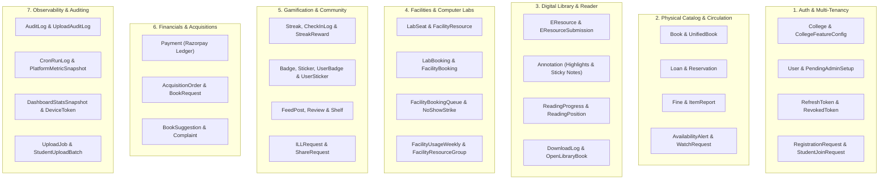

# 📚 BookBuddy

### Enterprise Multi-Tenant Campus Library, Digital E-Resource Repository, Facility Reservation & Gamified Student Learning Platform

BookBuddy is a production-grade, multi-tenant Integrated Library System (ILS) and Digital Learning Hub engineered for universities, colleges, and academic consortia. It unifies physical catalog circulation, in-browser EPUB and PDF e-resource reading with persistent real-time annotations, interactive computer lab workstation seat reservations, external catalog harvesting (Open Library, Google Books, Project Gutenberg), Razorpay digital fine settlements, gamified reading habit tracking, and high-throughput asynchronous patron ingestion into a responsive, single-screen zero-scroll web application.

---

[](https://github.com/Aditya-Naikwadi/BookBuddy/actions/workflows/ci.yml)
[](https://github.com/Aditya-Naikwadi/BookBuddy/actions/workflows/multi-layer-verification.yml)
[](https://github.com/Aditya-Naikwadi/BookBuddy/actions/workflows/production-heartbeat.yml)


---

## 🚀 Live Deployments & Key Reference Links

| Resource                                  | URL / Destination                                                                                        | Description                                                                        |
| :---------------------------------------- | :------------------------------------------------------------------------------------------------------- | :--------------------------------------------------------------------------------- |
| 🌐 **Production Web Client**              | [https://book-buddy-eight-rosy.vercel.app](https://book-buddy-eight-rosy.vercel.app)                     | Production Single-Page Application hosted on Vercel Global Edge CDN                |
| ⚙️ **Production REST API Server**         | [https://bookbuddy-kcwl.onrender.com](https://bookbuddy-kcwl.onrender.com)                               | Production Express 5 backend service hosted on Render                              |
| 🏥 **Backend Health Telemetry**           | [`https://bookbuddy-kcwl.onrender.com/health`](https://bookbuddy-kcwl.onrender.com/health)               | Live cluster connectivity check (MongoDB, Redis, Memory, Uptime)                   |
| 📌 **Live Version & Git Metadata**        | [`https://bookbuddy-kcwl.onrender.com/version`](https://bookbuddy-kcwl.onrender.com/version)             | Live deployment commit SHA, environment name, and release tags                     |
| 📘 **Deep Architectural Reference**       | [`ARCHITECTURE.md`](ARCHITECTURE.md)                                                                     | 1,000+ line technical breakdown of database, security, and desk systems            |
| 📁 **Monorepo Directory Layout**          | [`STRUCTURE.md`](STRUCTURE.md)                                                                           | Comprehensive directory map and separation-of-concerns guidelines                  |
| 📜 **API Contract Architecture**          | [`docs/API_CONTRACT_ARCHITECTURE.md`](docs/API_CONTRACT_ARCHITECTURE.md)                                 | Centralized Zod request/response validation contracts and zero-drift schemas       |
| 🆔 **Identity & Role Normalization**      | [`docs/CANONICAL_IDENTITY_AND_ROLE_NORMALIZATION.md`](docs/CANONICAL_IDENTITY_AND_ROLE_NORMALIZATION.md) | Canonical casing, role invariants, and schema-level validation pipelines           |
| 🛡️ **Scheduled & CI Quality Audits**      | [`docs/SCHEDULED_AUDITS.md`](docs/SCHEDULED_AUDITS.md)                                                   | Automated CI quality gates, static AST verification, and scheduled audit workflows |
| 📄 **Engineering Case Study**             | [`docs/CASE_STUDY.md`](docs/CASE_STUDY.md)                                                               | In-depth engineering retrospective, problem statement, and architectural decisions |
| 🎯 **Resume & Technical Accomplishments** | [`docs/RESUME_POINTS.md`](docs/RESUME_POINTS.md)                                                         | High-impact technical metrics, throughput stats, and architectural milestones      |
| 🤝 **Contribution & Verification Guide**  | [`CONTRIBUTING.md`](CONTRIBUTING.md)                                                                     | Local contribution standards, Git commit conventions, and pre-push verification    |
| 🤖 **AI Agent Guidelines**                | [`AGENTS.md`](AGENTS.md)                                                                                 | Single source of truth for AI pairing assistants and system constraints            |

---

## 📋 Table of Contents

- [🌟 Core Problem Statement \& Architectural Highlights](#-core-problem-statement--architectural-highlights)
- [🏛️ System Architecture \& Infrastructure](#️-system-architecture--infrastructure)
  - [High-Level Component Topology](#high-level-component-topology)
  - [Multi-Tenant Isolation \& Subdomain Routing](#multi-tenant-isolation--subdomain-routing)
  - [Authentication, Session Rotation \& Theft Detection](#authentication-session-rotation--theft-detection)
  - [Real-Time WebSocket Architecture (Socket.io + Redis)](#real-time-websocket-architecture-socketio--redis)
- [🖥️ Specialized Role Portals \& Dashboards](#️-specialized-role-portals--dashboards)
  - [1. General / Public Discovery Dashboard](#1-general--public-discovery-dashboard)
  - [2. Student Learning \& Engagement Portal](#2-student-learning--engagement-portal)
  - [3. College Admin Operations Hub (13 Desk Modules)](#3-college-admin-operations-hub-13-desk-modules)
  - [4. Super Admin Platform Command Center (10 Management Consoles)](#4-super-admin-platform-command-center-10-management-consoles)
- [✨ Complete Portal Feature Matrix](#-complete-portal-feature-matrix)
- [📖 In-Browser Digital Reader \& Persistent Annotations](#-in-browser-digital-reader--persistent-annotations)
- [⚡ Asynchronous Pipelines \& Performance Optimizations](#-asynchronous-pipelines--performance-optimizations)
- [⏱️ Automated Background Cron \& Worker Architecture](#️-automated-background-cron--worker-architecture)
- [📱 Offline PWA \& Hardware Gate Kiosk Integration](#-offline-pwa--hardware-gate-kiosk-integration)
- [🗄️ Entity Data Architecture \& Domain Models (73 Schemas)](#️-entity-data-architecture--domain-models-73-schemas)
- [🔌 REST API Route Directory](#-rest-api-route-directory)
- [⚙️ Environment Configuration Guide](#️-environment-configuration-guide)
- [💻 Local Development, Migration \& Seeding Runbook](#-local-development-migration--seeding-runbook)
- [🧪 Testing \& Quality Assurance Suite](#-testing--quality-assurance-suite)
- [🛡️ Automated CI Quality Gates (10 Invariant Gates)](#️-automated-ci-quality-gates-10-invariant-gates)
- [📦 Shared Workspace \& Canonical Contract Layer (`@bookbuddy/shared`)](#-shared-workspace--canonical-contract-layer-bookbuddyshared)
- [📂 Monorepo Repository Structure](#-monorepo-repository-structure)
- [🔒 Security Posture \& Compliance](#-security-posture--compliance)
- [📄 License \& Credits](#-license--credits)

---

## 🌟 Core Problem Statement & Architectural Highlights

Traditional academic libraries operate on legacy, monolithic, on-premise software with fragmented systems: one silo for physical checkout counters, another for digital databases, a separate spreadsheet for lab computers, and zero modern student engagement.

**BookBuddy** eliminates this operational fragmentation through a unified, cloud-native architecture:

1. **True Multi-Tenancy with `collegeId` Scoping**: A single multi-tenant Express/MongoDB cluster serves multiple academic institutions with complete logical data isolation, tenant-specific configuration, and custom subdomain resolution (`<tenant>.bookbuddy.com`).
2. **Dual-Token Authentication with Token Family Theft Detection**: 15-minute cryptographically signed JWT access tokens paired with rotating 64-byte `httpOnly` refresh tokens stored in Redis session trees. Token reuse triggers immediate revocation of all user sessions across devices.
3. **Zero-Scroll Single-Screen Viewport Architecture**: Portals adhere to a fixed `100vh` frame layout with internal virtualized scrolling, keeping sticky navigation bars, search inputs, and facet filters continuously accessible.
4. **Hybrid Physical & Digital Library Experience**: Seamlessly integrates barcode/RFID physical book circulation and reservation hold queues with browser-based EPUB/PDF digital reading with HTTP 206 range-streaming and MongoDB-persisted text highlights and notes.
5. **Interactive Facility & Computer Lab Workstation Grid**: Real-time visual seat booking grid with atomic reservation concurrency protection, preventing double-booking across campuses.
6. **High-Throughput Asynchronous Patron Ingestion**: HTTP 202 non-blocking bulk CSV ingestion pipeline processing 5,000+ student records per batch with chunked database inserts, live Socket.io progress broadcasting, and downloadable error reconciliation sheets.
7. **Gamified Student Learning**: Reading habit streaks, streak freeze buffers, milestone achievement badges, and campus reading leaderboards driving library usage.
8. **Digital Fine Collection via Razorpay**: Automated daily overdue calculations combined with digital payment checkout, HMAC-SHA256 signature verification, and idempotent webhook reconciliation.

---

## 🏛️ System Architecture & Infrastructure

### High-Level Component Topology



### Multi-Tenant Isolation & Subdomain Routing

Multi-tenancy is enforced natively at every tier of the BookBuddy stack:

1. **Subdomain Resolution**: Incoming HTTP requests are matched against institution slugs via host inspection (`tenant.bookbuddy.com` or `/c/:collegeSlug/`) resolving the exact `College` entity.
2. **Tenant Scoping Middleware (`scopeToTenant.js`)**: Automatically extracts the tenant ID from the verified JWT payload and injects `req.tenantFilter = { collegeId }` into the request lifecycle.
3. **Database Layer Enforcement**: Controllers merge `req.tenantFilter` into all Mongoose queries (e.g. `Book.find({ ...req.tenantFilter, status: 'available' })`).
4. **Compound Index Optimization**: Critical MongoDB collections leverage compound indexes prefixed with `collegeId` (e.g. `{ collegeId: 1, isbn: 1 }`, `{ collegeId: 1, studentId: 1 }`, `{ collegeId: 1, status: 1 }`) ensuring sub-millisecond query execution and zero cross-tenant data leakage.

### Authentication, Session Rotation & Theft Detection



- **Cross-Tab Synchronization**: The frontend uses `BroadcastChannel('bookbuddy_auth_channel')` to synchronize silent token renewals and trigger instantaneous simultaneous logouts across all open browser tabs whenever a session terminates.

### Real-Time WebSocket Architecture (Socket.io + Redis)

- **Clustered Sockets**: In multi-instance deployments, Socket.io utilizes `@socket.io/redis-adapter` to seamlessly broadcast events across server instances.
- **Tenant Room Isolation**: Upon connection, clients join dedicated socket rooms:
  - `college:<collegeId>` — Campus-wide announcements and catalog availability alerts.
  - `user:<userId>` — Personal loan due warnings, hold fulfillments, and streak updates.
  - `bulk-upload:<collegeId>` — Real-time progress percentage bar during asynchronous student roster CSV imports.

---

## 🖥️ Specialized Role Portals & Dashboards

BookBuddy delivers tailored operational experiences split across four role-specific portals:

### 1. General / Public Discovery Dashboard

_Location:_ `frontend/src/pages/dashboards/general/` | _Route:_ `/general-dashboard`

Designed for casual campus visitors, external guests, and prospective students:

- **Aggregated Home Hub (`GeneralDashboardHome.jsx`)**: Loads operating hours, real-time lab workstation seat availability, trending e-books, and campus reading metrics via a single-round-trip unified endpoint (`/api/v1/dashboards/general/home-data`).
- **Unified OPAC Catalog Search (`GeneralSearch.jsx`)**: High-speed physical inventory search with debounced autocomplete, multi-faceted filtering (discipline, department, availability status, media type), real-time physical copy counters (`copiesAvailable` vs `totalCopies`), and external provider fallbacks.
- **External Catalog Harvesting (Open Library, Google Books & Project Gutenberg)**: Integrates external book metadata through `googleBooksClient.js`, `openLibraryClient.js`, and `gutendexClient.js`, allowing patrons to discover public domain literature and global publications directly within the institutional portal.
- **Institutional Subdomain & Deep Link Resolution (`CollegeDeepLinkEntry.jsx`)**: Supports wildcard institution subdomains (`https://<tenant>.bookbuddy.com`) and custom routing paths (`/c/:collegeSlug/*`), dynamically scoping catalog searches and campus data to the active academic institution.
- **Dual Self-Registration & Activation Portal (`RegistrationPage.jsx`, `CollegeStudentRegister.jsx`, `StudentActivationPage.jsx`)**: Provides dedicated application workflows for new institutional tenant onboardings as well as tenant-scoped student enrollment (`/register/:collegeSlug`) and single-use token account activation (`/c/:collegeSlug/activate`).
- **Digital E-Resources Browser & Preview Reader (`GeneralEResources.jsx`, `DigitalReaderModal.jsx`)**: Institutional digital repository of open-access EPUB/PDF publications with instant in-browser sample reading without requiring account registration.
- **Guest Local Bookmarks (`GeneralSaved.jsx`)**: Browser-local bookmarking engine powered by `useLocalBookmarks` and `localStorage`, enabling visitors to save titles across sessions without an account.
- **Live Announcement Ticker**: Real-time ticker for campus library announcements, book fairs, and holiday schedules backed by Socket.io broadcast events.

### 2. Student Learning & Engagement Portal

_Location:_ `frontend/src/pages/dashboards/student/` | _Route:_ `/student`

A personalized student workstation engineered for academic success and daily library interaction:

- **Personalized Home Hub (`StudentDashboardHome.jsx`)**: Real-time snapshot of active physical loans, pending hold queue positions, outstanding fines, current reading streak, freeze token buffer, quick-access reading lists, and personalized book recommendations.
- **Interactive Onboarding Walkthrough Tour (`OnboardingTour.jsx`)**: Step-by-step guided tour welcoming newly enrolled students and explaining key ILS features, digital reader shortcuts, and lab reservation workflows.
- **Forced Password Change Enforcement**: Accounts provisioned via bulk CSV roster imports carry `mustChangePasswordOnNextLogin: true`. First-time student logins are automatically intercepted with a mandatory password change modal before dashboard access is unlocked.
- **Dynamic Feature-Gated Navigation (`FeatureGate.jsx`, `FeatureFlagContext.jsx`)**: Sidebar navigation items and page routes are dynamically rendered based on the college's active service catalog. If a module (e.g. `facilities_booking` or `crossCollegeILL`) is disabled by the administrator, navigation links are hidden and direct URL access is blocked.
- **Catalog & Holds Queue (`Catalog.jsx`)**: Browse physical volumes, reserve unavailable titles, and monitor real-time hold queue queue position (`queuePosition`) with automatic notice dispatch upon item check-in.
- **Availability Watch Alerts (`/api/v1/availability-alerts`)**: Students can subscribe to out-of-stock or currently checked-out titles to receive instantaneous push/email notifications the moment a copy is returned.
- **My Loans & Instant Online Renewals (`MyLoans.jsx`)**: Active loan ledger with color-coded return countdown timers, automated 2-day due reminder alerts, and single-click online renewal (up to `MAX_RENEWALS`, default: 2 times).
- **Fines & Digital Payments (`Fines.jsx`)**: Clear breakdown of overdue fines by loan with integrated Razorpay checkout, counter cash settlement status, and downloadable payment receipts.
- **Digital Patron Card with Gate Scanner Compatibility (`PatronCard.jsx`)**: Mobile-friendly digital library card rendering both high-resolution Code128 barcodes and dynamic QR codes for rapid verification at physical circulation desks and hardware entrance scanner kiosks (`SCANNER_API_KEY`).
- **Fullscreen E-Book Reader & Digital Assets (`EResources.jsx`, `EbookReader.jsx`, `/student/reader/:id`)**: Academic reading environment for institutional EPUB and PDF textbooks with HTTP 206 chunked range streaming, font scaling (80% to 160%), reading themes (Light / Dark / Sepia), table-of-contents navigation, PDF canvas thumbnail browsing, and persistent text highlights and contextual sticky notes synced to MongoDB (`Annotation`).
- **Reading Progress & CFI Coordinate Sync (`ReadingProgress`, `ReadingPosition`)**: Canonical Content Fragment Identifier (CFI) coordinate tracking that saves exact reading position and progress percentage across devices.
- **Reading Lists & Custom Shelves (`ReadingLists.jsx`, `MyShelves.jsx`, `AddToListPicker.jsx`)**: Organize books into custom shelves ("Currently Reading", "Thesis Research", "Favorites", "Completed") with drag-and-drop reordering (`@dnd-kit`), custom tags, and public/private privacy controls.
- **Star Ratings & Peer Book Reviews (`ReviewList.jsx`, `StarRatingInput.jsx`, `/api/v1/reviews`)**: 1-to-5 star rating system with peer book reviews, helpfulness upvotes, and campus community moderation.
- **Smart Personalized Recommendations (`Recommendations.jsx`)**: Machine-assisted book suggestions tailored to the student's academic major/course, past borrowing history, and campus-wide reading velocity.
- **Facility & Lab Workstation Booking Grid (`LabBooking.jsx`)**: Interactive seat layout of campus computer labs displaying workstation hardware specifications (RAM, GPU, OS, dual monitors), hourly timeslot reservations, 10-minute no-show auto-release sweeps, and automated waitlist queue promotions.
- **Helpdesk, Complaints & Purchase Suggestions (`Support.jsx`)**: Centralized patron support ticket submission, institutional complaint filing (`Complaint`), and new book acquisition requests (`BookSuggestion`).
- **Item Damage & Lost Reporting (`ItemReport`)**: Direct reporting module allowing students to report damaged covers, missing pages, or lost physical items to library staff.
- **Gamified Achievements & Daily Streaks (`Achievements.jsx`)**: Daily check-in button, streak counter, streak-freeze buffer tokens (protecting streaks during exam breaks), milestone achievement stickers, and campus-wide reading leaderboards.
- **Campus Community Feed (`Feed.jsx`)**: Real-time campus-wide bulletin board for student book discussions, peer reading recommendations, and study group formation.
- **Inter-Library Loan / Cross-College Catalog (`CrossCollegeCatalog.jsx`, `ShareRequestStatusTracker.jsx`)**: Search shared catalogs of partner institutions in the university consortium and track inter-library loan shipment status.
- **Offline Downloads Manager (`Downloads.jsx`)**: Client-side storage engine using IndexedDB (`idb`) and Service Worker caching, allowing students to download textbooks for completely offline reading without network connectivity.
- **Student Profile & Preferences (`StudentProfileSettings.jsx`)**: Comprehensive account management including avatar customization, academic details, password update, dark/light theme switching, and multi-channel notification preferences (In-App, Email, SMS via Twilio).

### 3. College Admin Operations Hub (13 Desk Modules)

_Location:_ `frontend/src/pages/dashboards/college-admin/` | _Route:_ `/college-admin`

A comprehensive ERP back-office providing complete operational control over campus library holdings, student rosters, facilities, and financial collections across 13 dedicated desk modules:

| Desk Module                   | Route                           | Operational Functionality                                                                                                                                                                                                                                                         |
| :---------------------------- | :------------------------------ | :-------------------------------------------------------------------------------------------------------------------------------------------------------------------------------------------------------------------------------------------------------------------------------- |
| **Circulation Desk**          | `/college-admin/circulation`    | High-speed barcode/RFID book checkout with atomic copy decrements (`copiesAvailable - 1`), return processing with automatic overdue calculation, renewal overrides, lost item marking, and ready-for-pickup hold notice dispatch.                                                 |
| **Patrons Desk**              | `/college-admin/patrons`        | Student roster directory with search by name, email, or Student ID; active loan auditing, unpaid fine reviews, profile verification, borrowing suspension toggles, and physical card printing.                                                                                    |
| **Cataloging Desk**           | `/college-admin/cataloging`     | Add and update physical catalog records with automated ISBN metadata auto-fetch from Google Books and Open Library, physical shelf address assignment (`Shelf A-12-04`), copy barcode generation, and media categorization.                                                       |
| **Inventory Overview**        | `/college-admin/inventory`      | Real-time shelf auditing, missing/damaged item tracking (`ItemReport`), condition assessment (Good, Fair, Damaged), low-stock alerts, and book withdrawal workflows.                                                                                                              |
| **Finances Desk**             | `/college-admin/finances`       | Overdue penalty audit trails, counter cash fine collection receipts, manual fine waivers with required justification notes logged to `AuditLog`, and Razorpay transaction reconciliations.                                                                                        |
| **Facilities Desk**           | `/college-admin/facilities`     | Computer lab workstation designer, bulk workstation seat generation, hardware specification tagging (RAM, GPU, OS, dual monitors), maintenance mode toggles (`operational` vs `under_maintenance`), and live hourly seat occupancy monitoring.                                    |
| **Digital Assets Desk**       | `/college-admin/digital-assets` | Institutional EPUB/PDF e-resource uploads, digital access permission settings, download count analytics, and review/moderation queue for student-submitted study notes and thesis guides (`EResourceSubmission`).                                                                 |
| **Acquisitions Desk**         | `/college-admin/acquisitions`   | Procurement pipeline management: create purchase orders (`AcquisitionOrder`), compare supplier vendor quotes, track ISBN receiving batches, monitor departmental budgets, and log serial subscription renewals (gated by `canManageAcquisitions`).                                |
| **Feature Manager Settings**  | `/college-admin/features`       | Granular toggle for institution-specific service catalog modules (Gamification, Inter-Library Loan, Community Feed, Facilities Booking, Razorpay Payments); borrowing policy customization (loan period, renewal limits, fine rate/day); automatically purges tenant Redis cache. |
| **Bulk Student Upload**       | `/college-admin/bulk-upload`    | Non-blocking asynchronous CSV student roster ingestion (HTTP 202 Accepted) processing 5,000+ records in 500-item chunks with live Socket.io progress updates, downloadable validation error CSVs, and printable single-use account activation handouts.                           |
| **Share Requests (ILL Desk)** | `/college-admin/share-requests` | Manage consortium Inter-Library Loan requests received from partner colleges: review requested titles, approve outbound courier shipments, track transit tracking numbers, and confirm loan return check-ins.                                                                     |
| **Helpdesk Desk**             | `/college-admin/helpdesk`       | Centralized patron support desk: resolve student library complaints (`Complaint`), review patron book acquisition suggestions (`BookSuggestion`), add internal staff notes, and send status notifications.                                                                        |
| **Analytics Overview**        | `/college-admin/analytics`      | Interactive visual ILS reporting: circulation velocity graphs, top borrowed books leaderboard, departmental borrowing distributions, peak lab usage hours, and on-demand CSV data export (`/reports/:type`).                                                                      |

### 4. Super Admin Platform Command Center (10 Management Consoles)

_Location:_ `frontend/src/pages/dashboards/admin-portal/` | _Route:_ `/admin-portal`

Platform-wide command center for managing tenants, platform health, security compliance, and disaster recovery across 10 specialized administrative consoles:

1. **System Overview & Health (`SystemOverview.jsx`, `AdminDashboardHome.jsx`)**:
   - Real-time platform cluster metrics: active tenant count, aggregate users by role, global circulation volume, total digital assets, and system health status (`/api/dashboards/admin-portal/system/health`).
   - Predictive database storage forecasting using moving averages to project system-wide collection growth.
   - Background cron execution history and run status tracking (`CronRunLog`).
2. **College Admin Manager (`CollegeAdminManager.jsx`)**:
   - Provision new academic institutions (`College`).
   - Assign custom subdomains (`<slug>.bookbuddy.com`) and institute branding logos.
   - Provision Chief College Librarian root administrator credentials.
   - Configure institution subscription tiers (`Free`, `Standard`, `Enterprise`) and toggle platform lifecycle status (`active`, `suspended`, `archived`).
3. **Onboarding Review Queue (`OnboardingReviewQueue.jsx`)**:
   - Review, verify, and approve incoming self-service institution registration applications.
   - Inspect accreditation documents, institutional domain verification, and initial administrator contact details.
4. **Global Content Moderation (`GlobalContentModeration.jsx`)**:
   - Audit reported book reviews, public bulletin posts, and comments across all college feeds.
   - One-click content removal, content warnings, and patron feed privilege suspensions.
5. **Immutable Audit Logs (`AuditLogs.jsx`)**:
   - Security event log tracking administrative logins, permission changes, fine waivers, and student data exports.
   - Search and filter by actor, action type, IP address, timestamp, and college tenant.
6. **System Settings & Defaults (`SystemSettings.jsx`)**:
   - Configure global rate limiters, fallback SMTP mail server credentials, master Razorpay keys, and Sentry error telemetry.
7. **User Management Directory (`UserManagement.jsx`)**:
   - Global user directory with cross-tenant search, role promotion (e.g. promoting student to librarian), and global account deactivation.
8. **Global Data Oversight (`GlobalDataOversight.jsx`)**:
   - Aggregated system-wide intelligence comparing circulation velocity, digital asset consumption, and patron growth across all colleges.
9. **Global Support Queue (`GlobalSupportQueue.jsx`)**:
   - Platform-level support ticketing queue for technical escalations submitted by college administrators.
10. **MFA-Gated User Impersonation Engine (`ImpersonationBanner.jsx`)**:
    - Secure persona assumption allowing super-administrators to step into any college admin or student persona for debugging.
    - Displays an omnipresent persistent amber warning banner with one-click session exit and logs all actions to the immutable audit trail.

---

## ✨ Complete Portal Feature Matrix

| Functional Module                                                  | Public / Visitor 🌐 | Student Portal 🎓 |   College Admin 🏛️    |     Super Admin 🛡️     |
| :----------------------------------------------------------------- | :-----------------: | :---------------: | :-------------------: | :--------------------: |
| **Public OPAC Catalog Search**                                     |         ✅          |        ✅         |          ✅           |           ✅           |
| **External Catalog Fallback (OpenLib / Google Books / Gutenberg)** |         ✅          |        ✅         |          ✅           |           ✅           |
| **Institutional Subdomain & Deep Link Routing**                    |         ✅          |        ✅         |          ✅           |           ✅           |
| **Dual Self-Registration (College Application & Student Signup)**  |         ✅          |        ❌         |          ❌           |      ✅ (Approve)      |
| **Guest Local Bookmarks (localStorage)**                           |         ✅          |        ❌         |          ❌           |           ❌           |
| **In-Browser EPUB & PDF Reader**                                   |    ✅ (Previews)    | ✅ (Full Access)  |          ✅           |           ✅           |
| **Persistent Text Highlights & Notes (Annotations)**               |         ❌          |        ✅         |          ✅           |           ✅           |
| **Reading Progress & CFI Coordinate Sync**                         |         ❌          |        ✅         |          ❌           |           ❌           |
| **Physical Book Hold Reservations & Queue Position**               |         ❌          |        ✅         |   ✅ (Issue/Manage)   |           ✅           |
| **Availability Watch Alerts (Out-of-Stock Notifications)**         |         ❌          |        ✅         |          ❌           |           ❌           |
| **Automated Due Alerts & Online Renewals**                         |         ❌          |        ✅         | ✅ (Manual Override)  |           ✅           |
| **Computer Lab Seat Grid Reservation & Waitlist**                  |         ❌          |        ✅         |   ✅ (Grid Config)    |           ✅           |
| **Facility 10-Min No-Show Auto-Release & Queue Sweep**             |         ❌          |        ✅         |    ✅ (Automated)     |           ✅           |
| **Daily Reading Streaks, Freezes & Milestone Badges**              |         ❌          |        ✅         |          ❌           |           ❌           |
| **Star Ratings & Peer Book Reviews**                               |         ❌          |        ✅         | ✅ (Staff Moderation) | ✅ (Global Moderation) |
| **Campus Bulletin Board / Community Feed**                         |         ❌          |        ✅         | ✅ (Staff Moderation) | ✅ (Global Moderation) |
| **Inter-Library Loan (ILL) Consortium Sharing**                    |         ❌          |        ✅         |  ✅ (Fulfill & Ship)  | ✅ (Network Oversight) |
| **Digital Fine Settlement via Razorpay**                           |         ❌          |        ✅         |  ✅ (Waiver / Cash)   |           ✅           |
| **Digital Patron Card with QR & Code128 Barcode**                  |         ❌          |        ✅         |  ✅ (Scan / Verify)   |           ✅           |
| **Hardware Kiosk Scanner Gate API (`SCANNER_API_KEY`)**            |         ❌          |        ❌         |          ✅           |           ✅           |
| **Offline E-Book Storage (IndexedDB + PWA)**                       |         ❌          |        ✅         |          ❌           |           ❌           |
| **Custom Reading Lists & Drag-and-Drop Shelves**                   |         ❌          |        ✅         |          ❌           |           ❌           |
| **Book Suggestions & Item Damage Reporting**                       |         ❌          |        ✅         |  ✅ (Review/Action)   |           ✅           |
| **Interactive Onboarding Walkthrough Tour**                        |         ❌          |        ✅         |          ❌           |           ❌           |
| **Student Profile & Multi-Channel Notifications (SMS/Email)**      |         ❌          |        ✅         |          ❌           |           ❌           |
| **Async Bulk CSV Patron Ingestion (5,000+ Records)**               |         ❌          |        ❌         |          ✅           |           ✅           |
| **Printable Single-Use Student Credential Handouts**               |         ❌          |        ❌         |          ✅           |           ✅           |
| **Acquisitions Procurement Pipeline & Purchase Orders**            |         ❌          |        ❌         |  ✅ (Budget/Quotes)   |           ✅           |
| **Transitive Feature Flag Management (Redis Cached)**              |         ❌          |        ❌         |  ✅ (Tenant Scoped)   |  ✅ (Platform Global)  |
| **Multi-Branch Physical Shelf Inventory Auditing**                 |         ❌          |        ❌         |          ✅           |           ✅           |
| **MFA-Gated User Impersonation with Warning Banner**               |         ❌          |        ❌         |          ❌           |           ✅           |
| **Cluster Telemetry, Storage Forecast & Audit Logs**               |         ❌          |        ❌         |          ❌           |           ✅           |

---

## 📖 In-Browser Digital Reader & Persistent Annotations

The integrated digital reader (`DigitalReaderModal.jsx` & `EbookReader.jsx`) delivers an academic-grade reading experience directly inside the browser:


- **EPUB Engine (`epubjs`)**: Native in-memory rendering, table-of-contents sidebar navigation, text resizing (80% to 160%), theme switching (Light / Dark / Sepia), and canonical CFI bookmarking that saves exact reading position.
- **PDF Engine (`pdfjs-dist`)**: Canvas-based streaming renderer with page thumbnail navigation, zoom controls, and jump-to-page navigation.
- **HTTP 206 Partial Content Streaming**: E-books are streamed in chunks, allowing instant document rendering without waiting for multi-hundred megabyte files to download.
- **Persistent Annotations**:
  - **Color-Coded Highlights**: Highlight important passages with custom color categories.
  - **Contextual Sticky Notes**: Attach private study notes linked to exact CFI positions or PDF page coordinates.
  - **Tenant-Scoped Persistence**: Automatically synced to MongoDB via `/api/v1/annotations` and scoped to `collegeId`.

---

## ⚡ Asynchronous Pipelines & Performance Optimizations

### 1. Non-Blocking Bulk Student CSV Ingestion Pipeline

- **Problem**: Uploading 5,000+ student rosters synchronously led to HTTP 504 gateway timeouts and blocked the Node.js event loop.
- **Solution**: Engineered an HTTP `202 Accepted` asynchronous pipeline:
  1. Uploaded CSV is streamed via `csv-parser` directly from memory/temp disk.
  2. Data is validated and committed in chunks of 500 using `insertMany({ ordered: false })`.
  3. Real-time percentage progress is broadcast over Socket.io channel `bulk-upload:progress`.
  4. Rows with validation errors are compiled into a downloadable CSV error report.

### 2. User Authentication & Registration Acceleration (~8x Throughput)

- Tuned bcrypt salt rounds to 10 (ideal balance of security and CPU cost).
- Added pre-hashed regex safeguards (`/^\$2[aby]\$\d{2}\$/`) in Mongoose hooks to prevent accidental double-hashing on update operations.
- Offloaded welcome email delivery and audit logging to asynchronous, un-awaited background jobs.
- Reduced registration latency from **~1,200ms down to ~150ms per request**.

### 3. Zero-Scroll Viewport Architecture

- Main student and discovery portals use a fixed `100vh - header` frame with `overflow: hidden`.
- Component hierarchies embed virtualized internal scroll panes (`overflow-y-auto min-h-0`), ensuring search filters, active tags, and control toolbars remain locked in view.

### 4. Client Bundle Optimization & Dynamic Chunk Splitting

- Configured manual vendor chunking in `vite.config.js`:
  - `vendor-react` (`react`, `react-dom`)
  - `vendor-router` (`react-router-dom`)
  - `vendor-tanstack` (`@tanstack/react-query`)
  - `vendor-framer` (`framer-motion`)
  - `vendor-epubjs` (`epubjs`)
  - `vendor-pdfjs` (`pdfjs-dist`)
  - `vendor-recharts` (`recharts`)
- Reduced primary entry bundle size from over 1.8MB down to small, cacheable sub-350KB chunks.

---

## ⏱️ Automated Background Cron & Worker Architecture

BookBuddy runs a hardened background task scheduler in [`backend/src/services/cronService.js`](backend/src/services/cronService.js) using `node-cron`. The engine features **atomic execution locking** (preventing overlapping runs via an in-memory `runningJobs` set), **failure isolation** (Sentry exception capture without crashing the service), and **persistent run auditing** via `CronRunLog`.

| Job Name                             | Cron Schedule  | Frequency               | Primary Responsibility & Logic Flow                                                                                                                                                                           | Key Models                     |
| :----------------------------------- | :------------- | :---------------------- | :------------------------------------------------------------------------------------------------------------------------------------------------------------------------------------------------------------ | :----------------------------- |
| **Overdue Fine Accrual**             | `0 0 * * *`    | Daily at 00:00 UTC      | Scans all `active` and `overdue` loans past their `dueDate`. Updates loan status to `overdue`, calculates timezone-aware overdue days, and upserts fine records in `Fine` collection up to `FINE_MAX_AMOUNT`. | `Loan`, `Fine`                 |
| **Hold Queue Expiry Sweep**          | `*/15 * * * *` | Every 15 minutes        | Sweeps hold reservations in `ready_for_pickup` status where the pickup window (`HOLD_PICKUP_WINDOW_HOURS`, default: 48h) has lapsed. Cancels expired hold and auto-promotes next student in queue.            | `Reservation`, `Loan`          |
| **Due Date Reminders**               | `0 8 * * *`    | Daily at 08:00 UTC      | Identifies loans maturing within `DUE_REMINDER_DAYS_BEFORE` (default: 2 days). Sends automated reminder notices via multi-channel notification service (In-App, Email, SMS).                                  | `Loan`, `User`, `Notification` |
| **Streak Expiry Sweep**              | `5 0 * * *`    | Daily at 00:05 UTC      | Evaluates active patron reading streaks. If student missed daily check-in, automatically consumes a streak freeze buffer token (`freezesAvailable`). If no freezes remain, resets streak to 0.                | `Streak`, `CheckInLog`         |
| **Streak Cutoff Reminders**          | `0 21 * * *`   | Daily at 21:00 UTC      | Identifies students with active reading streaks who have not checked in today (`STREAK_REMINDER_HOURS_BEFORE`, default: 3h before cutoff). Dispatches urgent check-in nudge alerts.                           | `Streak`, `Notification`       |
| **Metrics Aggregation**              | `0 1 * * *`    | Daily at 01:00 UTC      | Precalculates multi-tenant circulation velocity, active patron ratios, outstanding fine totals, and lab occupancy statistics, persisting snapshots to `DashboardStatsSnapshot`.                               | `DashboardStatsSnapshot`       |
| **Weekly Leaderboard Snapshot**      | `0 0 * * 0`    | Weekly Sun at 00:00 UTC | Compiles the top 10 campus readers by gamification points for the preceding week and saves immutable record in `LeaderboardSnapshot` for historical trophies.                                                 | `User`, `LeaderboardSnapshot`  |
| **Nightly Recommendations**          | `0 2 * * *`    | Daily at 02:00 UTC      | Recomputes machine-assisted book recommendations college-by-college to bound RAM usage, factoring in patron course major, borrowing history, and campus popularity trends.                                    | `UserRecommendation`, `Book`   |
| **Daily Payment Reconciliation**     | `0 3 * * *`    | Daily at 03:00 UTC      | Cross-checks local `Payment` records against the Razorpay REST API for orders within the last 48 hours. Flags status mismatches and missing transactions in audit logs.                                       | `Payment`, `AuditLog`          |
| **Stale Registration Cleanup**       | `0 4 * * *`    | Daily at 04:00 UTC      | Automatically prunes unverified self-service student registration requests (`RegistrationRequest`) older than 7 days to keep database indexes lean.                                                           | `RegistrationRequest`          |
| **Workstation No-Show Auto-Release** | `*/2 * * * *`  | Every 2 minutes         | Evaluates computer lab bookings. If a student does not check in within the 10-minute grace window, marks booking as `no_show`, increments patron strike count, and immediately frees seat.                    | `LabBooking`, `LabSeat`        |
| **Facility Queue Promotion Expiry**  | `* * * * *`    | Every 1 minute          | Sweeps lab waitlist queue promotions. If an auto-promoted student does not confirm their seat reservation within 10 minutes, expires claim and promotes the next student in line.                             | `FacilityBookingQueue`         |

---

## 📱 Offline PWA & Hardware Gate Kiosk Integration

### 1. Offline E-Book Engine (IndexedDB + Service Worker)

- **Client-Side Cache (`idb`)**: Built on browser IndexedDB, allowing students to download entire EPUB and PDF textbook packages directly to their local browser storage via [`Downloads.jsx`](frontend/src/pages/Downloads.jsx).
- **Zero-Network Reader Hydration**: When internet access is disconnected, the e-reader detects offline state and loads files, highlights, and annotations directly from IndexedDB without server requests.
- **PWA Manifest & App Shell**: Configured with full PWA manifests (`manifest.json`) and caching service workers for standalone mobile app installation on Android, iOS, and desktop browsers.

### 2. Physical Hardware Gate Scanner API

- **Dedicated Scanner Security**: Hardware barcode/RFID turnstiles and library entrance kiosks authenticate against `/api/v1/patron-card/verify` using a secure header secret (`x-scanner-key: SCANNER_API_KEY`).
- **High-Throughput Verification**: Rate-limited up to 60 verifications per minute with sub-50ms response latency, returning patron status (`active`, `suspended`, `expired`), photo avatar, borrowing eligibility, and current overdue loan flags.
- **Dual Format Support**: Validates both Code128 physical barcodes printed on ID cards and dynamic cryptographic QR codes rendered in the student's mobile patron card.

---

## 🗄️ Entity Data Architecture & Domain Models (73 Schemas)

BookBuddy structures its MongoDB domain layer across 73 purpose-built Mongoose models organized into 7 primary architectural clusters:



---

## 🔌 REST API Route Directory

All endpoints are versioned under `/api/v1`. Unversioned legacy endpoints emit a 90-day deprecation header.

### 1. Authentication, Sessions & Personas (`/api/v1/auth`)

| Method | Endpoint                       | Description                                                          | Access          |
| :----- | :----------------------------- | :------------------------------------------------------------------- | :-------------- |
| `POST` | `/api/v1/auth/login`           | Authenticate credentials; returns access token + sets refresh cookie | Public          |
| `POST` | `/api/v1/auth/register`        | Student self-registration with college domain validation             | Public          |
| `POST` | `/api/v1/auth/refresh`         | Silent refresh token rotation; issues new access token               | Public (Cookie) |
| `POST` | `/api/v1/auth/logout`          | Revoke active refresh session and clear cookies                      | Authenticated   |
| `GET`  | `/api/v1/auth/me`              | Fetch currently authenticated user profile and permissions           | Authenticated   |
| `POST` | `/api/v1/auth/impersonate`     | Assume another user persona for debugging (super-admin only)         | Super Admin     |
| `POST` | `/api/v1/auth/change-password` | Mandatory initial password change or profile password update         | Authenticated   |

### 2. Registration, Activation & Public Onboarding (`/api/v1/registration`)

| Method | Endpoint                            | Description                                              | Access |
| :----- | :---------------------------------- | :------------------------------------------------------- | :----- |
| `POST` | `/api/v1/registration/college`      | Submit self-service institutional onboarding application | Public |
| `POST` | `/api/v1/registration/student`      | Register student under a verified college tenant         | Public |
| `GET`  | `/api/v1/registration/verify-token` | Validate single-use student activation token             | Public |
| `POST` | `/api/v1/registration/activate`     | Complete account activation and set initial password     | Public |

### 3. Public Discovery & General Home Aggregator (`/api/v1/dashboards/general`, `/api/v1/aggregator`)

| Method | Endpoint                                   | Description                                                     | Access |
| :----- | :----------------------------------------- | :-------------------------------------------------------------- | :----- |
| `GET`  | `/api/v1/dashboards/general/home-data`     | Single-round-trip public discovery metrics, arrivals, and hours | Public |
| `GET`  | `/api/v1/dashboards/general/:id/dashboard` | Tenant-scoped public discovery dashboard data                   | Public |
| `GET`  | `/api/v1/aggregator/stats`                 | Aggregated catalog and workstation telemetry                    | Public |

### 4. Physical Books & Internal Catalog (`/api/v1/books`, `/api/v1/catalog`)

| Method   | Endpoint                 | Description                                                     | Access        |
| :------- | :----------------------- | :-------------------------------------------------------------- | :------------ |
| `GET`    | `/api/v1/books`          | Search institution physical inventory with pagination & filters | Authenticated |
| `GET`    | `/api/v1/books/:id`      | Get detailed metadata, copies, and hold queue status            | Authenticated |
| `POST`   | `/api/v1/books`          | Add new physical book title and initialize barcode copies       | College Admin |
| `PUT`    | `/api/v1/books/:id`      | Update book metadata or shelf location                          | College Admin |
| `DELETE` | `/api/v1/books/:id`      | Remove a book title from the catalog                            | College Admin |
| `GET`    | `/api/v1/catalog/search` | Fast full-text OPAC catalog search with category facets         | Authenticated |

### 5. External Catalog Harvesting (`/api/v1/google-books`, `/api/v1/eresources/external`)

| Method | Endpoint                                  | Description                                          | Access        |
| :----- | :---------------------------------------- | :--------------------------------------------------- | :------------ |
| `GET`  | `/api/v1/google-books/search`             | Search external Google Books API with caching        | Authenticated |
| `GET`  | `/api/v1/google-books/isbn/:isbn`         | Auto-fetch book metadata and cover art by ISBN       | College Admin |
| `GET`  | `/api/v1/eresources/external/gutenberg`   | Harvest public domain e-books from Project Gutenberg | Authenticated |
| `GET`  | `/api/v1/eresources/external/openlibrary` | Harvest bibliographic records from Open Library      | Authenticated |

### 6. Circulation, Loans & Holds (`/api/v1/loans`, `/api/v1/reservations`)

| Method   | Endpoint                      | Description                                                 | Access          |
| :------- | :---------------------------- | :---------------------------------------------------------- | :-------------- |
| `GET`    | `/api/v1/loans/my-loans`      | Fetch active and historical book loans for current user     | Student         |
| `POST`   | `/api/v1/loans/checkout`      | Check out a book copy to a student via barcode scan         | College Admin   |
| `POST`   | `/api/v1/loans/return`        | Process book return, calculate fines, and promote next hold | College Admin   |
| `POST`   | `/api/v1/loans/:id/renew`     | Request renewal of an active loan (up to max limit)         | Student / Admin |
| `POST`   | `/api/v1/reservations`        | Place a hold reservation on an unavailable title            | Student         |
| `GET`    | `/api/v1/reservations/queue`  | Query current student position in hold queue                | Student         |
| `DELETE` | `/api/v1/reservations/:id`    | Cancel a pending hold reservation                           | Student / Admin |
| `POST`   | `/api/v1/availability-alerts` | Subscribe to out-of-stock book availability notifications   | Student         |

### 7. Digital E-Resources & Persistent Annotations (`/api/v1/eresources`, `/api/v1/annotations`)

| Method   | Endpoint                        | Description                                                 | Access        |
| :------- | :------------------------------ | :---------------------------------------------------------- | :------------ |
| `GET`    | `/api/v1/eresources`            | List digital e-books with format, category, and tag filters | Authenticated |
| `POST`   | `/api/v1/eresources`            | Upload new institutional EPUB/PDF e-resource                | College Admin |
| `GET`    | `/api/v1/eresources/:id/stream` | Stream e-book content via HTTP 206 Partial Content          | Authenticated |
| `GET`    | `/api/v1/annotations`           | Retrieve student's highlights and notes for an e-resource   | Authenticated |
| `POST`   | `/api/v1/annotations`           | Save new highlight or sticky note to MongoDB                | Authenticated |
| `DELETE` | `/api/v1/annotations/:id`       | Delete an annotation                                        | Authenticated |
| `PUT`    | `/api/v1/reading-progress/:id`  | Update exact CFI coordinates and reading percentage         | Student       |
| `GET`    | `/api/v1/reading-stats`         | Fetch patron aggregate reading duration and page counts     | Student       |

### 8. Reading Lists, Custom Shelves & Bookmarks (`/api/v1/reading-lists`, `/api/v1/shelves`)

| Method | Endpoint                          | Description                                              | Access  |
| :----- | :-------------------------------- | :------------------------------------------------------- | :------ |
| `GET`  | `/api/v1/reading-lists`           | List patron's custom reading lists                       | Student |
| `POST` | `/api/v1/reading-lists`           | Create new custom reading list                           | Student |
| `POST` | `/api/v1/reading-lists/:id/items` | Add book title to reading list                           | Student |
| `GET`  | `/api/v1/shelves`                 | Fetch student custom shelves with drag-and-drop ordering | Student |
| `POST` | `/api/v1/shelves`                 | Create custom bookshelf category ("Thesis", "Favorites") | Student |
| `GET`  | `/api/v1/bookmarks`               | Fetch user cloud-synchronized book bookmarks             | Student |
| `POST` | `/api/v1/bookmarks`               | Toggle bookmark on physical or digital catalog title     | Student |
| `GET`  | `/api/v1/saved-searches`          | Retrieve saved catalog search queries                    | Student |

### 9. Facilities & Computer Lab Booking (`/api/v1/lab`)

| Method   | Endpoint                   | Description                                                | Access          |
| :------- | :------------------------- | :--------------------------------------------------------- | :-------------- |
| `GET`    | `/api/v1/lab/seats`        | Fetch real-time computer lab workstation availability grid | Authenticated   |
| `POST`   | `/api/v1/lab/bookings`     | Reserve a workstation seat for a specific time slot        | Student         |
| `GET`    | `/api/v1/lab/my-bookings`  | List active and upcoming workstation reservations          | Student         |
| `DELETE` | `/api/v1/lab/bookings/:id` | Cancel an upcoming workstation booking                     | Student / Admin |
| `POST`   | `/api/v1/lab/seats/bulk`   | Bulk generate workstation seats with hardware specs        | College Admin   |

### 10. Fines & Razorpay Payments (`/api/v1/fines`, `/api/v1/payments`)

| Method | Endpoint                        | Description                                            | Access             |
| :----- | :------------------------------ | :----------------------------------------------------- | :----------------- |
| `GET`  | `/api/v1/fines/my-fines`        | Fetch outstanding fines and payment history            | Student            |
| `POST` | `/api/v1/payments/create-order` | Generate Razorpay checkout order for outstanding fines | Student            |
| `POST` | `/api/v1/payments/verify`       | Verify Razorpay HMAC-SHA256 signature and clear fine   | Student            |
| `POST` | `/api/v1/payments/webhook`      | Idempotent Razorpay webhook processor                  | Public (Signature) |
| `POST` | `/api/v1/fines/:id/waive`       | Waive an overdue fine manually with justification note | College Admin      |

### 11. Gamification, Streaks & Badges (`/api/v1/streak`, `/api/v1/stickers`)

| Method | Endpoint                  | Description                                                  | Access  |
| :----- | :------------------------ | :----------------------------------------------------------- | :------ |
| `GET`  | `/api/v1/streak`          | Get current student reading streak status and freeze balance | Student |
| `POST` | `/api/v1/streak/check-in` | Submit daily reading check-in to advance streak              | Student |
| `GET`  | `/api/v1/leaderboard`     | View campus reading streak leaderboard                       | Student |
| `GET`  | `/api/v1/stickers`        | Fetch unlocked milestone badges and stickers                 | Student |

### 12. Community Feed & Book Reviews (`/api/v1/feed`, `/api/v1/reviews`)

| Method | Endpoint                       | Description                                          | Access        |
| :----- | :----------------------------- | :--------------------------------------------------- | :------------ |
| `GET`  | `/api/v1/feed`                 | List campus community bulletin posts and discussions | Authenticated |
| `POST` | `/api/v1/feed`                 | Create new discussion post or reading recommendation | Student       |
| `GET`  | `/api/v1/reviews/book/:bookId` | Fetch verified student reviews and star ratings      | Authenticated |
| `POST` | `/api/v1/reviews`              | Submit 1-5 star rating and written book critique     | Student       |

### 13. Inter-Library Loan (ILL) & Consortium (`/api/v1/ill`, `/api/v1/share-requests`)

| Method | Endpoint                        | Description                                                     | Access        |
| :----- | :------------------------------ | :-------------------------------------------------------------- | :------------ |
| `GET`  | `/api/v1/catalog/cross-college` | Search shared catalogs across participating consortium colleges | Authenticated |
| `POST` | `/api/v1/ill/request`           | Submit inter-library loan request to partner college            | Student       |
| `GET`  | `/api/v1/share-requests`        | List incoming/outgoing consortium sharing requests              | College Admin |
| `PUT`  | `/api/v1/share-requests/:id`    | Approve, ship, or confirm return of shared book title           | College Admin |

### 14. Acquisitions Procurement & Serials (`/api/v1/acquisitions`)

| Method | Endpoint                          | Description                                         | Access        |
| :----- | :-------------------------------- | :-------------------------------------------------- | :------------ |
| `GET`  | `/api/v1/acquisitions/orders`     | List purchase orders and vendor requisitions        | College Admin |
| `POST` | `/api/v1/acquisitions/orders`     | Create new purchase requisition with vendor quotes  | College Admin |
| `PUT`  | `/api/v1/acquisitions/orders/:id` | Update receiving batch status and commit to catalog | College Admin |

### 15. Patron Card & Hardware Scanner Gate (`/api/v1/patron-card`)

| Method | Endpoint                     | Description                                                    | Access           |
| :----- | :--------------------------- | :------------------------------------------------------------- | :--------------- |
| `GET`  | `/api/v1/patron-card/me`     | Generate digital patron card with barcode & QR identifiers     | Student          |
| `POST` | `/api/v1/patron-card/verify` | Gate kiosk scanner verification (secured by `SCANNER_API_KEY`) | Hardware Scanner |

### 16. Support, Complaints & Book Suggestions (`/api/v1/complaints`, `/api/v1/feedback`)

| Method | Endpoint                   | Description                                       | Access        |
| :----- | :------------------------- | :------------------------------------------------ | :------------ |
| `POST` | `/api/v1/complaints`       | File student complaint or facility issue report   | Student       |
| `POST` | `/api/v1/book-suggestions` | Suggest new book acquisition to library committee | Student       |
| `POST` | `/api/v1/item-reports`     | Report physical item damage or missing pages      | Student       |
| `GET`  | `/api/v1/announcements`    | Retrieve active campus announcements and alerts   | Authenticated |

### 17. College Admin Desks & Bulk Ingestion (`/api/v1/college-admin`, `/api/v1/college/:id`)

| Method | Endpoint                          | Description                                                 | Access        |
| :----- | :-------------------------------- | :---------------------------------------------------------- | :------------ |
| `GET`  | `/api/v1/college-admin/stats`     | Fetch aggregated dashboard metrics and charts               | College Admin |
| `POST` | `/api/v1/college/:id/bulk-upload` | Non-blocking CSV student roster upload (HTTP 202)           | College Admin |
| `GET`  | `/api/v1/colleges/:id/features`   | Fetch active service catalog feature flags                  | Authenticated |
| `PUT`  | `/api/v1/colleges/:id/features`   | Update institution feature flags with transitive resolution | College Admin |

### 18. Super Admin Platform Center (`/api/v1/dashboards/admin-portal`)

| Method | Endpoint                                        | Description                                            | Access      |
| :----- | :---------------------------------------------- | :----------------------------------------------------- | :---------- |
| `GET`  | `/api/v1/dashboards/admin-portal/overview`      | Platform-wide telemetry (colleges, users, system load) | Super Admin |
| `GET`  | `/api/v1/dashboards/admin-portal/colleges`      | Manage and provision college tenants                   | Super Admin |
| `GET`  | `/api/v1/dashboards/admin-portal/audit-logs`    | Query immutable administrative audit logs              | Super Admin |
| `POST` | `/api/v1/dashboards/admin-portal/moderate`      | Take moderation action on reported content             | Super Admin |
| `GET`  | `/api/v1/dashboards/admin-portal/system/health` | Live infrastructure cluster telemetry check            | Super Admin |

### 19. Health, Telemetry & OpenAPI Documentation (`/health`, `/version`, `/ping`)

| Method | Endpoint                    | Description                                             | Access |
| :----- | :-------------------------- | :------------------------------------------------------ | :----- |
| `GET`  | `/health`                   | Unified health check (MongoDB, Redis, Memory, Uptime)   | Public |
| `GET`  | `/version`                  | Runtime commit SHA, build version, and environment name | Public |
| `GET`  | `/ping`                     | Lightweight zero-overhead process keep-alive handler    | Public |
| `GET`  | `/api/v1/docs/swagger.json` | OpenAPI 3.0 specification for API explorer              | Public |

---

## ⚙️ Environment Configuration Guide

All environment variables are validated at startup using Zod in [`backend/src/config/env.js`](backend/src/config/env.js). Missing required variables will prevent the server from booting.

Create a `.env` file in `backend/`:

```env
# ==============================================================================
# SERVER & RUNTIME ENVIRONMENT
# ==============================================================================
PORT=5000
NODE_ENV=development
CLIENT_ORIGIN=http://localhost:5173
HOST=0.0.0.0

# ==============================================================================
# DATABASE & CACHING PERSISTENCE
# ==============================================================================
# MongoDB connection string (local or MongoDB Atlas replica set)
MONGO_URI=mongodb://127.0.0.1:27017/bookbuddy
MONGO_MAX_POOL_SIZE=50

# Redis connection URL (required for Socket.io adapter, sessions, and rate limiting)
REDIS_URL=redis://127.0.0.1:6379

# ==============================================================================
# AUTHENTICATION, TOKENS & HARDWARE SECURITY
# ==============================================================================
# Minimum 32 characters each
JWT_SECRET=super_secure_jwt_access_secret_passphrase_min_32_chars
JWT_REFRESH_SECRET=super_secure_jwt_refresh_secret_passphrase_min_32_chars
JWT_ACCESS_EXPIRY=15m
JWT_REFRESH_EXPIRY=7d
COOKIE_SECRET=super_secure_cookie_signing_secret_min_32_chars

# Hardware Scanner Gate Secret (for library turnstiles and circulation kiosks)
SCANNER_API_KEY=bookbuddy_scanner_secret_2026

# ==============================================================================
# THIRD-PARTY OAUTH PROVIDERS (PASSPORT.JS)
# ==============================================================================
GOOGLE_CLIENT_ID=your_google_oauth_client_id
GOOGLE_CLIENT_SECRET=your_google_oauth_client_secret
GOOGLE_CALLBACK_URL=http://localhost:5000/api/v1/auth/google/callback

GITHUB_CLIENT_ID=your_github_oauth_client_id
GITHUB_CLIENT_SECRET=your_github_oauth_client_secret
GITHUB_CALLBACK_URL=http://localhost:5000/api/v1/auth/github/callback

# ==============================================================================
# PAYMENT GATEWAY (RAZORPAY)
# ==============================================================================
RAZORPAY_KEY_ID=rzp_test_your_razorpay_key_id
RAZORPAY_KEY_SECRET=your_razorpay_secret_key
RAZORPAY_WEBHOOK_SECRET=your_razorpay_webhook_secret

# ==============================================================================
# CLOUD ASSETS & STORAGE (CLOUDINARY & VERCEL BLOB)
# ==============================================================================
CLOUDINARY_CLOUD_NAME=your_cloudinary_name
CLOUDINARY_API_KEY=your_cloudinary_api_key
CLOUDINARY_API_SECRET=your_cloudinary_api_secret
BLOB_READ_WRITE_TOKEN=vercel_blob_token_if_deployed_on_vercel

# ==============================================================================
# MULTI-CHANNEL NOTIFICATIONS (EMAIL & SMS)
# ==============================================================================
# Nodemailer SMTP Configuration
SMTP_HOST=smtp.gmail.com
SMTP_PORT=587
SMTP_USER=library.notifications@university.edu
SMTP_PASS=app_specific_smtp_password
SMTP_FROM="BookBuddy Campus Library <noreply@bookbuddy.edu>"

# Twilio SMS Gateway (for urgent loan due notices & hold fulfillment alerts)
TWILIO_SID=AC_your_twilio_account_sid
TWILIO_AUTH_TOKEN=your_twilio_auth_token
TWILIO_FROM_NUMBER=+1234567890

# ==============================================================================
# EXTERNAL CATALOG HARVESTING & FAST SEARCH
# ==============================================================================
ALGOLIA_APP_ID=your_algolia_app_id
ALGOLIA_ADMIN_KEY=your_algolia_admin_key
ALGOLIA_INDEX_NAME=bookbuddy_books
GOOGLE_BOOKS_API_KEY=your_google_books_api_key
OPEN_LIBRARY_USER_AGENT="BookBuddy/1.0 (library-ils@university.edu)"
GUTENDEX_BASE_URL=https://gutendex.com/books/
GUTENDEX_CACHE_TTL_SECONDS=86400
GUTENDEX_TIMEOUT_MS=5000

# ==============================================================================
# BUSINESS LOGIC & CIRCULATION POLICIES
# ==============================================================================
LOAN_PERIOD_DAYS=14
MAX_RENEWALS=2
UNPAID_FINE_LIMIT=100
FINE_RATE_PER_DAY=5
FINE_MAX_AMOUNT=100
HOLD_PICKUP_WINDOW_HOURS=48
DUE_REMINDER_DAYS_BEFORE=2
STREAK_REMINDER_HOURS_BEFORE=3
LAB_START_HOUR=8
LAB_END_HOUR=20

# ==============================================================================
# RATE LIMITING & SECURITY THRESHOLDS
# ==============================================================================
RATE_LIMIT_GLOBAL_MAX=100
RATE_LIMIT_GLOBAL_WINDOW_MS=60000
RATE_LIMIT_AUTH_MAX=5
RATE_LIMIT_AUTH_IP_MAX=20
RATE_LIMIT_AUTH_EMAIL_MAX=5
RATE_LIMIT_AUTH_WINDOW_MS=900000
RATE_LIMIT_PATRON_CARD_VERIFY_MAX=60
RATE_LIMIT_PATRON_CARD_VERIFY_WINDOW_MS=60000
RATE_LIMIT_EXPENSIVE_MAX=10
RATE_LIMIT_EXPENSIVE_WINDOW_MS=60000

# ==============================================================================
# TELEMETRY, SIEM WEBHOOKS & ERROR TRACKING
# ==============================================================================
SENTRY_DSN=https://your_sentry_dsn@sentry.io/project
ENABLE_MEMORY_LOGGING=false
ERROR_WEBHOOK_URL=https://hooks.slack.com/services/xxx/yyy/zzz
SLACK_WEBHOOK_URL=https://hooks.slack.com/services/xxx/yyy/zzz
SIEM_WEBHOOK_URL=https://siem.university.edu/ingest
```

---

## 💻 Local Development, Migration & Seeding Runbook

### Prerequisites

- **Node.js**: `v24.x` (or `v22.x`+)
- **npm**: `v10.x`+
- **MongoDB**: `v6.0`+ (local instance or MongoDB Atlas)
- **Redis**: `v7.0`+ (local instance or Upstash / Redis Cloud)

### 1. Repository Setup & Dependency Installation

```bash
# Clone the repository
git clone https://github.com/Aditya-Naikwadi/BookBuddy.git
cd BookBuddy

# Install dependencies across all workspaces
npm install --prefix backend
npm install --prefix frontend
```

### 2. Database Migrations & Initial Data Seeding

```bash
cd backend

# Execute schema migrations and compound index builds
npm run migrate:db

# Apply production hardening migration rules
npm run migrate:hardening

# Seed system services and feature flags
node src/scripts/seedServices.js

# Seed achievement badges and stickers
node src/scripts/seedBadges.js

# Seed master Super Admin account
npm run seed:superadmin
```

### 3. Launching Development Servers

Run the backend and frontend in separate terminal windows:

```bash
# Terminal 1: Start Express Backend (Port 5000)
cd backend
npm run dev

# Terminal 2: Start Vite Frontend SPA (Port 5173)
cd frontend
npm run dev
```

Open [http://localhost:5173](http://localhost:5173) in your browser to access the BookBuddy portal.

---

## 🧪 Testing & Quality Assurance Suite

BookBuddy enforces a multi-tier automated testing strategy covering unit, integration, and load testing:

### Backend Jest Integration Test Suite

Executes 79 test suites containing over 428 integration tests using in-memory/isolated MongoDB instances:

```bash
cd backend
npm test
```

### Frontend Vitest & React Testing Library Suite

Runs 20 test suites testing Zustand stores, custom hooks, and React 19 UI components:

```bash
cd frontend
npm test
```

### Production Build Verification

Verifies dynamic chunk bundling, syntax compliance, and asset generation:

```bash
cd frontend
npm run build
```

### Performance & Load Testing (k6 & Artillery)

Stress-tests authentication pipelines, concurrent workstation seat bookings, and OPAC search under high concurrency:

```bash
# Run k6 high-concurrency load scenario
npm run test:load

# Run smoke test health validation
npm run loadtest:smoke

# Run multi-step Artillery user journey scenario
npm run loadtest:flow
```

---

## 🛡️ Automated CI Quality Gates (10 Invariant Gates)

BookBuddy enforces a zero-trust, 10-tier static and dynamic automated quality gate pipeline that runs on every pull request and push to `main`:

```bash
# Execute all static AST and architectural verification gates locally
npm run ci:gates
```

| Gate        | Name                                    | Script / Command                 | Invariant Enforced                                                                                                                                                                                                                    |
| :---------- | :-------------------------------------- | :------------------------------- | :------------------------------------------------------------------------------------------------------------------------------------------------------------------------------------------------------------------------------------ |
| **Gate 1**  | **Dependency Vulnerability Scanning**   | `npm run check:audit`            | Runs automated `npm audit` checking production dependencies against the GitHub Advisory Database for high/critical CVEs.                                                                                                              |
| **Gate 2**  | **Secret-Leak Scanning**                | `npm run scan:secrets`           | AST and regex scanner inspecting tracked files and staged git diffs for high-entropy tokens, private keys, JWT secrets, and API credentials.                                                                                          |
| **Gate 3**  | **Multi-Tenant Data Isolation Audit**   | `npm run check:tenant-isolation` | Static AST audit of all 73 Mongoose models and 53 Express controllers ensuring strict `collegeId` scoping on database operations and queries.                                                                                         |
| **Gate 4**  | **N+1 Query Detection Audit**           | `npm run check:nplusone`         | Scans all backend controllers and service methods to ensure database queries (`find`, `findById`, `findOne`) are never invoked sequentially inside loops (`forEach`, `for...of`, `map`), enforcing vectorized `$in` and bulk queries. |
| **Gate 5**  | **Transaction Boundary Verification**   | `npm run check:transactions`     | Asserts that all multi-document transactional writes use `runInTransaction(transactionFn, afterCommitFn)` from `transactionHelper.js`, preventing side-effect leaks (Socket.io emits, SMS, emails) on transaction aborts/retries.     |
| **Gate 6**  | **Atomic Conditional Update Check**     | `npm run check:races`            | Enforces race-condition prevention across shared and contended state machines (workstation seats, loan counters, fine payments, waiver coupons) via `atomicConditionalUpdate` from `atomicUpdateHelper.js`.                           |
| **Gate 7**  | **API Contract Layer & Schema Drift**   | `npm run check:contracts`        | Verifies that all 121+ API route endpoints strictly import canonical Zod contracts from `@bookbuddy/shared`, prohibiting inline schemas and schema drift.                                                                             |
| **Gate 8**  | **Identity & Role Normalization Check** | `npm run check:normalization`    | Static AST audit ensuring all user identities and email addresses use lowercase normalization, and all route permissions reference canonical `ROLES` constants rather than ad-hoc arrays.                                             |
| **Gate 9**  | **Database Index-Usage Verification**   | `npm run check:indexes`          | Validates MongoDB explain plans and collection index maps, catching unbounded `COLLSCAN` queries and ensuring compound index coverage on high-frequency queries.                                                                      |
| **Gate 10** | **Concurrency Race Invariants Suite**   | `npm run test:concurrency`       | Stress-tests concurrent seat bookings, wallet deductions, stock decrements, and fine settlements under parallel execution to verify race invariants.                                                                                  |

---

## 📦 Shared Workspace & Canonical Contract Layer (`@bookbuddy/shared`)

BookBuddy utilizes an integrated npm workspace (`shared/`) that establishes a single source of truth across the frontend, backend, and external tools:

```
shared/
├── src/
│   ├── contracts/        # Canonical Zod request/response schemas for all API domains
│   ├── constants/        # Centralized roles (ROLES), status enums, and system constants
│   ├── utils/            # Normalization utilities (email/username lowercase, sanitization)
│   └── index.js          # Unified entrypoint exported as @bookbuddy/shared
└── package.json
```

- **Runtime Validation**: Express middleware (`validate.js`) consumes `@bookbuddy/shared` schemas to automatically validate `req.body`, `req.query`, and `req.params`.
- **Zero-Drift Client API**: Frontend API client modules mirror the exact DTO contracts, eliminating client/server contract mismatch errors.
- **Strict Role Normalization**: Prevents privilege escalation and auth bypass by enforcing normalized uppercase role tokens (`STUDENT`, `COLLEGE_ADMIN`, `SUPER_ADMIN`).

---

## 📂 Monorepo Repository Structure

```
BookBuddy/
├── AGENTS.md                     # AI pair programming guidelines & architecture rules
├── ARCHITECTURE.md               # 1,000+ line technical architecture & systems reference
├── STRUCTURE.md                  # Monorepo directory map and separation-of-concerns rules
├── CONTRIBUTING.md               # Contribution guidelines & pre-commit validation runbook
├── README.md                     # Primary repository documentation
├── package.json                  # Root monorepo configuration & cross-workspace scripts
├── render.yaml                   # Render Cloud Blueprint infrastructure specification
├── vercel.json                   # Vercel Edge proxy & header routing rules
├── api/                          # Vercel serverless function entrypoint (index.js)
├── config/                       # Shared environment & system configuration schemas
├── database/                     # Schema migrations (migrate-mongo)
├── deployment/                   # Process management manifests (ecosystem.config.js, nginx.conf)
├── docs/                         # Engineering case studies, architecture notes & contract docs
│   ├── API_CONTRACT_ARCHITECTURE.md                   # Centralized Zod contracts & OpenAPI architecture
│   ├── CANONICAL_IDENTITY_AND_ROLE_NORMALIZATION.md   # Identity & role normalization specifications
│   ├── SCHEDULED_AUDITS.md                            # Scheduled CI quality gates & audit workflows
│   ├── CASE_STUDY.md                                  # In-depth architectural retrospective
│   ├── RESUME_POINTS.md                               # Technical impact metrics & bullet points
│   └── architecture/                                  # Deep dives into backend, frontend, and database design
├── scripts/                      # Deployment verification, security scanning & CI quality gates
│   ├── security/                 # Secret-leak scanning & dependency audit scripts
│   ├── testing/                  # Static AST quality gates (isolation, races, contracts, indexes)
│   └── deployment/               # Post-deploy health verification & Render telemetry monitors
├── shared/                       # Shared workspace package (@bookbuddy/shared)
│   ├── contracts/                # Canonical Zod validation schemas across all 50+ endpoints
│   ├── constants/                # Canonical user roles, permissions, status enums
│   └── index.js                  # Package entrypoint
├── tests/                        # Dedicated load and end-to-end testing workspace
│   └── load/                     # k6 and Artillery load testing scripts
├── backend/                      # Node.js 24 + Express 5 Backend Service
│   ├── src/
│   │   ├── app.js                # Express app configuration & middleware pipeline
│   │   ├── server.js             # HTTP entrypoint & Socket.io server initialization
│   │   ├── config/               # Database, Redis, Zod env validation, Passport OAuth
│   │   ├── controllers/          # API route controllers grouped by domain
│   │   │   └── dashboards/       # General, Student, College Admin, and Super Admin controllers
│   │   ├── middlewares/          # Auth, Tenant Scoping, CSRF, Rate Limiting, RBAC, Validation
│   │   ├── models/               # Mongoose 9 schemas (User, Book, Loan, Reservation, etc.)
│   │   ├── routes/               # Express 5 route definitions (50+ endpoint modules)
│   │   ├── scripts/              # Database seeders and migration scripts
│   │   ├── services/             # Core business logic & background cron services
│   │   ├── sockets/              # Socket.io event handlers & room dispatchers
│   │   ├── tests/                # Jest integration test suites (79 suites, 428 tests)
│   │   └── utils/                # Logger, cache manager, atomicUpdateHelper, transactionHelper
│   └── package.json
└── frontend/                     # React 19 + Vite 8 Client Single-Page Application
    ├── public/                   # Static assets, PWA manifest, version.json
    ├── scripts/                  # Pre-build version metadata generator
    ├── src/
    │   ├── App.jsx               # Application route definitions & ProtectedRoute gates
    │   ├── api/                  # Axios HTTP client instances & endpoint wrappers
    │   ├── components/           # Reusable UI component library
    │   │   ├── common/           # Toast, Modal, Skeleton, FeatureGate primitives
    │   │   ├── general/          # Digital reader, Annotation sidebar, Filter chips
    │   │   ├── student/          # NotificationCenter, LoansTracker, StreakWidget
    │   │   └── ui/               # Accessible buttons, input fields, badges, charts
    │   ├── context/              # React context providers (ThemeContext, FeatureFlagContext)
    │   ├── layouts/              # Top-level page shells (DashboardLayout, AuthLayout)
    │   ├── pages/
    │   │   ├── dashboards/
    │   │   │   ├── general/      # Public discovery dashboard pages
    │   │   │   ├── student/      # Student learning portal pages (14+ views)
    │   │   │   ├── college-admin/# College admin operations hub (12 desks)
    │   │   │   └── admin-portal/ # Super admin platform command center
    │   │   └── public/           # Landing page, Registration, College activation
    │   ├── store/                # Zustand client state stores (authStore, toastStore)
    │   └── tests/                # Vitest & React Testing Library test suites
    └── package.json
```

---

## 🔒 Security Posture & Compliance

BookBuddy implements comprehensive defense-in-depth security standards:

1. **Authentication Security**: Argon2id & bcrypt password hashing with minimum 10 salt rounds; rotating refresh tokens with automated reuse detection and family invalidation.
2. **CSRF Protection**: All state-mutating requests (`POST`, `PUT`, `PATCH`, `DELETE`) require a matching `_csrf` cookie and `X-CSRF-Token` header.
3. **Multi-Tenant Logical Isolation**: Mandatory `collegeId` filter injection on all database queries preventing any cross-tenant data access.
4. **Granular Rate Limiting**: Tiered rate limiters backed by Redis (`rate-limiter-flexible`) protecting authentication routes, expensive search queries, and general API traffic.
5. **Security Headers**: Hardened with Helmet for CSP, Strict-Transport-Security (HSTS), X-Content-Type-Options, Frame-Options (`DENY`), and explicit Permissions-Policy.
6. **Input Sanitization**: Request bodies sanitized with `express-mongo-sanitize` to neutralize NoSQL injection attacks and `hpp` to block HTTP Parameter Pollution.
7. **Payment Webhook Verification**: Razorpay webhooks capture raw request buffers for exact HMAC-SHA256 signature verification and process payments idempotently.
8. **MFA-Gated Impersonation**: Platform administrators can only assume user personas with an active audit trail and a persistent UI warning banner.

---
