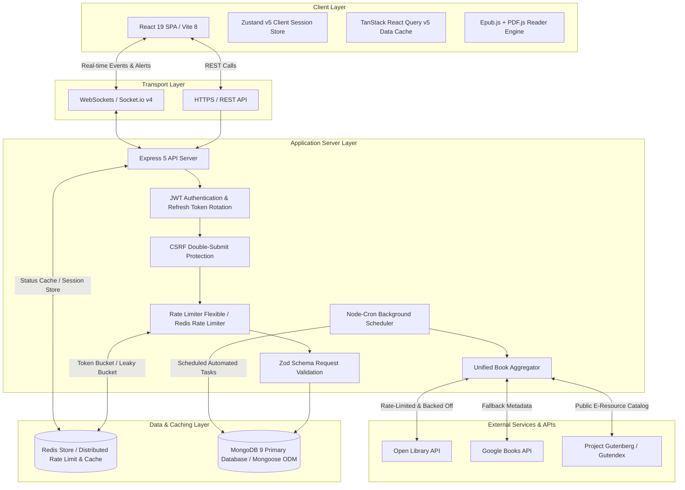
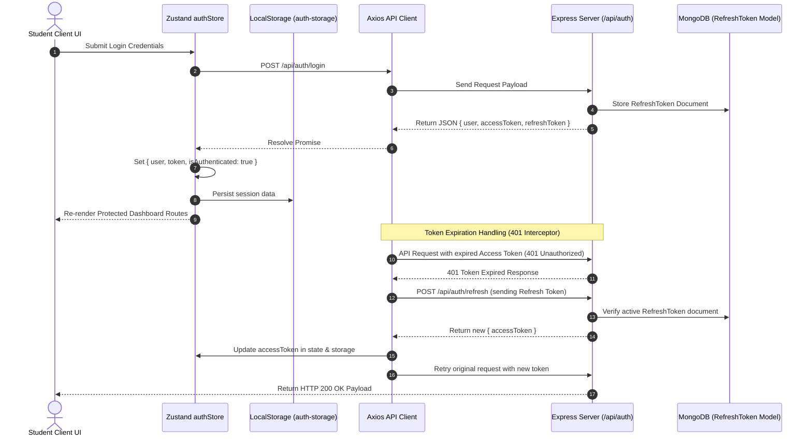
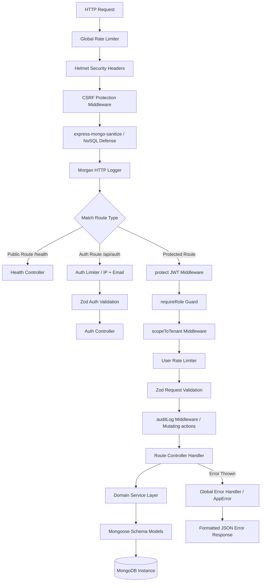
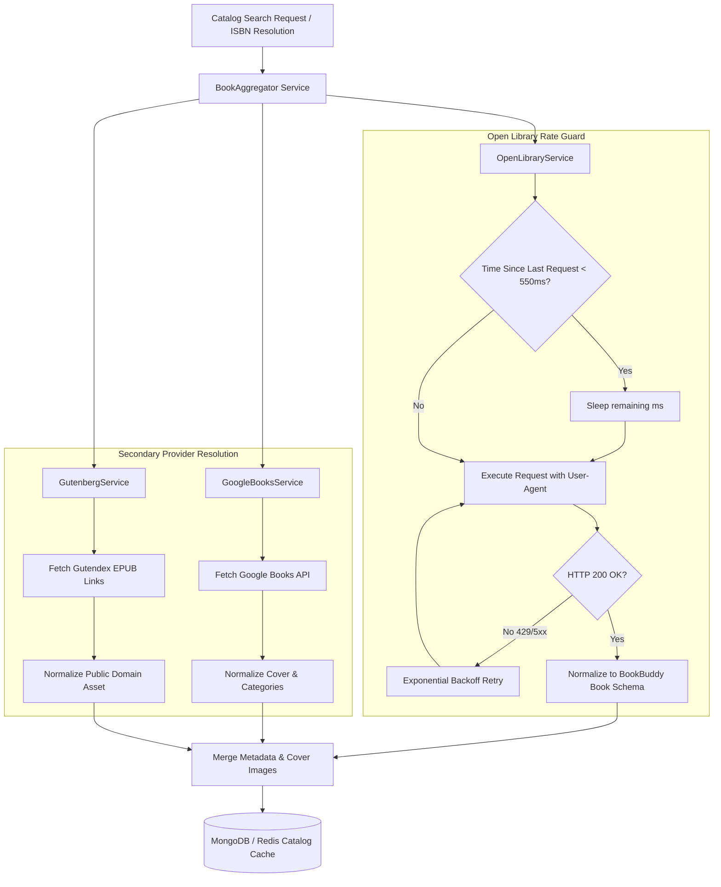
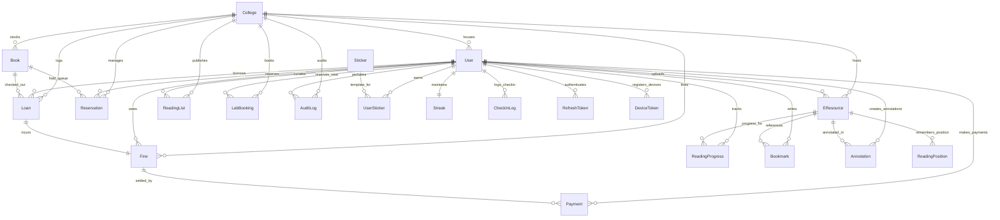
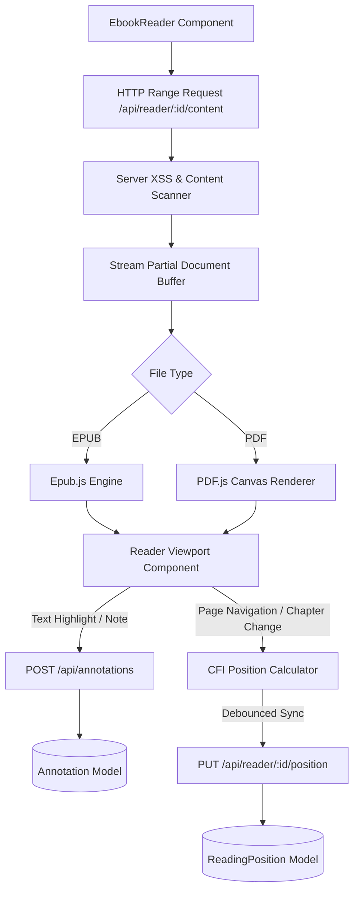
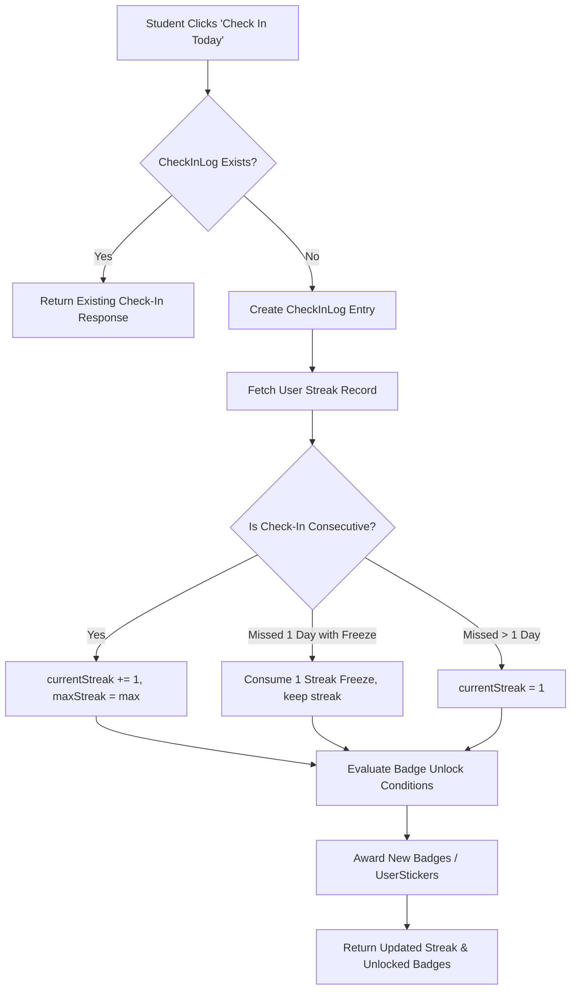

```mermaid
sequenceDiagram
    autonumber
    actor Admin as College Admin
    participant Server as Express App
    participant Auth as protect Middleware
    participant Scope as scopeToTenant Middleware
    participant Controller as collegeAdminController
    participant Service as loanService
    participant DB as MongoDB

    Admin->>Server: POST /api/dashboards/college-admin/circulation/checkout
    Server->>Auth: Verify JWT Token Signature & Claims
    Auth-->>Server: Attach req.user = { id, role: "college-admin", collegeId: "COLLEGE_123" }
    Server->>Scope: Check role requirement
    Scope-->>Server: Set req.tenantFilter = { collegeId: "COLLEGE_123" }
    Server->>Controller: Invoke checkoutBookHandler(req, res)
    Controller->>Service: checkoutBook(patronId, bookId, req.tenantFilter)
    
    rect rgb(15, 23, 42)
        Note over Service,DB: Enforce Tenant Scoped Query
        Service->>DB: Book.findOne({ _id: bookId, collegeId: "COLLEGE_123" })
        DB-->>Service: Book Record
        Service->>DB: User.findOne({ _id: patronId, collegeId: "COLLEGE_123" })
        DB-->>Service: User Record
        Service->>DB: Book.findOneAndUpdate({ _id: bookId, collegeId: "COLLEGE_123", copiesAvailable: { $gt: 0 } }, { $inc: { copiesAvailable: -1 } })
        DB-->>Service: Success Response
    end

    Service-->>Controller: Checkout Complete
    Controller-->>Admin: HTTP 201 Created (JSON Response)
```

# 📚 BookBuddy

### A modern, multi-tenant campus library management, digital e-resource hosting, facility reservation, and student engagement platform featuring gamified reading streaks, inline EPUB & PDF reading with live annotations, real-time operations, external book catalog aggregation (Open Library & Google Books), and integrated fine payments.

---

[](https://github.com/Aditya-Naikwadi/BookBuddy/actions/workflows/ci.yml)


---

## 📋 Table of Contents

- [📖 Overview & Key Differentiators](#-overview--key-differentiators)
- [🏛️ System Architecture](#️-system-architecture)
- [🎨 Frontend Architecture & State Flow](#-frontend-architecture--state-flow)
- [⚙️ Backend Architecture & Pipeline](#️-backend-architecture--pipeline)
- [🌐 External Book Catalog & Open Library Integration](#-external-book-catalog--open-library-integration)
- [🔒 Multi-Tenancy & Data Isolation](#-multi-tenancy--data-isolation)
- [🎛️ Tenant Service Selection & Feature-Gated Dashboards](#️-tenant-service-selection--feature-gated-dashboards)
- [📥 Bulk Student Roster Upload & Web Worker Engine](#-bulk-student-roster-upload--web-worker-engine)
- [🛡️ Security Architecture & Protection Suite](#️-security-architecture--protection-suite)
- [🗄️ Database Architecture, ERD & Indexing](#️-database-architecture-erd--indexing)
- [🗃️ Database Migrations, Backup & CLI Utilities](#️-database-migrations-backup--cli-utilities)
- [⚡ Concurrency Integrity & Race Condition Protection](#-concurrency-integrity--race-condition-protection)
- [✨ Portal Feature Matrix](#-portal-feature-matrix)
  - [🎓 Student Portal](#-student-portal)
  - [🏛️ College Admin Portal](#️-college-admin-portal)
  - [🌐 Super Admin Portal](#-super-admin-portal)
- [📖 Multi-Format E-Resource Reader & Annotation Engine](#-multi-format-e-resource-reader--annotation-engine)
- [💳 Online Fine Payments & Webhook Subsystem](#-online-fine-payments--webhook-subsystem)
- [🎮 Gamification & Engagement Subsystem](#-gamification--engagement-subsystem)
- [⏰ Background Scheduled Cron Jobs](#-background-scheduled-cron-jobs)
- [🔌 Complete API Reference](#-complete-api-reference)
- [⚙️ Environment Configuration Reference](#️-environment-configuration-reference)
- [🚀 Quick Start & Installation Guide](#-quick-start--installation-guide)
  - [🔑 Initial Accounts for Portal Testing](#-initial-accounts-for-portal-testing--management)
  - [Prerequisites](#prerequisites)
  - [Local Setup](#local-development-setup)
  - [Database Management, Indexing & Seeding](#database-management-indexing--multi-tenant-seeding)
  - [Docker Compose Launch](#docker-compose-launch)
  - [Testing & Coverage](#running-tests)
- [🌐 Production Build & Deployment Guide](#-production-build--deployment-guide)
- [📁 Repository Structure](#-repository-structure)
- [📄 License & Maintenance](#-license--maintenance)

---

## 📖 Overview & Key Differentiators

Traditional library systems act as static catalogs, failing to meet modern student expectations for real-time collaboration, digital accessibility, and interactive academic engagement. **BookBuddy** re-imagines the college library as an integrated digital campus hub.

BookBuddy bridges the gap between platform super-administrators, campus librarians, and students by consolidating:
1. **Multi-Tenant Physical Inventory Management**: Multi-branch physical book tracking, hold queue reservations with auto-promotion, and automated overdue fine calculations.
2. **Computer Lab Workstation Reservations**: Real-time seat grid visualization and concurrency-locked time-slot bookings.
3. **Digital E-Resource Repository, Reader & Annotations**: In-browser EPUB & PDF parsing, Stored-XSS injection scanning, HTTP range streaming, CFI/page position synchronization, and persistent text annotations & notes.
4. **External Book Catalog Aggregation**: Automated metadata enrichment and search resolution across Open Library API, Google Books API, and Project Gutenberg.
5. **Online Fine Payment Settlement**: Digital fine payment processing with transaction verification and idempotent payment webhook integration.
6. **Gamified Student Engagement**: Idempotent daily reading check-ins, streak calculations with freeze log buffers, and unlockable achievement stickers and milestone badges.
7. **Real-Time Event & Notification Network**: Socket.io WebSocket alerts, in-app notification centers, and automated push device token tracking.

---

## 🏛️ System Architecture

BookBuddy uses a decoupled, event-driven architecture designed for high throughput, strict tenant isolation, sub-second client updates, and fault-tolerant external API aggregation.



---

## 🎨 Frontend Architecture & State Flow

### Technical Stack & Rationale
- **React 19 & Vite 8**: Direct JSX rendering with instantaneous HMR dev server build cycles.
- **Tailwind CSS v4 & PostCSS**: Utility-first styling utilizing CSS native variables and modern dark/light mode themes.
- **Zustand v5 & TanStack React Query v5**: Zustand handles lightweight UI state and persisted session data (`auth-storage` in `localStorage`), while React Query handles server state caching, optimistic updates, and background re-fetching.
- **Epub.js & PDF.js Worker**: Client-side document parsing and canvas rendering for EPUB and PDF e-resources without external plugins.
- **Framer Motion & Canvas Confetti**: Micro-interactions, page transitions, and streak check-in milestone celebrations.

### Authentication & Session Persistence Flow



---

## ⚙️ Backend Architecture & Pipeline

Incoming HTTP requests pass through an isolated sequence of middleware gates to sanitize inputs, enforce rate limits, verify JWT signatures & CSRF tokens, and scope to tenant ID before invoking controller logic.



---

## 🌐 External Book Catalog & Open Library Integration

BookBuddy features a production-grade external book catalog integration service layer (`OpenLibraryService`, `GoogleBooksService`, `GutenbergService`, `BookAggregator`) designed for rate-limited, fault-tolerant book discovery and metadata enrichment.



### Key Capabilities & Policy Compliance
1. **Mandated User-Agent Header**: Requests to Open Library API strictly specify an identified user-agent header (`OPEN_LIBRARY_USER_AGENT=BookBuddy/1.0 (dev@bookbuddy.com)`), satisfying Open Library API terms of service.
2. **Rate Limit Guard (< 2 Req/Sec)**: Implements an internal rate limiter (`_rateLimitGuard`) enforcing a minimum 550ms delay between consecutive outbound HTTP requests, preventing IP throttling.
3. **Resilient Retry with Exponential Backoff**: Transient errors (`429 Too Many Requests`, `5xx Server Errors`) automatically trigger exponential backoff retries with random jitter (`Math.pow(2, retryCount) * 1000 + randomJitter`).
4. **High-Resolution Cover Mapping**: Dynamically resolves Open Library cover IDs (`cover_i`) and ISBNs (ISBN-10 / ISBN-13) to Open Library high-resolution cover endpoints (`https://covers.openlibrary.org/b/id/{id}-L.jpg`).
5. **Memory-Efficient Bulk Dump Parser**: Includes a stream-based parser script (`server/src/scripts/parseOpenLibraryDump.js`) utilizing Node.js `readline` interfaces to stream multi-gigabyte Open Library `.json.gz` data dumps in `O(1)` memory.

---

## 🔒 Multi-Tenancy & Data Isolation

BookBuddy enforces strict multi-tenancy at the middleware layer using `scopeToTenant`. For non-super-admin users, `scopeToTenant` extracts `req.user.collegeId` from the verified JWT and attaches `req.tenantFilter = { collegeId: req.user.collegeId }`. Controllers use this object in all Mongoose queries to prevent cross-tenant data leaks.



---

## 🎛️ Tenant Service Selection & Feature-Gated Dashboards

BookBuddy implements a data-driven feature-gating system where each college institution's enabled service modules dictate the layout, navigation, and accessible routes across both College Admin and Student portals.

1. **Service Selection Wizard (Tenant Onboarding Step 3)**:
   - When a college administrator registers their institution, Step 3 of the onboarding wizard provisions their tenant's service modules (`selectedServices: string[]`).
   - Grouped into 4 service categories: **Core** (Catalog, Circulation, Patron Card, Fines), **Engagement** (E-Resources, Reading Lists, AI Recommendations, Gamification), **Facilities** (Lab & Seat Booking, Helpdesk), and **Analytics**.
   - Offers preset service bundles (**Essentials Bundle**, **Full Suite**) with individual toggle customization and inline dependency resolution (e.g. enabling *Gamification* automatically resolves and checks *AI Recommendations*).
   - Enforces core service validation before proceeding.

2. **FeatureFlagProvider & Hooks**:
   - `FeatureFlagProvider` (`client/src/context/FeatureFlagContext.jsx`) fetches the college's active feature config (`GET /api/college/:id/features`) once per session via `@tanstack/react-query`.
   - Exposes `useFeature(key)` and `useFeatureFlags()` hooks throughout the client component tree without prop-drilling.

3. **Data-Driven Navigation & Route Guards**:
   - Navigation configurations (`client/src/config/navigation.js`) drive both desktop sidebar and mobile bottom navigation in `DashboardLayout.jsx`. Disabled features are automatically omitted from student navigation menus.
   - Page routes wrapped with `<FeatureGate feature="..." isPageGate>` present a friendly fallback page (`FeatureUnavailablePage.jsx`) if accessed by direct URL.

---

## 📥 Bulk Student Roster Upload & Web Worker Engine

The College Admin Dashboard features an enterprise bulk student import engine designed to handle rosters of thousands of student records seamlessly without blocking main-thread UI rendering.

1. **Non-Blocking Web Worker Parsing**:
   - Uploaded CSV files are parsed in a dedicated background Web Worker (`client/src/workers/csvParser.worker.js`) via Vite Web Worker imports (`new Worker(new URL('./csvParser.worker.js', import.meta.url), { type: 'module' })`).
   - Runs client-side validation for required fields (`Student ID`, `Full Name`, `Email`), email regex syntax, and intra-file duplicate Student IDs.

2. **Virtualized Preview Table & Inline Data Cleaning**:
   - `UploadPreviewTable.jsx` utilizes windowed rendering to display thousands of candidate rows at 60 FPS.
   - Each row displays status indicators (`Valid`, `Warning`, `Error`). Admins can double-click cells to edit malformed emails or missing fields inline with instant re-validation.
   - Includes an `ErrorOnlyFilterToggle.jsx` switch to filter preview rows directly to error records.

3. **Adapted CSV Template Generator**:
   - `TemplateDownloadButton.jsx` reads `useFeatureFlags()` and generates a CSV template whose columns dynamically adapt to the college's active features (e.g. adding *Preferred Lab* if Facilities Booking is enabled).

4. **Async Upload Job Status & Error CSV Export**:
   - Submitting an import triggers asynchronous backend processing (`POST /api/college/:id/students/bulk-upload`).
   - `UploadProgressPanel.jsx` polls job status using exponential backoff (1.5s → 3s → 6s).
   - Upon completion, `UploadResultSummary.jsx` displays processed/failed statistics, offers a downloadable CSV error report for failed rows, and provides a one-click action to re-upload just the corrected failed subset.

---

## 🛡️ Security Architecture & Protection Suite

1. **Authentication & Token Rotation**: Access Tokens (15 mins) and Refresh Tokens stored in MongoDB (`RefreshToken` model) with session invalidation capabilities.
2. **Dual Identifier Login & MFA (2FA)**: Authentication supports both Email addresses and Student/Admin IDs. Supports optional Multi-Factor Authentication (`mfaSecret` / `totpCode`) with 6-digit TOTP authenticator verification.
3. **CSRF Protection**: Double-submit CSRF cookie pattern validation (`csrf.js`).
4. **Password Hashing**: Passwords secured using `Argon2id` / `bcrypt` with transparent upgrade.
5. **NoSQL Injection Defense**: `express-mongo-sanitize` strips `$` and `.` characters from incoming `req.body`, `req.query`, and `req.params`.
6. **HTTP Header Hardening**: `helmet` sets X-Content-Type-Options, X-Frame-Options, Strict-Transport-Security, and Content Security Policies.
7. **E-Resource Stored-XSS Sanitization**: EPUB archives are parsed server-side with `adm-zip` to strip `<script>` tags, inline event handlers (`onload`, `onerror`), and `javascript:` protocol links before storage.
8. **Input Validation**: All request payloads are validated using strict `Zod` schemas prior to controller execution.
9. **Multi-Tier Rate Limiting** (`express-rate-limit` / `rate-limiter-flexible` backed by Redis):

| Tier | Window | Max Requests | Key / Identifier | Targeted Endpoints |
| :--- | :--- | :--- | :--- | :--- |
| **Global Limiter** | 1 Minute | 100 | IP Address | All API routes (`/api/*`) |
| **Auth Strict Limiter** | 15 Minutes | 5 | IP + Email Combo | `/api/auth/login`, `/api/auth/register` |
| **Auth IP Fallback** | 15 Minutes | 20 | IP Address | `/api/auth/*` |
| **User Limiter** | 1 Minute | 100 | User ID / JWT Sub | Protected routes |
| **Expensive Routes** | 1 Minute | 10 | User ID / IP | Analytics, catalog text search, reports |

---

## 🗄️ Database Architecture, ERD & Indexing

### Entity-Relationship Diagram (ERD)



### Collection Schema Indexes

| Target Collection | Index Definition | Index Type | Target Query Path / Purpose |
| :--- | :--- | :--- | :--- |
| `users` | `{ email: 1 }` | Single-Field, Unique | Fast user login & authentication lookup |
| `users` | `{ studentId: 1, collegeId: 1 }` | Compound, Unique | Patron ID identification within college |
| `books` | `{ collegeId: 1, title: "text", author: "text", isbn: "text" }` | Compound Text Index | Full-text catalog search scoped to college |
| `loans` | `{ collegeId: 1, status: 1 }` | Compound | College Admin active/overdue loans queue |
| `loans` | `{ userId: 1, status: 1 }` | Compound | Student active borrowed books dashboard |
| `fines` | `{ userId: 1, status: 1 }` | Compound | Outstanding fine balance aggregation |
| `fines` | `{ loanId: 1 }` | Single-Field, Unique | Fine accrual idempotency (blocks duplicate fines) |
| `annotations` | `{ userId: 1, eresourceId: 1 }` | Compound | User annotations query per digital resource |
| `payments` | `{ transactionId: 1 }` | Single-Field, Unique | Payment transaction verification idempotency |
| `reservations` | `{ bookId: 1, status: 1, queuePosition: 1 }` | Compound | Fast hold-queue promotion on book return |
| `labbookings` | `{ seatId: 1, date: 1, timeslot: 1, status: 1 }` | Compound, Partial Unique | Concurrency lock (prevents double bookings) |
| `readingprogresses`| `{ userId: 1, eresourceId: 1 }` | Compound, Unique | E-resource progress upserts |
| `readingpositions` | `{ userId: 1, eResourceId: 1 }` | Compound, Unique | Ebook CFI bookmark position lookup |
| `userstickers` | `{ userId: 1, stickerId: 1 }` | Compound, Unique | Prevents duplicate badge/sticker rewards |
| `streaks` | `{ userId: 1 }` | Single-Field, Unique | Direct streak status lookup and daily update |
| `checkinlogs` | `{ userId: 1, checkInDate: 1 }` | Compound, Unique | Enforces single check-in per day |
| `refreshtokens` | `{ token: 1 }`, `{ userId: 1 }` | Single-Field / Compound | Fast session lookup and user logout revocation |
| `pendingadminsetups` | `{ setupToken: 1 }` | Single-Field, Unique | Fast lookup for college admin onboarding setup tokens |
| `platformmetricsnapshots` | `{ snapshotDate: -1 }` | Single-Field | Rapid historical platform health and metrics trends lookup |
| `auditlogs` | `{ collegeId: 1, createdAt: -1 }` | Compound | Scoped tenant audit trail queries with immutability protection |
| `eresourcesubmissions` | `{ status: 1, createdAt: -1 }` | Compound | Super Admin platform content moderation queue |
| `collegefeatureconfigs` | `{ collegeId: 1 }` | Single-Field, Unique | Fast tenant service feature flags and gating lookup |

---

## 🗃️ Database Migrations, Backup & CLI Utilities

BookBuddy provides a comprehensive suite of migration and maintenance scripts under `server/src/scripts/` and `server/migrations/`:

### Database Migration Scripts
| Script / Command | File Path | Purpose / Action Taken |
| :--- | :--- | :--- |
| `npm run migrate:db` | `server/src/scripts/migrateIndicesAndDefaults.js` | Populates default `maxFineLimit: 100` on Colleges and generates 32-byte hex `cardSecret` tokens for users. |
| `npm run migrate:up` | `server/migrations/` | Runs all pending `migrate-mongo` migration scripts. |
| `npm run migrate:down` | `server/migrations/` | Rolls back the last `migrate-mongo` migration step. |
| `npm run migrate:hardening` | `server/src/scripts/migrateProductionHardening.js` | Applies strict production indexing rules, compound unique constraints, and schema validations. |
| `node src/scripts/migrateNotificationReadFields.js` | `server/src/scripts/migrateNotificationReadFields.js` | Converts legacy boolean `read: true/false` notification fields to timestamped `readAt: Date` values. |

### Database Backup & Maintenance Utilities
| Script / Command | File Path | Purpose / Action Taken |
| :--- | :--- | :--- |
| `node src/scripts/backupDatabase.js` | `server/src/scripts/backupDatabase.js` | Creates timestamped JSON/BSON collection dumps under `server/backups/`. |
| `node src/scripts/restoreDatabase.js` | `server/src/scripts/restoreDatabase.js` | Restores MongoDB collections from target backup archive folders. |
| `npm run db:clear` | `server/src/scripts/clearDatabase.js` | Safely purges sample documents while retaining index definitions and system configuration. |
| `node src/scripts/purgeMockData.js` | `server/src/scripts/purgeMockData.js` | Selectively deletes test patrons and mock circulation records. |
| `node src/scripts/openLibraryCron.js` | `server/src/scripts/openLibraryCron.js` | Triggers manual CLI execution of the Open Library external catalog ingestion worker. |
| `node src/scripts/parseOpenLibraryDump.js` | `server/src/scripts/parseOpenLibraryDump.js` | Parses compressed Open Library `.json.gz` bulk data dumps in `O(1)` memory. |

---

## ⚡ Concurrency Integrity & Race Condition Protection

1. **Atomic Inventory Decrement**:
   Checkouts decrease `copiesAvailable` only if `copiesAvailable > 0`, avoiding negative inventory levels under concurrent requests:
   ```js
   const updatedBook = await Book.findOneAndUpdate(
     { _id: bookId, collegeId, copiesAvailable: { $gt: 0 } },
     { $inc: { copiesAvailable: -1 } },
     { new: true }
   );
   if (!updatedBook) throw new AppError('Book is currently out of stock.', 400);
   ```

2. **Partial Unique Index Lock on Lab Bookings**:
   Prevents double bookings for the same seat, date, and timeslot:
   ```js
   LabBookingSchema.index(
     { seatId: 1, date: 1, timeslot: 1 },
     { unique: true, partialFilterExpression: { status: 'booked' } }
   );
   ```

3. **Idempotent Fine Accrual**:
   Unique constraint on `Fine.loanId` prevents background workers from creating duplicate fines for a late return.

4. **Idempotent Fine Payments**:
   Unique index on `Payment.transactionId` ensures payment webhooks cannot double-credit a student's balance.

---

## ✨ Portal Feature Matrix

### 🎓 Student Portal
- **Catalog Search**: Full-text physical book & digital asset search with live availability tracking and external metadata enrichment.
- **My Borrowed Books & Fine Tracking**: View active loans, due dates, renewals, and fine details.
- **Digital Patron Card**: Interactive virtual card with barcode & QR code generation for library circulation.
- **Inline EPUB & PDF Reader**: Read digital ebooks with dark/light mode, typography settings, Table of Contents navigation, and CFI/page autosync.
- **Highlights & Notes**: Create, edit, highlight, and filter text annotations directly inside e-resources.
- **Digital Fine Payment Settlement**: Pay overdue library fines online securely with instant digital receipts.
- **Gamification Suite**: Daily check-ins, streak counts, streak freeze protection, and unlockable achievement badges & stickers.
- **Computer Lab Reservations**: View live workstation maps and reserve computer lab timeslots.
- **Support & Purchase Suggestions**: Submit book purchase recommendations, file complaints, and track status resolutions.

### 🏛️ College Admin Portal
- **Circulation Desk**: Atomic book checkouts, check-ins, renewals, and fine collection.
- **Catalog Management**: Add, update, archive, or remove physical books and digital e-resources.
- **Patron Management**: Manage student & faculty accounts, modify access statuses, and review activity history.
- **E-Resource Uploader**: Upload EPUB & PDF files with built-in Stored-XSS scanning and moderation options.
- **Lab Workstation Management**: Define lab layouts, add workstation seats, and monitor bookings.
- **Financial & Analytics Hub**: Monitor circulation metrics, popular titles, and revenue collections.

### 🌐 Super Admin Portal & Operations Control Plane
- **Platform System Overview**: Monitor real-time platform metrics, active college tenant counters, patron volumes, digital resource storage stats, and historical metric snapshot trends (`PlatformMetricSnapshot`).
- **College Tenant & Admin Manager**: Onboard new college institutions, configure feature-gated service modules, issue single-use secure setup links (`PendingAdminSetup`), and provision college admin access credentials.
- **Global Content Moderation**: Review, approve, or reject public e-resource submissions (`EResourceSubmission`) with automated Stored-XSS scanning, status badges, and platform-wide distribution controls.
- **Centralized Security Audit Logs**: Operational data tables (`OpsDataTable`, `OpsSeverityBadge`, `OpsHeader`) with immutable audit trails (`AuditLog`), category/severity filtering, and IP tracing for system mutations and security events.

---

## 📖 Multi-Format E-Resource Reader & Annotation Engine

The multi-format reader provides digital reading directly within the browser:



---

## 💳 Online Fine Payments & Webhook Subsystem

The fine payment module enables digital settlement of library fines:

```mermaid
graph TD
    Student[Student UI] --> InitPay[POST /api/payments/checkout-session]
    InitPay --> Gateway[Payment Gateway API]
    Gateway -->> Student: Return Payment Gateway URL / Token
    Student ->> Gateway: Complete Payment
    Gateway --> Webhook[POST /api/payments/webhook]
    Webhook --> Verify[Verify Signature & Transaction ID]
    Verify --> MarkFine[Update Fine status to 'paid']
    Verify --> RecordPay[Create Payment Record in MongoDB]
    RecordPay --> Socket[Socket.io Real-time Payment Confirmation]
    Socket -->> Student: Instant UI Balance Update & Receipt
```

---

## 🎮 Gamification & Engagement Subsystem

BookBuddy includes a gamification system designed to encourage consistent reading habits:



---

## ⏰ Background Scheduled Cron Jobs & Disconnection Safety

Executed automatically via `node-cron` inside `server/src/services/cronService.js` and `server/src/services/aggregationCronWorker.js`:

| Job Name | Schedule | Purpose / Action Taken |
| :--- | :--- | :--- |
| **Overdue Fine Accrual** | `0 0 * * *` (Midnight) | Evaluates late loans, updates loan status to `overdue`, and creates unpaid `Fine` records. |
| **Hold Reservation Expiry** | `0 * * * *` (Hourly) | Expire uncollected hold reservations exceeding the pickup window and promotes the next patron in line. |
| **Due Date Reminders** | `0 9 * * *` (9 AM Daily) | Dispatches WebSocket & in-app notifications for loans due within 24–48 hours. |
| **Streak Expiry & Reminders** | `0 * * * *` (Hourly) | Resets active reading streaks if no check-in occurred within the user's timezone day (or consumes a streak freeze). Sends reminder notifications 3 hours before midnight to users at risk. |
| **External Catalog Ingestion** | `0 3 * * *` (3 AM Daily) | Dispatches `aggregationCronWorker` to sync metadata, covers, and subjects from Open Library & Google Books APIs. |

### Cron Disconnection Safety & Isolation
- **Connection Guard**: `runJob` inspects `mongoose.connection.readyState === 1` before invoking any cron task, skipping database queries when disconnected to avoid query buffering timeouts.
- **Silent Log Error Catch**: `CronRunLog.create(...).catch(() => {})` safely catches log writing errors during database connection interruptions, preventing unhandled promise rejections.

---

## 🔌 Complete API Reference

### 🔐 Authentication (`/api/auth`)

| Method | Endpoint | Auth Required | Allowed Roles | Description |
| :--- | :--- | :---: | :--- | :--- |
| `POST` | `/api/auth/register` | No | Public | Register a new student account |
| `POST` | `/api/auth/login` | No | Public | Authenticate credentials & return JWT access/refresh tokens |
| `POST` | `/api/auth/refresh` | No | Public | Issue new Access Token using valid Refresh Token |
| `POST` | `/api/auth/logout` | Yes | All Roles | Revoke current user session & refresh token |

### 📚 Physical Books & Catalog (`/api/books`, `/api/catalog`)

| Method | Endpoint | Auth Required | Allowed Roles | Description |
| :--- | :--- | :---: | :--- | :--- |
| `GET` | `/api/books` | Yes | `student`, `college-admin` | Search physical books catalog (tenant-scoped) |
| `GET` | `/api/books/:id` | Yes | `student`, `college-admin` | Fetch detailed book information & current holds |
| `POST` | `/api/books` | Yes | `college-admin` | Add a new physical book title to inventory |
| `PUT` | `/api/books/:id` | Yes | `college-admin` | Update book metadata or copy quantities |
| `DELETE` | `/api/books/:id` | Yes | `college-admin` | Remove a book title from the catalog |

### 📖 E-Resources, Reader & Annotations (`/api/eresources`, `/api/reader`, `/api/annotations`)

| Method | Endpoint | Auth Required | Allowed Roles | Description |
| :--- | :--- | :---: | :--- | :--- |
| `GET` | `/api/eresources` | Yes | All Roles | List digital e-resources (EPUBs, PDFs) |
| `POST` | `/api/reader/upload` | Yes | `college-admin`, `super-admin` | Upload EPUB/PDF file with automated XSS scanning |
| `GET` | `/api/reader/:resourceId/content` | Yes | All Roles | Stream document content using HTTP range requests |
| `GET` | `/api/reader/:resourceId/position` | Yes | `student` | Fetch user's saved CFI/page reading position |
| `PUT` | `/api/reader/:resourceId/position` | Yes | `student` | Update saved CFI/page reading position |
| `GET` | `/api/annotations` | Yes | `student` | Get user annotations for an e-resource |
| `POST` | `/api/annotations` | Yes | `student` | Create text highlight or note annotation |
| `DELETE` | `/api/annotations/:id` | Yes | `student` | Delete specified annotation |

### 💳 Fine Payments (`/api/payments`, `/api/fines`)

| Method | Endpoint | Auth Required | Allowed Roles | Description |
| :--- | :--- | :---: | :--- | :--- |
| `GET` | `/api/fines/my-fines` | Yes | `student` | List student unpaid and paid fine history |
| `POST` | `/api/fines/:id/pay` | Yes | `college-admin` | Record manual cash payment for student fine |
| `POST` | `/api/payments/checkout-session` | Yes | `student` | Initiate online payment session for fine balance |
| `POST` | `/api/payments/webhook` | No | Gateway Signature | Webhook handler for idempotent transaction processing |
| `GET` | `/api/payments/history` | Yes | `student` | Retrieve payment receipts and history |

### 🔄 Circulation & Holds (`/api/loans`, `/api/reservations`)

| Method | Endpoint | Auth Required | Allowed Roles | Description |
| :--- | :--- | :---: | :--- | :--- |
| `POST` | `/api/dashboards/college-admin/circulation/checkout` | Yes | `college-admin` | Atomic book checkout to student |
| `POST` | `/api/dashboards/college-admin/circulation/return` | Yes | `college-admin` | Atomic book return & automatic hold promotion |
| `POST` | `/api/dashboards/student/reservations` | Yes | `student` | Reserve an out-of-stock physical book |
| `DELETE` | `/api/dashboards/student/reservations/:id` | Yes | `student` | Cancel active reservation |

### 🎮 Gamification & Streaks (`/api/checkin`, `/api/streak`, `/api/badges`)

| Method | Endpoint | Auth Required | Allowed Roles | Description |
| :--- | :--- | :---: | :--- | :--- |
| `POST` | `/api/checkin` | Yes | `student` | Idempotent daily check-in |
| `GET` | `/api/streak` | Yes | `student` | Retrieve current streak, freezes, and stats |
| `GET` | `/api/streak/history` | Yes | `student` | Fetch check-in history logs for calendar view |
| `POST` | `/api/streak/recalculate` | Yes | `student` | Audit & reconstruct streak from check-in logs |
| `GET` | `/api/badges` | Yes | `student` | Fetch all available badges & user unlock status |

### 🖥️ Facility & Lab Workstation Bookings (`/api/lab`)

| Method | Endpoint | Auth Required | Allowed Roles | Description |
| :--- | :--- | :---: | :--- | :--- |
| `GET` | `/api/lab/seats` | Yes | `student`, `college-admin` | Fetch lab workstation seats and availability |
| `POST` | `/api/dashboards/student/lab-bookings` | Yes | `student` | Concurrency-locked seat reservation |
| `DELETE` | `/api/dashboards/student/lab-bookings/:id` | Yes | `student` | Cancel lab seat booking |

---

## ⚙️ Environment Configuration Reference

Create a `.env` file in the `server/` directory:

```env
# Server Configuration
PORT=5000
NODE_ENV=development
MONGO_URI=mongodb://localhost:27017/bookbuddy
CLIENT_ORIGIN=http://localhost:5173

# JWT Secrets & Expiration
JWT_SECRET=your_super_secret_access_key_change_in_production
JWT_REFRESH_SECRET=your_super_secret_refresh_key_change_in_production
JWT_ACCESS_EXPIRY=15m
JWT_REFRESH_EXPIRY=7d

# Redis Configuration (Distributed Rate Limiting & Caching)
REDIS_URL=redis://localhost:6379

# External API Configuration (Open Library & Google Books)
OPEN_LIBRARY_USER_AGENT=BookBuddy/1.0 (dev@bookbuddy.com)
OPEN_LIBRARY_BASE_URL=https://openlibrary.org
GOOGLE_BOOKS_API_KEY=your_google_books_api_key_optional

# Rate Limiting Parameters
RATE_LIMIT_GLOBAL_MAX=100
RATE_LIMIT_GLOBAL_WINDOW_MS=60000
RATE_LIMIT_AUTH_MAX=5
RATE_LIMIT_AUTH_IP_MAX=20
RATE_LIMIT_AUTH_EMAIL_MAX=5
RATE_LIMIT_AUTH_WINDOW_MS=900000
RATE_LIMIT_USER_MAX=100
RATE_LIMIT_USER_WINDOW_MS=60000
RATE_LIMIT_EXPENSIVE_MAX=10
RATE_LIMIT_EXPENSIVE_WINDOW_MS=60000
```

---

## 🚀 Quick Start & Installation Guide

### 🔑 Initial Accounts for Portal Testing & Management

| Role / Dashboard | Email / Identifier | Password | Target Dashboard Route |
| :--- | :--- | :--- | :--- |
| **Super Admin** | `SuperAdmin@bookbuddy.com` *(or `SUPER_01`)* | `superadmin` | `/admin-portal` |
| **College Admin** | `collegeadmin@bookbuddy.com` *(or `ADM_001`)* | `Demo@123` | `/college-admin` |
| **Student** | `student@bookbuddy.com` *(or `STU1001`)* | `Demo@123` | `/student-dashboard` |
| **General User** | `general@bookbuddy.com` | `Demo@123` | `/general-dashboard` |

*Note: Authentication supports both Email addresses and Student/Admin IDs, verified dynamically against MongoDB via Express API routes. Run `npm run seed:dataset` in `server/` to initialize or refresh these records.*

### Prerequisites
- **Node.js**: `v20.x` or later (`node -v`)
- **MongoDB**: `v6.0` or later running on port `27017`
- **Redis**: Recommended for distributed rate limiting (falls back to in-memory mode if unavailable)

### Local Development Setup

1. **Clone the repository**:
   ```bash
   git clone https://github.com/Aditya-Naikwadi/BookBuddy.git
   cd BookBuddy
   ```

2. **Install Server Dependencies**:
   ```bash
   cd server
   npm install
   ```

3. **Install Client Dependencies**:
   ```bash
   cd ../client
   npm install
   ```

4. **Configure Environment Variables**:
   Create `server/.env` with your settings (see [Environment Configuration](#️-environment-configuration-reference)).

### Database Management, Indexing & Multi-Tenant Seeding

Run the following utility scripts in `server/` to manage database indexes and test data:

```bash
cd server

# 1. Synchronize schema indexes and defaults
npm run migrate:db

# 2. Execute pending database migrations
npm run migrate:up

# 3. Apply production hardening indexes
npm run migrate:hardening

# 4. Seed production-ready multi-tenant dataset (3 Colleges, 21 Role Accounts)
npm run seed:dataset

# 5. Purge mock data and reset clean state
npm run db:clear
```

5. **Start the API Server**:
   ```bash
   cd server
   npm run dev
   ```
   *The Express API will listen at `http://localhost:5000`.*

6. **Start the React Frontend**:
   ```bash
   cd client
   npm run dev
   ```
   *Open `http://localhost:5173` in your browser.*

### Docker Container Launch

Boot MongoDB, Redis, and the multi-stage Node.js server container:

```bash
cd server
docker-compose up --build
```

*Note: The production `Dockerfile` uses a multi-stage Alpine build (`node:20-alpine`) featuring native C++ build tools (`python3`, `make`, `g++`) for native dependencies (`bcrypt`), non-root execution (`USER node`), and automated database migrations (`npx migrate-mongo up`) upon container initialization.*

### Running Tests

Execute Jest unit, integration, and security test suites:

```bash
cd server
npm test
```

---

## 📁 Repository Structure

```
BookBuddy/
├── .github/
│   └── workflows/
│       └── ci.yml              # GitHub Actions CI/CD Pipeline
├── client/                     # React 19 Frontend Application (Vite 8 / Tailwind v4)
│   ├── public/                 # Static assets & PDF.js worker (pdf.worker.min.mjs)
│   ├── src/
│   │   ├── api/                # Axios API client connection & interceptors
│   │   ├── components/         # Shared UI components & layout elements
│   │   │   └── student/        # Patron card, ebook reader, support, analytics, streak
│   │   ├── features/           # Specialized feature modals (milestone celebrations)
│   │   ├── hooks/              # Custom React hooks (socket, reader, checkin, support)
│   │   ├── pages/              # Main view routes & dashboards (Student, College Admin, Super Admin)
│   │   └── store/              # Zustand global state stores (authStore)
│   ├── package.json
│   └── vite.config.js
├── docs/                       # Architectural Specifications & Deep-Dives
│   └── architecture/
│       ├── frontend-design.md  # Client-side routing, state, and rendering details
│       ├── backend-design.md   # Express middleware, handlers, and job scheduling
│       └── database-design.md  # Mongoose schemas, indexes, and concurrency locks
├── server/                     # Express Backend Application (CommonJS / Node 20)
│   ├── migrations/             # migrate-mongo migration files
│   ├── src/
│   │   ├── controllers/        # Express request handlers & business rules
│   │   │   └── dashboards/     # Student, College Admin, Super Admin dashboard controllers
│   │   ├── middlewares/        # Auth, CSRF, scoping, Zod validation, rate limiters
│   │   ├── models/             # 28+ Mongoose models and database index definitions
│   │   ├── routes/             # REST API routing definitions
│   │   ├── scripts/            # Migration, backup, restore, & Open Library scripts
│   │   ├── services/           # Decoupled domain business logic, external API clients, & cron worker
│   │   ├── sockets/            # Real-time WebSocket connection handling
│   │   └── tests/              # Jest integration, audit, & security test suites
│   ├── docker-compose.yml
│   ├── package.json
│   └── server.js
├── vercel.json                 # Vercel deployment configuration
├── .gitignore
└── README.md
```

---

## 🌐 Production Build & Deployment Guide

BookBuddy is engineered for zero-downtime, high-performance production deployment across cloud platforms (Vercel, Render, AWS Elastic Beanstalk, Docker Swarm, Kubernetes).

### 1. Production Build Commands

```bash
# 1. Install client dependencies & build optimized client bundle
cd client
npm install
npm run build

# 2. Test server in production mode
cd ../server
npm install
NODE_ENV=production npm start
```

### 2. Vercel Serverless & SPA Configuration (`vercel.json`)
For client-side single page application routing (`react-router-dom`), serverless functions, and dependency installation flags, `vercel.json` is configured in the root directory:
```json
{
  "installCommand": "npm install --legacy-peer-deps && npm install --prefix server --legacy-peer-deps && npm install --prefix client --legacy-peer-deps",
  "buildCommand": "npm run build --prefix client",
  "outputDirectory": "client/dist",
  "functions": {
    "api/index.js": {
      "includeFiles": "server/src/**"
    }
  },
  "rewrites": [
    {
      "source": "/api/:path*",
      "destination": "/api"
    },
    {
      "source": "/(.*)",
      "destination": "/index.html"
    }
  ]
}
```

### 3. Production Environment Checklist
- Set `NODE_ENV=production` on the API server.
- Configure production MongoDB Atlas connection string (`MONGODB_URI`) with replica set support.
- Configure Redis host (`REDIS_HOST`, `REDIS_PORT`, `REDIS_PASSWORD`) for rate limiting and cache storage.
- Provide strong random JWT secret strings (`JWT_SECRET`, `REFRESH_TOKEN_SECRET`) with 64+ characters.
- Configure `OPEN_LIBRARY_USER_AGENT` with valid platform contact details.
- Ensure CORS origin (`CLIENT_URL`) matches your production frontend domain.

### 4. GitHub Actions Automated CI/CD Pipeline (`.github/workflows/ci.yml`)
BookBuddy utilizes a GitHub Actions workflow with three automated pipeline jobs:
1. **Continuous Integration (`ci`)**:
   - Spawns a `mongo:6.0` service container on `localhost:27017`.
   - Installs server dependencies and verifies Linter compliance (`npm run lint`).
   - Validates environment variables (`MONGO_URI`, `JWT_SECRET`, `JWT_REFRESH_SECRET`, `CLIENT_ORIGIN`).
   - Executes Jest integration, security, and schema test suites (`npm test`).
   - Verifies production Vite bundle compilation (`npm run build`).
2. **Automated Vercel Deployment (`deploy-vercel`)**:
   - Triggers on push to `main`/`master` branches.
   - Detects `VERCEL_TOKEN` repository secret availability.
   - Pulls production environment variables, prebuilds deployment artifacts, and deploys to Vercel Production (`vercel deploy --prebuilt --prod`).
3. **GitHub Container Registry Deployment (`deploy-docker`)**:
   - Triggers on push to `main`/`master` branches.
   - Converts repository name to lowercase (`REPO_LOWER`).
   - Builds multi-stage Docker image via Docker Buildx (`server/Dockerfile`).
   - Pushes tagged Docker image (`ghcr.io/<repo>/bookbuddy-server:latest` and `:commit-sha`) to GitHub Container Registry (`ghcr.io`).

### 5. Render Free-Tier Keep-Alive Ping Subsystem (`.github/workflows/keep-alive.yml`)
- **Purpose**: Render's free tier spins down backend services after 15 minutes of inactivity, introducing a ~30–60s cold-start latency for subsequent requests. To keep the process warm, an automated GitHub Actions workflow pings the lightweight `GET /ping` endpoint every 12 minutes (`*/12 * * * *`).
- **Zero-Overhead `/ping` Endpoint**: The `/ping` route returns `200 OK` immediately without touching MongoDB or Redis, ensuring near-instant process warming.
- **Instance Hour Cap & Guardrails**: Render provides 750 free instance-hours per month. A single service running 24/7 consumes ~720–744 hours/month ($31 \text{ days} \times 24 \text{ hours} = 744 \text{ hours}$), remaining safely within the free monthly allowance.
- **Maintenance Note**: This is a temporary workaround for free-tier hosting. When upgrading to a paid Render instance ($7/mo Starter tier which never sleeps), disable or remove `.github/workflows/keep-alive.yml`.

---

## 🏗️ Architectural Deep-Dives

For in-depth architectural specifications, refer to the dedicated documentation guides:
- 📖 [Frontend Architecture Guide](docs/architecture/frontend-design.md)
- ⚙️ [Backend Architecture Guide](docs/architecture/backend-design.md)
- 🗄️ [Database Design & Indexing Guide](docs/architecture/database-design.md)

---

## 🤝 Contributing

1. Fork the repository and create your feature branch: `git checkout -b feature/amazing-feature`.
2. Ensure code passes linting and unit tests: `npm run lint` and `npm test`.
3. Commit your changes following standard conventional commits format.
4. Push to the branch and open a Pull Request.

---

## 📄 License & Maintenance

This repository is maintained by the college IT administration team under the **ISC License**. For deployment guidelines, enterprise onboarding, or security vulnerabilities, contact the platform maintainers.
