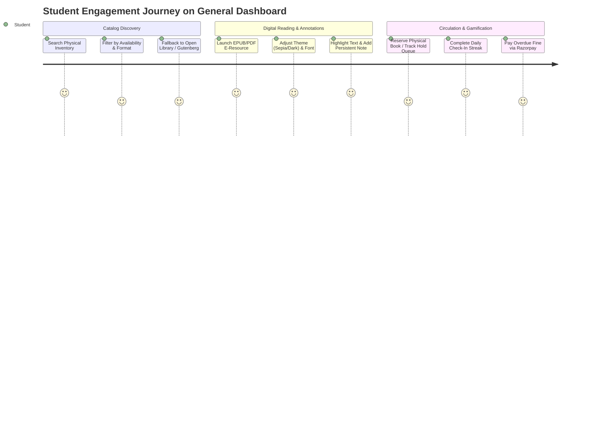
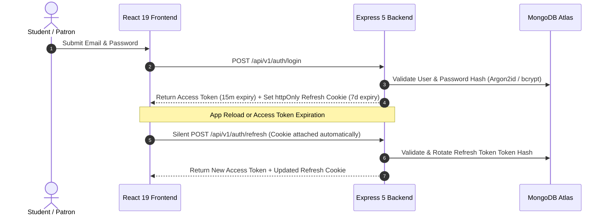

# 📚 BookBuddy

### Enterprise Multi-Tenant Campus Library, Digital E-Resource Hosting, Facility Reservation & Gamified Student Engagement Platform

BookBuddy is a modern, production-grade full-stack platform that transforms traditional college libraries into integrated digital campus hubs. It combines multi-tenant physical inventory circulation, real-time computer lab workstation reservations, in-browser EPUB & PDF e-book reading with live text annotations, automated external catalog aggregation (Open Library, Google Books, & Project Gutenberg), digital fine payments via Razorpay, gamified reading streaks, and an automated continuous deployment & verification engine.

---

[](https://github.com/Aditya-Naikwadi/BookBuddy/actions/workflows/ci.yml)
[](https://github.com/Aditya-Naikwadi/BookBuddy/actions/workflows/multi-layer-verification.yml)
[](https://github.com/Aditya-Naikwadi/BookBuddy/actions/workflows/production-heartbeat.yml)


---

## 🚀 Live Deployments & Case Study

- 🌐 **Production Web Application (Vercel):** [https://book-buddy-eight-rosy.vercel.app](https://book-buddy-eight-rosy.vercel.app)
- ⚙️ **Production REST API & Backend (Render):** [https://bookbuddy-kcwl.onrender.com](https://bookbuddy-kcwl.onrender.com)
- 🏥 **Backend Health Check:** [`https://bookbuddy-kcwl.onrender.com/health`](https://bookbuddy-kcwl.onrender.com/health)
- 📌 **Live Version Metadata:** [`https://bookbuddy-kcwl.onrender.com/version`](https://bookbuddy-kcwl.onrender.com/version)
- 📘 **Comprehensive Technical Architecture & Dashboards Reference:** [`ARCHITECTURE.md`](ARCHITECTURE.md)
- 📄 **Full Engineering Case Study:** [`docs/CASE_STUDY.md`](docs/CASE_STUDY.md)

---

## 📋 Table of Contents

- [📖 Overview \& Key Differentiators](#-overview--key-differentiators)
- [🎓 General Dashboard (Student \& Patron Portal)](#-general-dashboard-student--patron-portal)
  - [Module Breakdown](#module-breakdown)
  - [User Experience \& Engagement Journeys](#user-experience--engagement-journeys)
- [🏛️ System Architecture](#️-system-architecture)
  - [Data Isolation \& Multi-Tenancy](#data-isolation--multi-tenancy)
  - [Authentication Flow (Access + Refresh Tokens)](#authentication-flow-access--refresh-tokens)
  - [Real-Time Socket.IO Infrastructure](#real-time-socketio-infrastructure)
- [📖 Multi-Format Digital Reader \& Persistent Annotations](#-multi-format-digital-reader--persistent-annotations)
- [✨ Complete Portal Feature Matrix](#-complete-portal-feature-matrix)
- [🔌 API Overview \& Main Endpoints](#-api-overview--main-endpoints)
- [⚙️ Local Setup \& Environment Configuration](#️-local-setup--environment-configuration)
- [📁 Repository \& Directory Structure](#-repository--directory-structure)
- [⚠️ Known Limitations \& Architectural Notes](#️-known-limitations--architectural-notes)
- [📄 License](#-license)

---

## 📖 Overview & Key Differentiators

BookBuddy replaces legacy, monolithic library software with a decoupled multi-tenant campus platform:

1. **Multi-Tenant Physical Inventory & Holds**: Multi-branch physical catalog tracking, hold reservation queues with auto-promotion upon check-in, and automated overdue fine accumulation.
2. **General Dashboard & Patron Hub**: Unified student portal providing quick access to physical book searches, digital e-resource reading, loan trackers, notifications, and gamified reading streak rewards.
3. **Computer Lab Workstation Grid**: Visual seat grid layout, real-time availability polling, and atomic reservation concurrency protection.
4. **Digital E-Resource Repository & Reader**: In-browser EPUB & PDF rendering, HTTP 206 range streaming, position CFI/page synchronization, and persistent text highlights & notes saved to MongoDB.
5. **External Catalog Aggregation**: Automated search fallback and metadata enrichment via Open Library API, Google Books API, and Project Gutenberg.
6. **Digital Fine Payments**: Online fine collection via Razorpay with HMAC-SHA256 signature verification and idempotent webhook processing.
7. **Gamified Student Engagement**: Daily reading check-in streak tracking, streak freeze buffers, and milestone achievement badges.
8. **Real-Time WebSocket Network**: Socket.io event channels for real-time notification alerts, loan updates, and connection status feedback.

---

## 🎓 General Dashboard (Student & Patron Portal)

The **General Dashboard** (`frontend/src/pages/dashboards/general/`) serves as the central hub for campus patrons and students. It consolidates all library services—search, circulation, digital reading, notifications, and reading habits—into a responsive, accessible single-page application.

### Module Breakdown

| Module | Location | Description |
| :--- | :--- | :--- |
| **Home Hub (`GeneralDashboardHome.jsx`)** | `/dashboard` | Aggregated student overview featuring metric cards (active loans, holds, fines, streak count), recommended books carousel, lab workstation status, and recent notifications. |
| **OPAC Search (`GeneralSearch.jsx`)** | `/dashboard/search` | Real-time physical inventory search with multi-faceted filters (discipline, language, format, availability), page parameter bounds capping (`totalPages`), and external search fallback. |
| **E-Resources Hub (`GeneralEResources.jsx`)** | `/dashboard/eresources` | Digital library listing open-access and institutional EPUB/PDF e-books with search, tag filters, slow API feedback banners, and instant launch into the reader modal. |
| **Digital Reader (`DigitalReaderModal.jsx`)** | Reader Modal | In-browser EPUB and PDF reader supporting theme switching (Light / Dark / Sepia), text size scaling, page/CFI navigation, and persistent highlight/note creation. |
| **Text Annotations (`AnnotationSidebar.jsx`)** | Reader Sidebar | Real-time text highlight and note manager allowing students to review, search, and delete annotations stored in MongoDB with tenant isolation. |
| **Saved Items & Lists (`GeneralSaved.jsx`)** | `/dashboard/saved` | Personal reading lists, bookmarked titles, and Project Gutenberg external resource fallback notices (`toast.info`). |
| **Notification Center (`NotificationCenter.jsx`)** | Navigation Header | Real-time Socket.IO alert hub displaying loan status notifications, hold fulfillments, and fine notices with an active socket connection status bar. |
| **Loans & Holds Tracker** | Home & Profile | Active physical loan countdown timer, hold queue position tracker, return request trigger, and overdue fine status. |
| **Reading Streak & Badges** | Profile & Home Widget | Daily check-in button, consecutive day counter, streak freeze status, and milestone achievement badge showcase. |

### User Experience & Engagement Journeys



---

## 🏛️ System Architecture

BookBuddy adopts a decoupled, event-driven architecture designed for sub-second client state updates, strict multi-tenant data isolation, and robust cache fallback degradation.

```mermaid
graph TD
    subgraph Frontend Client (Vercel)
        ReactSPA["React 19 SPA (Vite 8 + Tailwind v4)"]
        ZustandStores["Zustand Stores (Auth, Toast, Saved)"]
        ReactQuery["TanStack React Query v5 Cache"]
        ReaderEngine["Epub.js + PDF.js Engine"]
    end

    subgraph Network Gateway & Router
        VercelCDN["Vercel Global Edge CDN"]
        ViteProxy["Vite Dev Proxy (/api/v1)"]
        WSChannel["Socket.io WebSockets"]
    end

    subgraph Backend Server (Render)
        ExpressApp["Express 5 Server (Node 24)"]
        AuthMw["JWT Auth & CSRF Middleware"]
        TenantMw["Multi-Tenant Isolation Scoper (req.tenantFilter)"]
        LimiterMw["Rate Limiter Flexible"]
    end

    subgraph Persistence Layer
        MongoDB[(MongoDB Atlas / Cloud)]
        RedisCache[(Redis Cache / In-Memory Fallback)]
    end

    ReactSPA -->|REST API / HTTP| ViteProxy
    ViteProxy --> ExpressApp
    ReactSPA -->|WebSockets| WSChannel
    WSChannel --> ExpressApp
    ExpressApp --> AuthMw
    AuthMw --> TenantMw
    TenantMw --> LimiterMw
    LimiterMw --> MongoDB
    LimiterMw --> RedisCache
```

### Data Isolation & Multi-Tenancy

Multi-tenancy is enforced at the database query level using `collegeId` scoping:

* **Scope Middleware (`backend/src/middlewares/scopeToTenant.js`)**: Extracts `collegeId` from the authenticated user's JWT payload and injects `req.tenantFilter = { collegeId }`.
* **Mongoose Model Enforcement**: All database operations merge `req.tenantFilter` into their query filters (e.g., `Book.find({ ...req.tenantFilter, status: 'available' })`).
* **Compound Indexing**: Collections leverage compound index patterns `{ collegeId: 1, _id: 1 }` for high-throughput tenant data isolation.

### Authentication Flow (Access + Refresh Tokens)

BookBuddy uses a secure dual-token authentication pattern with automatic silent token rotation:



* **Short-Lived Access Token**: JWT signed with `HS256`, valid for 15 minutes, passed via `Authorization: Bearer <token>` header.
* **Long-Lived Refresh Token**: Cryptographically random 64-byte token stored in `httpOnly`, `SameSite=Strict`, `Secure` cookie and hashed before DB storage.
* **Token Rotation & Theft Detection**: Rotating refresh tokens on every `/auth/refresh` request; reusing a revoked token immediately invalidates all active sessions for that user.

### Real-Time Socket.IO Infrastructure

* **Connection Lifecycle**: Socket clients authenticate using JWT tokens and join tenant room channels `college:<collegeId>` and user channels `user:<userId>`.
* **Event Channels**:
  * `notification:new` — Pushes instant alert cards to the Notification Center.
  * `loan:status_updated` — Updates active loan statuses and return deadlines in real time.
  * `streak:updated` — Broadcasts daily reading streak milestone updates.
  * `socket:reconnect` — Automatically retries dropped WebSocket connections with status feedback.

---

## 📖 Multi-Format Digital Reader & Persistent Annotations

The embedded reader (`DigitalReaderModal.jsx`) enables patrons to read digital library assets without downloading raw files:

* **EPUB Engine (`epubjs`)**: Native in-memory rendering, table-of-contents sidebar navigation, text resizing (80% to 160%), and canonical CFI bookmarking.
* **PDF Engine (`pdfjs-dist`)**: Canvas-rendered page view, page thumbnail grid, zoom controls, and page jumping.
* **HTTP Range Streaming**: Big PDF/EPUB assets are served via Express with HTTP 206 Partial Content range support.
* **Persistent Text Annotations**:
  * **Highlights**: Highlight selected text passages with customized highlight colors.
  * **Notes**: Attach personal notes to specific CFI targets or page numbers.
  * **Database Storage**: Saved via `POST /api/v1/annotations` with multi-tenant `collegeId` protection, persisting seamlessly across reloads.

---

## ✨ Complete Portal Feature Matrix

| Feature | Student / Patron Portal 🎓 | College Admin Portal 🏛️ | Super Admin Portal 🌐 |
| :--- | :---: | :---: | :---: |
| **Catalog Search & Filtering** | ✅ | ✅ | ✅ |
| **Digital Reader & EPUB/PDF Streaming** | ✅ | ✅ | ✅ |
| **Persistent Text Annotations & Notes** | ✅ | ✅ | ✅ |
| **Physical Book Hold Reservations** | ✅ | ✅ (Manage Holds) | ✅ |
| **Lab Workstation Seat Grid Booking** | ✅ | ✅ (Seat Config) | ✅ |
| **Gamified Reading Streaks & Badges** | ✅ | ❌ | ❌ |
| **Online Fine Payments (Razorpay)** | ✅ | ✅ (Manual Override) | ✅ |
| **Notification Center & Socket.IO Alerts** | ✅ | ✅ | ✅ |
| **CSV Bulk Patron Roster Upload** | ❌ | ✅ | ✅ |
| **Tenant Feature Flag Toggles** | ❌ | ❌ | ✅ |
| **Super-Admin User Impersonation** | ❌ | ❌ | ✅ |

---

## 🔌 API Overview & Main Endpoints

### Auth & Session (`/api/v1/auth`)

- `POST /api/v1/auth/login` — Authenticate patron credentials (issues access token + sets refresh cookie)
- `POST /api/v1/auth/register` — Public student registration with college domain validation
- `POST /api/v1/auth/refresh` — Silent refresh token rotation & new access token issuance
- `POST /api/v1/auth/logout` — Revoke refresh token and clear cookies (enforces CSRF validation)
- `GET /api/v1/auth/me` — Fetch current authenticated user profile & tenant scope

### General Dashboard (`/api/v1/general-dashboard`)

- `GET /api/v1/general-dashboard/home-data` — Fetch aggregated metrics, reading lists, carousels, and announcements
- `GET /api/v1/general-dashboard/college/:id/dashboard` — Fetch tenant-specific general dashboard data (cached 60s)

### Physical Catalog & Books (`/api/v1/books`)

- `GET /api/v1/books` — Search physical book inventory with pagination, category, and availability filters
- `GET /api/v1/books/:id` — Retrieve book detail metadata by ID
- `GET /api/v1/catalog/external-search` — Aggregated search across Open Library and Google Books API

### Digital E-Resources & Annotations (`/api/v1/eresources`, `/api/v1/annotations`)

- `GET /api/v1/eresources` — List digital e-books (EPUB/PDF) with tag filtering
- `GET /api/v1/eresources/:id/stream` — Stream e-resource content with HTTP 206 Partial Content support
- `GET /api/v1/annotations` — Fetch user's persistent text highlights and notes for an e-resource
- `POST /api/v1/annotations` — Save new text highlight/note annotation to database
- `DELETE /api/v1/annotations/:id` — Delete an annotation

### Circulation & Workstations (`/api/v1/loans`, `/api/v1/reservations`, `/api/v1/lab`)

- `GET /api/v1/loans/my-loans` — List active and historical physical loans for current patron
- `POST /api/v1/reservations` — Place a hold reservation on a physical book
- `GET /api/v1/lab/seats` — Get real-time seat availability grid for computer workstation lab
- `POST /api/v1/lab/bookings` — Reserve a workstation seat for a specific time slot

### Notifications & Streaks (`/api/v1/notifications`, `/api/v1/streaks`)

- `GET /api/v1/notifications` — Fetch user notifications with read status
- `PATCH /api/v1/notifications/:id/read` — Mark notification as read
- `POST /api/v1/streaks/check-in` — Submit daily reading check-in to maintain reading streak

---

## ⚙️ Local Setup & Environment Configuration

### Prerequisites

* **Node.js**: `v24.x` (or `v20.x`+)
* **npm**: `v10.x`+
* **MongoDB**: `v6.0`+ (local instance or MongoDB Atlas)
* **Redis** *(Optional)*: `v7.0`+ (falls back to `node-cache` in-memory store automatically if omitted)

### 1. Environment Configuration

Create `.env` inside `backend/`:

```env
# Server Setup
PORT=5000
NODE_ENV=development
CLIENT_ORIGIN=http://localhost:5173

# Database & Cache
MONGO_URI=mongodb://127.0.0.1:27017/bookbuddy
REDIS_URL=redis://127.0.0.1:6379

# Authentication & JWT Secrets (Min 32 characters)
JWT_SECRET=your_super_secret_jwt_access_key_min_32_chars
JWT_REFRESH_SECRET=your_super_secret_jwt_refresh_key_min_32_chars
JWT_ACCESS_EXPIRY=15m
JWT_REFRESH_EXPIRY=7d
COOKIE_SECRET=your_cookie_secret_key_here

# Payment Gateway (Optional)
RAZORPAY_KEY_ID=rzp_test_xxxxxxxxx
RAZORPAY_KEY_SECRET=your_razorpay_secret_key
```

### 2. Installation & Running

```bash
# Clone the repository
git clone https://github.com/Aditya-Naikwadi/BookBuddy.git
cd BookBuddy

# Option A: Install dependencies and build via root script
npm run build

# Option B: Run development servers in separate terminals
# Terminal 1: Backend Server (Port 5000)
cd backend
npm install
npm run dev

# Terminal 2: Frontend SPA (Port 5173)
cd frontend
npm install
npm run dev
```

### 3. Running Unit & Integration Tests

```bash
# Run backend Jest test suite
cd backend
npm test

# Run frontend Vitest test suite
cd frontend
npm test
```

---

## 📁 Repository & Directory Structure

```
BookBuddy/
├── AGENTS.md                     # Canonical architecture rules & AI agent guidelines
├── README.md                     # Master project documentation
├── api/                          # Vercel serverless function entrypoint (api/index.js)
├── database/                     # Schema migrations (database/migrations/)
├── deployment/                   # Deployment scripts & Docker manifests
├── docs/                         # Architecture documentation & Case Study
├── scripts/                      # Deployment verification & operational scripts
├── tests/                        # Load tests (k6, Artillery) & E2E verification
├── backend/                      # Node.js 24 + Express 5 Backend
│   ├── src/
│   │   ├── config/               # DB, Redis, and Environment managers
│   │   ├── controllers/          # API route controllers
│   │   │   └── dashboards/       # General & Admin dashboard controllers
│   │   ├── middlewares/          # Security, Auth, CSRF, and Tenant Scoping
│   │   ├── models/               # Mongoose 9 Schemas (User, Book, Annotation, etc.)
│   │   ├── routes/               # Express 5 router definitions
│   │   │   └── dashboards/       # General & Student dashboard routes
│   │   ├── services/             # Business logic & background cron services
│   │   ├── sockets/              # Socket.io realtime event channels
│   │   ├── tests/                # Backend Jest test suite
│   │   └── utils/                # Dashboard cache, logger & helpers
│   └── package.json
└── frontend/                     # React 19 + Vite 8 Client SPA
    ├── public/                   # Static assets & version.json
    ├── src/
    │   ├── api/                  # Axios client & API request services
    │   ├── components/
    │   │   ├── common/           # Toast, Skeleton, and Modal UI primitives
    │   │   ├── general/          # Reader, Annotation sidebar, Filter chips
    │   │   └── student/          # NotificationCenter, Loans, Streak, Badges
    │   ├── hooks/                # Custom React hooks
    │   ├── pages/
    │   │   └── dashboards/
    │   │       └── general/      # GeneralDashboardHome, GeneralSearch, GeneralEResources, GeneralSaved
    │   ├── store/                # Zustand client stores (authStore, toastStore, savedStore)
    │   └── tests/                # Frontend Vitest test suite
    └── package.json
```

---

## ⚠️ Known Limitations & Architectural Notes

1. **Dashboard Stats Cache TTL**: Aggregated home statistics are cached using `STATS_CACHE_TTL = 60s` to prevent heavy DB queries during peak usage. Cache invalidation (`invalidateStatsCache`) automatically triggers on key mutation events (e.g., adding/updating physical books).
2. **External Catalog Delays**: External book queries via Project Gutenberg (Gutendex) or Open Library can take up to 3-5 seconds depending on public API availability; handled via slow API loading feedback banners.
3. **Strict CSRF Enforcement**: Non-exempt API endpoints strictly require matching `X-CSRF-Token` headers and `_csrf` cookies in production mode to prevent cross-site request forgery.

---

## 📄 License

This project is licensed under the **ISC License**. Created and maintained by [Aditya Naikwadi](https://github.com/Aditya-Naikwadi).
