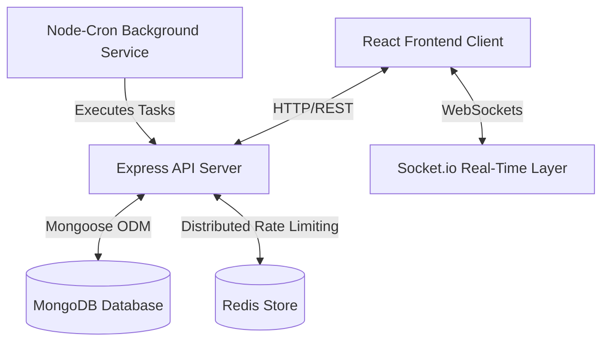
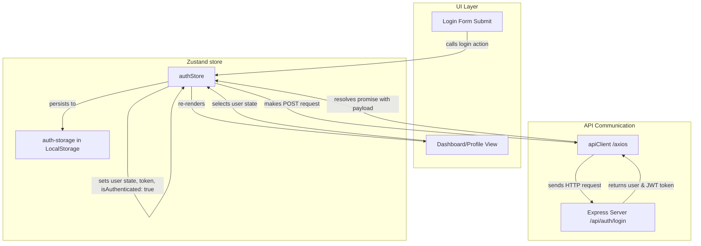
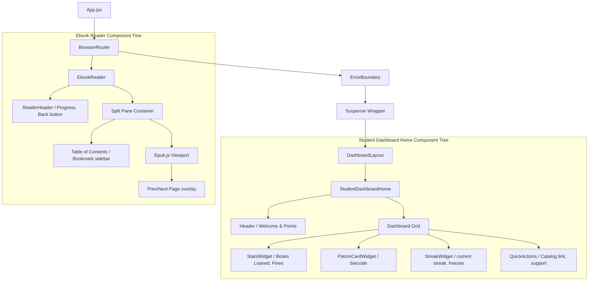
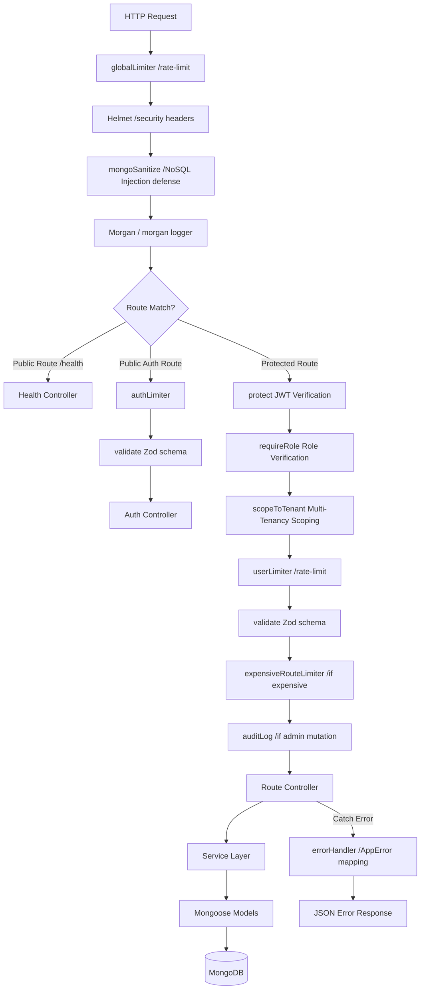
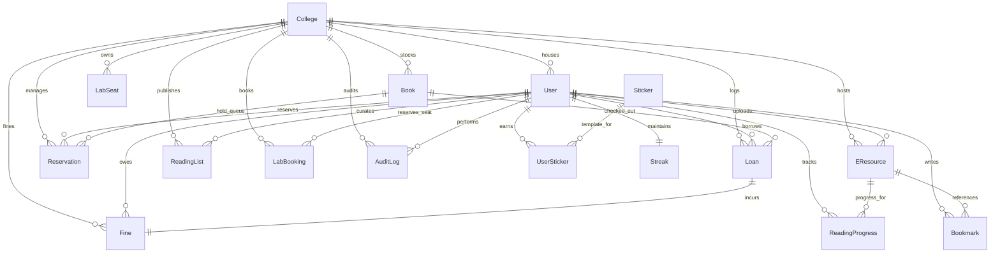

# BookBuddy

### A modern, multi-tenant campus library management and student engagement platform featuring gamified check-ins, facility bookings, and built-in e-resource reading.

---

[](https://github.com/Aditya-Naikwadi/BookBuddy/actions/workflows/ci.yml)


---

## 📖 Overview
Traditional library systems act as static catalogs, neglecting modern student expectations for real-time collaboration and academic engagement. BookBuddy re-imagines the college library as a connected campus hub. It bridges the gap between administrators, librarians, and students by consolidating physical inventory management, computer lab bookings, digital e-resource hosting (featuring an inline EPUB reader), and gamified learning milestones (streaks and stickers) in a single secure, multi-tenant environment.

---

## 🏛️ High-Level System Architecture



---

## 🎨 Frontend Architecture & Design

### Technical Stack & Rationale
BookBuddy's client is a modern React SPA built with the following core modules:
- **React 19 & Vite 8**: Direct JSX rendering with extremely fast HMR dev server.
- **Tailwind CSS v4**: Utility-first styling utilizing CSS native variables.
- **Zustand v5 & React Query v5**: Zustand persists critical user session state locally (`auth-storage` in localStorage), while React Query maintains caching, re-fetching, and loading states for API server data.
- **Epub.js**: Inline client-side parsing and rendering of public domain or uploaded EPUB books.

### Global State Flow
The authentication and session flows operate as follows:



### Component Hierarchy Trees
Routing is managed by React Router v7 with protected route gates (`ProtectedRoute`) enforcing roles:



---

## ⚙️ Backend Architecture & Design

### Request Execution Pipeline
Incoming requests go through a layered sequence of middleware gates to sanitize, rate-limit, and validate inputs before running controller logic:



### Multi-Tenancy Scoping Sequence
Multi-tenancy isolation is enforced at the middleware layer using `scopeToTenant`. For non-super-admins, the middleware logical scope inserts `req.tenantFilter = { collegeId: req.user.collegeId }` which is dynamically merged into Mongoose queries:

```mermaid
sequenceDiagram
    autonumber
    actor Admin as College Admin Client
    participant App as Express (app.js)
    participant Auth as protect Middleware
    participant Scope as scopeToTenant Middleware
    participant Audit as auditLog Middleware
    participant Ctrl as collegeAdminController
    participant Svc as loanService
    participant DB as MongoDB
    
    Admin->>App: POST /api/dashboards/college-admin/circulation/checkout (Headers: Authorization: Bearer JWT)
    App->>Auth: Parse & verify Access Token
    Auth-->>App: Set req.user = { id, role: "college-admin", collegeId }
    App->>Scope: Check role and construct filter
    Scope-->>App: Set req.tenantFilter = { collegeId: ObjectId("...") }
    App->>Audit: Record intent to write mutation
    App->>Ctrl: Execute checkoutBookHandler(req)
    Ctrl->>Svc: Call checkoutBook(patronId, bookId, req.tenantFilter)
    
    rect rgb(30, 41, 59)
        Note over Svc,DB: Enforce Tenant-Scoping & Concurrency Safety
        Svc->>DB: Book.findOne({ _id: bookId, ...tenantFilter })
        DB-->>Svc: Book Record
        Svc->>DB: User.findOne({ _id: patronId, ...tenantFilter })
        DB-->>Svc: User Record
        Svc->>DB: Atomic update: Book.findOneAndUpdate({ _id, copiesAvailable > 0 }, { $inc: { copiesAvailable: -1 } })
        DB-->>Svc: Success (copiesAvailable decremented)
        Svc->>DB: Loan.create({ collegeId, userId, bookId, dueDate })
        DB-->>Svc: Loan Record
    end
    
    Svc-->>Ctrl: Return checkout info
    Ctrl->>Audit: Commit audit details
    Ctrl-->>Admin: HTTP 201 Created (JSON Loan details)
```



### Background scheduled Jobs
Node-Cron handles daily and hourly tasks with observability logs kept inside `CronRunLog`:
- **Overdue Fine Accrual** (`0 0 * * *`): Evaluates late loans daily at local midnight, transitions loan statuses, and creates unpaid `Fine` records.
- **Queue Expiry Sweep** (`0 * * * *`): Hourly sweeps ready hold reservations that exceeded the pickup window, transitioning status and promoting the next queue position.
- **Due Reminders** (`0 9 * * *`): Daily warnings to patrons of upcoming loan return deadlines.
- **Streak Expiry & Reminders** (`0 * * * *`): Checks user timezone midnights hourly, resetting active reading streaks if no qualifying check-ins occurred (or consumes a streak freeze buffer). Reminds users at risk of losing active streaks 3 hours before midnight.

---

## 🗄️ Database Design & Indexing

### Complete Entity-Relationship Diagram (ERD)



### Schema Collections Indexing Table
Database indexes are configured explicitly to speed up query execution paths and prevent duplicates:

| Targeted Collection | Index Structure | Type | Query Path Served |
| :--- | :--- | :--- | :--- |
| `users` | `{ email: 1 }` | Single-field, Unique | Login auth lookup. |
| `users` | `{ studentId: 1 }` | Single-field, Unique | Member registration and circulation identification. |
| `loans` | `{ collegeId: 1, status: 1 }` | Compound | College admin Active vs Overdue loans queues. |
| `loans` | `{ userId: 1, status: 1 }` | Compound | Student loans dashboard lookup. |
| `fines` | `{ userId: 1, status: 1 }` | Compound | Student outstanding fine check (unpaid total). |
| `fines` | `{ loanId: 1 }` | Single-field, Unique | Fine accrual idempotency (ensuring one fine per loan). |
| `reservations` | `{ bookId: 1, status: 1 }` | Compound | Hold queue promotion lookup. |
| `labseats` | `{ collegeId: 1, labName: 1, seatNumber: 1 }` | Compound, Unique | Seat registry validation. |
| `labbookings` | `{ seatId: 1, date: 1, timeslot: 1, status: 1 }` | Compound, Unique (Partial) | Concurrency lock to prevent double booking. |
| `readingprogresses`| `{ userId: 1, eresourceId: 1 }` | Compound, Unique | Fast progress upsert / reading tracker lookup. |
| `userstickers` | `{ userId: 1, stickerId: 1 }` | Compound, Unique | Award unlocking duplicate prevention. |
| `streaks` | `{ userId: 1 }` | Single-field, Unique | Daily check-in updates and cron tracking. |
| `checkinlogs` | `{ userId: 1, checkInDate: 1 }` | Compound, Unique | Daily check-in duplicate prevention. |
| `readingpositions`| `{ userId: 1, eResourceId: 1 }` | Compound, Unique | Reading bookmark CFI position lookup. |

### Concurrency Integrity Controls
1. **Lending Decoupled Decrement**: Checkouts decrease `copiesAvailable` only if it is strictly greater than 0, preventing race condition inventory drops below zero:
   `Book.findOneAndUpdate({ _id: bookId, copiesAvailable: { $gt: 0 } }, { $inc: { copiesAvailable: -1 } })`
2. **Double Booking Locker**: Partial unique indexing on `labbookings` (`partialFilterExpression: { status: "booked" }`) blocks double bookings of seat/date/slot timeslots while allowing canceled slots to be reassigned.
3. **Idempotence fine locking**: Unique index constraints on `Fine.loanId` block background workers from issuing multiple late fine records for the same loan.

---

## ✨ System Features

### 🎓 Student Portal
* **Digital Catalog & Search**: Advanced text search across books and digital resources with real-time availability checking.
* **Loans & Fines Tracker**: View active checkout statuses, renewal limits, and unpaid late fines.
* **Digital Patron Card**: A virtual card display containing student membership identifiers.
* **Inline Ebook Reader**: Access, open, and read public-domain (Gutenberg) or internally-uploaded EPUB ebooks directly inside the browser, featuring range-request partial streaming, Stored-XSS injection scanning of XHTML/HTML/SVG files, SSRF-safe redirect following, and reading bookmark CFI sync.
* **Gamification & Engagement**: Check in daily to maintain reading streaks, featuring idempotent transaction-locked check-in logs, timezone-correct cron sweep streak protection with freeze log placeholders, badges catalog with unlock statuses, and a log-based streak recalculation tool.
* **Facilities Management**: Check live workstation seat availability and reserve computer lab timeslots.
* **Academic Support**: Submit purchase suggestions, file complaints, and send feedback to college administrators.

### 🏛️ College Admin Portal
* **Patron Management**: Add, suspend, or update student and staff member records.
* **Circulation Control**: Perform atomic, race-condition-safe checkouts and returns.
* **Cataloging & Digital Assets**: Add, edit, or remove books and upload e-resources to the digital repository.
* **Finances**: Track outstanding student fine balances, record payments, and view revenue.
* **Facilities & Helpdesk**: Manage computer lab seats, monitor bookings, and resolve support tickets.
* **Live Analytics**: Monitor circulation queues, student engagement statistics, and platform usage.

### 🌐 Super Admin Portal
* **System Overview**: High-level platform health metrics spanning all onboarded institutions.
* **College Onboarding**: Manage college settings and college admin accounts.
* **Moderation**: Verify and approve internally-uploaded e-resources before publishing.
* **Security Auditing**: Browse centralized, read-only system action logs.

---

## 🚀 Getting Started

### Prerequisites
- **Node.js**: `v20.x` or later (verify via `node -v`).
- **MongoDB**: `v6.0` or later (ensure service is running locally on port `27017`).
- **Redis**: Required for production rate limiting (optional locally, falls back to in-memory limits).

### Installation
1. **Clone the repository**:
   ```bash
   git clone https://github.com/Aditya-Naikwadi/BookBuddy.git
   cd BookBuddy
   ```
2. **Install Server dependencies**:
   ```bash
   cd server && npm install
   ```
3. **Install Client dependencies**:
   ```bash
   cd ../client && npm install
   ```

### Environment Variables Setup
Create a `.env` file in the `server/` directory and configure the following parameters:

```env
PORT=5000                              # Local server port
NODE_ENV=development                   # Environment mode (development, production, test)
MONGO_URI=mongodb://localhost:27017/bookbuddy # MongoDB connection string
CLIENT_ORIGIN=http://localhost:5173     # Frontend application URL (CORS)

JWT_SECRET=your_super_secret_access_key      # Signature key for short-lived Access tokens
JWT_REFRESH_SECRET=your_super_secret_refresh_key # Signature key for long-lived Refresh tokens
JWT_ACCESS_EXPIRY=15m                  # Access token lifespan (e.g., 15m)
JWT_REFRESH_EXPIRY=7d                  # Refresh token lifespan (e.g., 7d)

REDIS_URL=redis://localhost:6379       # Shared Redis cache URL (distributed rate limiting)

RATE_LIMIT_GLOBAL_MAX=100              # Baseline requests allowed per window
RATE_LIMIT_GLOBAL_WINDOW_MS=60000      # Global baseline rate window (1 minute)
RATE_LIMIT_AUTH_MAX=5                  # Max auth attempts per IP + Email combination
RATE_LIMIT_AUTH_IP_MAX=20              # Max auth attempts per IP address
RATE_LIMIT_AUTH_EMAIL_MAX=5            # Max auth attempts per Email across all IPs
RATE_LIMIT_AUTH_WINDOW_MS=900000       # Auth rate window (15 minutes)
RATE_LIMIT_USER_MAX=100                # Max per-user requests
RATE_LIMIT_USER_WINDOW_MS=60000        # Per-user rate window (1 minute)
RATE_LIMIT_EXPENSIVE_MAX=10            # Max queries to search/analytics
RATE_LIMIT_EXPENSIVE_WINDOW_MS=60000    # Expensive rate window (1 minute)
```

### Running Locally
1. **Run the Database and Cache**: Ensure MongoDB (and optionally Redis) is running.
2. **Start the API Server**:
   ```bash
   cd server
   npm run dev
   ```
   The API will listen at `http://localhost:5000`.
3. **Start the React Client**:
   ```bash
   cd client
   npm run dev
   ```
   Open `http://localhost:5173` in your browser.

### Docker Compose Launch (Single Command)
To boot MongoDB, Redis, and the backend server in isolated Docker containers:
```bash
cd server
docker-compose up --build
```

### Running Tests
To run all Jest integration and E2E Ebook Reader/Rate Limit test suites:
```bash
cd server
npm test
```

---

## 📁 Project Structure

```
BookBuddy/
├── client/                     # React Frontend Application (Vite/Tailwind v4)
│   ├── src/
│   │   ├── api/                # API client connection configurations
│   │   ├── components/         # Shared visual components and UI primitives
│   │   ├── pages/              # High-level dashboard views (lazy-loaded)
│   │   └── store/              # Zustand global client state stores
├── docs/
│   └── architecture/           # Deep-dive system design documentation
│       ├── frontend-design.md  # Client-side routing, state, and rendering
│       ├── backend-design.md   # Server controllers, middleware, and scheduling
│       └── database-design.md  # Collections schemas, indexing, and integrity
├── server/                     # Express Backend Application (CommonJS)
│   ├── src/
│   │   ├── controllers/        # Express handlers calling business rules
│   │   ├── middlewares/        # Authentication, scoping, and validation gates
│   │   ├── models/             # Mongoose schemas and database indexes
│   │   ├── services/           # Decoupled domain business logic
│   │   └── sockets/            # Real-time WebSocket connection handling
```

---

## 🔌 API Overview

Below are the primary API entry gateways:

| Endpoint Group | Auth Required | Allowed Roles | Purpose |
| :--- | :---: | :--- | :--- |
| `POST /api/auth/register` | No | Public (All) | Registers a new student account. |
| `POST /api/auth/login` | No | Public (All) | Authenticates credentials and issues JWTs. |
| `POST /api/auth/refresh` | No | Public (All) | Issues new Access Token using valid Refresh Token. |
| `GET /api/books` | Yes | `student`, `college-admin` | Searches physical catalog (tenant-scoped). |
| `POST /api/dashboards/college-admin/circulation/checkout` | Yes | `college-admin` | Decrements inventory and creates Loan (atomic). |
| `POST /api/dashboards/student/reservations` | Yes | `student` | Places hold on out-of-stock Book catalog item. |
| `POST /api/dashboards/student/lab-bookings` | Yes | `student` | Reserves computer lab timeslot (locked). |
| `GET /api/dashboards/college-admin/analytics/summary` | Yes | `college-admin` | Aggregates campus circulation metrics. |
| `POST /api/checkin` | Yes | `student` | Idempotent daily check-in to extend streak. |
| `GET /api/streak` | Yes | `student` | Retrieves user's current reading streak and stats. |
| `GET /api/streak/history` | Yes | `student` | Retrieves check-in history logs for calendar view. |
| `GET /api/badges` | Yes | `student` | Retrieves badge definitions with student unlock status. |
| `POST /api/badges` | Yes | `college-admin`, `super-admin` | Creates new badge definition (Zod-validated). |
| `POST /api/streak/recalculate` | Yes | `student` | Audits and reconstructs streak from check-in logs. |
| `POST /api/reader/upload` | Yes | `college-admin`, `super-admin` | Uploads and scans EPUB for Stored-XSS vectors. |
| `GET /api/reader/:resourceId/content` | Yes | `student`, `college-admin` | Streams EPUB file using HTTP range requests. |
| `PUT /api/reader/:resourceId/position` | Yes | `student` | Syncs current CFI reading position bookmark. |

---

## 🏗️ Architectural Deep-Dives
For the separate, granular design documents, please reference:
- 📖 [Frontend Architecture Guide](file:///c:/Users/naikw/OneDrive/Desktop/project/BookBuddy/docs/architecture/frontend-design.md)
- ⚙️ [Backend Architecture Guide](file:///c:/Users/naikw/OneDrive/Desktop/project/BookBuddy/docs/architecture/backend-design.md)
- 🗄️ [Database Design & Indexing Guide](file:///c:/Users/naikw/OneDrive/Desktop/project/BookBuddy/docs/architecture/database-design.md)

---

## 🧪 Testing Coverage
The platform maintains integration tests covering:
- Role authorization gates and tenant scopes
- Atomic inventory checkout bounds
- Hold queue promotions
- Overdue cron calculations
- WebSocket event deliveries

To run tests and generate coverage:
```bash
cd server
npm test -- --coverage
```

---

## 🤝 Contributing
Contributions are managed by the institution IT operations team. Please read through the frontend and backend guides before submitting changes.

---

## 📄 License
This repository does not currently contain a LICENSE file. The project is managed by college IT administrations. For specific deployment licenses, contact the platform maintainers.
