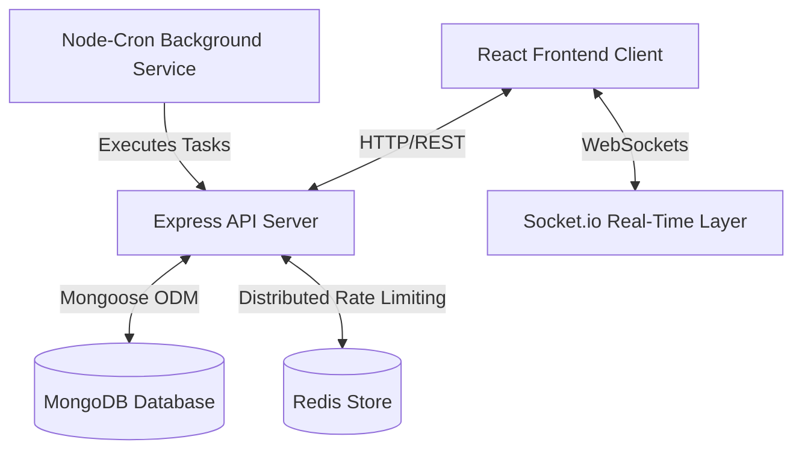

# BookBuddy

### A modern, multi-tenant campus library management and student engagement platform featuring gamified check-ins, facility bookings, and built-in e-resource reading.

---

[](https://github.com/Aditya-Naikwadi/BookBuddy/actions/workflows/ci.yml)


---

## Overview
Traditional library systems act as static catalogs, neglecting modern student expectations for real-time collaboration and academic engagement. BookBuddy re-imagines the college library as a connected campus hub. It bridges the gap between administrators, librarians, and students by consolidating physical inventory management, computer lab bookings, digital e-resource hosting (featuring an inline EPUB reader), and gamified learning milestones (streaks and stickers) in a single secure, multi-tenant environment.

---

## High-Level System Architecture



---

## ✨ Features

### 🎓 Student Portal
* **Digital Catalog & Search**: Advanced text search across books and digital resources with real-time availability checking.
* **Loans & Fines Tracker**: View active checkout statuses, renewal limits, and unpaid late fines.
* **Digital Patron Card**: A virtual card display containing student membership identifiers.
* **Inline Ebook Reader**: Access, open, and read public-domain (Gutenberg) or internally-uploaded EPUB ebooks directly inside the browser.
* **Gamification & Engagement**: Check in daily to maintain reading streaks, earn freezes, and unlock stickers/badges.
* **Facilities Management**: Check live workstation seat availability and reserve computer lab timeslots.
* **Academic Support**: Submit purchase suggestions, file complaints, and send feedback to college administrators.

### 🏛️ College Admin Portal
* **Patron Management**: Add, suspend, or update student and staff member records.
* **Circulation Control**: Perform atomic, race-condition-safe checkouts and returns.
* **Cataloging & Digital Assets**: Add, edit, or remove books and upload e-resources to the digital repository.
* **Finances**: Track outstanding student fine balances, record payments, and view revenue.
* **Facilities & Helpdesk**: Manage computer lab seats, monitor bookings, and resolve support tickets.
* **Live Analytics**: Monitor circulation queues, student engagement statistics, and platform usage.

### 🌐 Super Admin Portal
* **System Overview**: High-level platform health metrics spanning all onboarded institutions.
* **College Onboarding**: Manage college settings and college admin accounts.
* **Moderation**: Verify and approve internally-uploaded e-resources before publishing.
* **Security Auditing**: Browse centralized, read-only system action logs.

---

## 🛠️ Tech Stack

| Layer | Technology | Why |
| :--- | :--- | :--- |
| **Frontend UI** | React 19 / Vite 8 | High performance component-based rendering paired with near-instant hot module replacement (HMR). |
| **Styling** | Tailwind CSS v4 | Rapid utility-first design with native CSS variable optimization. |
| **Client State** | Zustand / React Query | Zustand provides clean, persistent local state, while React Query handles server-cache synchronizations. |
| **Web Server** | Node.js / Express 5 | Lightweight, async request execution suitable for high-concurrency APIs. |
| **Real-time** | Socket.io | Bi-directional socket communication for notifications and instant streak updates. |
| **Database** | MongoDB / Mongoose | Flexible NoSQL document model that seamlessly handles varied library, gamification, and facility booking schemas. |
| **Caching/Sync** | Redis | Shared, distributed cache that synchronizes rate limits globally across horizontally-scaled backend containers. |
| **Task Runner** | Node-Cron | Lightweight in-process scheduler for overdue calculations, hold queue sweeps, and midnight streak resets. |

---

## 🚀 Getting Started

### Prerequisites
- **Node.js**: `v20.x` or later (verify via `node -v`).
- **MongoDB**: `v6.0` or later (ensure service is running locally on port `27017`).
- **Redis**: Required for production rate limiting (optional locally, falls back to in-memory limits).

### Installation
1. **Clone the repository**:
   ```bash
   git clone https://github.com/Aditya-Naikwadi/BookBuddy.git
   cd BookBuddy
   ```
2. **Install Server dependencies**:
   ```bash
   cd server && npm install
   ```
3. **Install Client dependencies**:
   ```bash
   cd ../client && npm install
   ```

### Environment Variables Setup
Create a `.env` file in the `server/` directory and configure the following parameters:

```env
PORT=5000                              # Local server port
NODE_ENV=development                   # Environment mode (development, production, test)
MONGO_URI=mongodb://localhost:27017/bookbuddy # MongoDB connection string
CLIENT_ORIGIN=http://localhost:5173     # Frontend application URL (CORS)

JWT_SECRET=your_super_secret_access_key      # Signature key for short-lived Access tokens
JWT_REFRESH_SECRET=your_super_secret_refresh_key # Signature key for long-lived Refresh tokens
JWT_ACCESS_EXPIRY=15m                  # Access token lifespan (e.g., 15m)
JWT_REFRESH_EXPIRY=7d                  # Refresh token lifespan (e.g., 7d)

REDIS_URL=redis://localhost:6379       # Shared Redis cache URL (distributed rate limiting)

RATE_LIMIT_GLOBAL_MAX=100              # Baseline requests allowed per window
RATE_LIMIT_GLOBAL_WINDOW_MS=60000      # Global baseline rate window (1 minute)
RATE_LIMIT_AUTH_MAX=5                  # Max auth attempts per IP + Email combination
RATE_LIMIT_AUTH_IP_MAX=20              # Max auth attempts per IP address
RATE_LIMIT_AUTH_EMAIL_MAX=5            # Max auth attempts per Email across all IPs
RATE_LIMIT_AUTH_WINDOW_MS=900000       # Auth rate window (15 minutes)
RATE_LIMIT_USER_MAX=100                # Max per-user requests
RATE_LIMIT_USER_WINDOW_MS=60000        # Per-user rate window (1 minute)
RATE_LIMIT_EXPENSIVE_MAX=10            # Max queries to search/analytics
RATE_LIMIT_EXPENSIVE_WINDOW_MS=60000    # Expensive rate window (1 minute)
```

### Running Locally
1. **Run the Database and Cache**: Ensure MongoDB (and optionally Redis) is running.
2. **Start the API Server**:
   ```bash
   cd server
   npm run dev
   ```
   The API will listen at `http://localhost:5000`.
3. **Start the React Client**:
   ```bash
   cd client
   npm run dev
   ```
   Open `http://localhost:5173` in your browser.

### Docker Compose Launch (Single Command)
To boot MongoDB, Redis, and the backend server in isolated Docker containers:
```bash
cd server
docker-compose up --build
```

### Running Tests
To run all Jest integration and E2E Ebook Reader/Rate Limit test suites:
```bash
cd server
npm test
```

---

## 📁 Project Structure

```
BookBuddy/
├── client/                     # React Frontend Application (Vite/Tailwind v4)
│   ├── src/
│   │   ├── api/                # API client connection configurations
│   │   ├── components/         # Shared visual components and UI primitives
│   │   ├── pages/              # High-level dashboard views (lazy-loaded)
│   │   └── store/              # Zustand global client state stores
├── docs/
│   └── architecture/           # Deep-dive system design documentation
│       ├── frontend-design.md  # Client-side routing, state, and rendering
│       ├── backend-design.md   # Server controllers, middleware, and scheduling
│       └── database-design.md  # Collections schemas, indexing, and integrity
├── server/                     # Express Backend Application (CommonJS)
│   ├── src/
│   │   ├── controllers/        # Express handlers calling business rules
│   │   ├── middlewares/        # Authentication, scoping, and validation gates
│   │   ├── models/             # Mongoose schemas and database indexes
│   │   ├── services/           # Decoupled domain business logic
│   │   └── sockets/            # Real-time WebSocket connection handling
```

---

## 🔌 API Overview

Below are the primary API entry gateways:

| Endpoint Group | Auth Required | Allowed Roles | Purpose |
| :--- | :---: | :--- | :--- |
| `POST /api/auth/register` | No | Public (All) | Registers a new student account. |
| `POST /api/auth/login` | No | Public (All) | Authenticates credentials and issues JWTs. |
| `POST /api/auth/refresh` | No | Public (All) | Issues new Access Token using valid Refresh Token. |
| `GET /api/books` | Yes | `student`, `college-admin` | Searches physical catalog (tenant-scoped). |
| `POST /api/dashboards/college-admin/circulation/checkout` | Yes | `college-admin` | Decrements inventory and creates Loan (atomic). |
| `POST /api/dashboards/student/reservations` | Yes | `student` | Places hold on out-of-stock Book catalog item. |
| `POST /api/dashboards/student/lab-bookings` | Yes | `student` | Reserves computer lab timeslot (locked). |
| `GET /api/dashboards/college-admin/analytics/summary` | Yes | `college-admin` | Aggregates campus circulation metrics. |

---

## 🏗️ Architectural Deep-Dives

BookBuddy's architecture is separated into three distinct layers to ensure multi-tenant security, clean code division, and performant query routes. For a detailed breakdown, see:
- 📖 [Frontend Architecture](file:///c:/Users/naikw/OneDrive/Desktop/project/BookBuddy/docs/architecture/frontend-design.md)
- ⚙️ [Backend Architecture](file:///c:/Users/naikw/OneDrive/Desktop/project/BookBuddy/docs/architecture/backend-design.md)
- 🗄️ [Database Design & Indexing](file:///c:/Users/naikw/OneDrive/Desktop/project/BookBuddy/docs/architecture/database-design.md)

---

## 🧪 Testing Coverage
The platform maintains integration tests covering:
- Role authorization gates and tenant scopes
- Atomic inventory checkout bounds
- Hold queue promotions
- Overdue cron calculations
- WebSocket event deliveries

To run tests and generate coverage:
```bash
cd server
npm test -- --coverage
```

---

## 🤝 Contributing
Contributions are managed by the institution IT operations team. Please read through the [Frontend Architecture](file:///c:/Users/naikw/OneDrive/Desktop/project/BookBuddy/docs/architecture/frontend-design.md) and [Backend Architecture](file:///c:/Users/naikw/OneDrive/Desktop/project/BookBuddy/docs/architecture/backend-design.md) guides before submitting changes.

---

## 📄 License
This repository does not currently contain a LICENSE file. The project is managed by college IT administrations. For specific deployment licenses, contact the platform maintainers.
