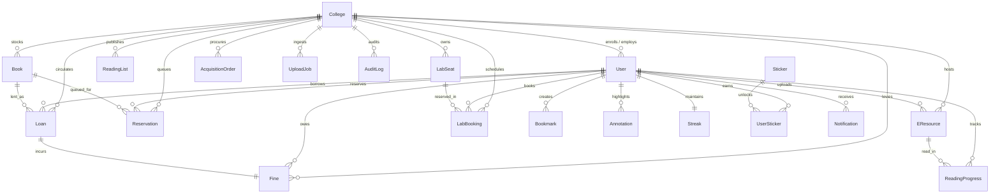
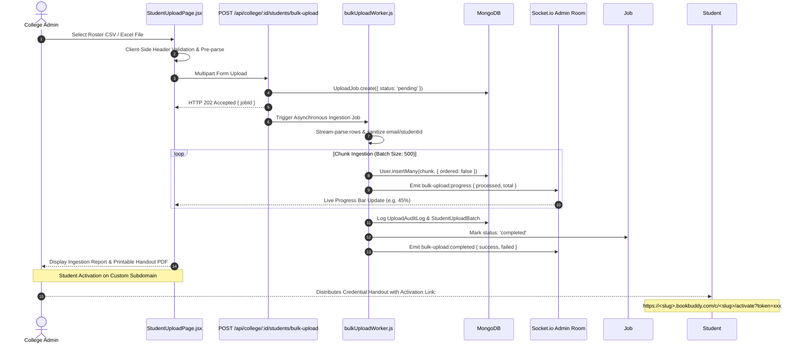

# 📖 Engineering Case Study: BookBuddy — Production Multi-Tenant Campus Library & Digital Hub

> **Document Classification:** Engineering Case Study & Production Post-Mortem  
> **Status:** Live in Production  
> **Target Environments:** Vercel Global Edge (Client) & Render Cloud Cluster (API & Socket.io)  
> **Runtime Stacks:** Node.js 24 LTS, Express 5.2, React 19.2, Vite 8, MongoDB Atlas 6.21, Redis 7, Socket.io 4.8  

---

## 🚀 Live Production Deployments & Telemetry

| Environment / Service | Live Production URL | Inspection Target & Verification Capabilities |
| :--- | :--- | :--- |
| 🌐 **Production Web Client (SPA)** | [https://book-buddy-eight-rosy.vercel.app](https://book-buddy-eight-rosy.vercel.app) | Vercel Global Edge CDN, React 19 SPA, zero-scroll virtualized grid, manual rollup vendor chunking, offline IndexedDB reader caching. |
| ⚙️ **Production REST API & Cluster** | [https://bookbuddy-kcwl.onrender.com](https://bookbuddy-kcwl.onrender.com) | Node.js 24 LTS Express cluster, Socket.io Redis pub/sub adapter, Zod boot-time validated environment, PM2 process management. |
| 🏥 **Deep Health Inspection Probe** | [`https://bookbuddy-kcwl.onrender.com/health`](https://bookbuddy-kcwl.onrender.com/health) | Real-time connectivity checks across MongoDB replica set, Redis cluster, external services, uptime, memory, and HTTP 200/503 status mapping. |
| 📌 **Live Version & Commit Telemetry** | [`https://bookbuddy-kcwl.onrender.com/version`](https://bookbuddy-kcwl.onrender.com/version) | Instant Git commit SHA verification (`RENDER_GIT_COMMIT` / `VERCEL_GIT_COMMIT_SHA`), short commit hash, build version, environment, and timestamp. |
| 📘 **Comprehensive System Architecture** | [`ARCHITECTURE.md`](../ARCHITECTURE.md) | Full 80 KB technical reference manual covering all 4 dashboards, cross-cutting subsystems, 72 schemas, and runbooks. |

---

## 1. Executive Summary

**BookBuddy** is an enterprise-grade, multi-tenant Integrated Library System (ILS), digital e-resource hosting platform, computer lab facility scheduler, and gamified student engagement engine built for higher education institutions, university networks, and academic consortia.

Built on **Node.js 24 LTS**, **Express 5.2**, **React 19.2**, **Vite 8**, **MongoDB Atlas**, **Redis 7**, and **Socket.io 4.8**, BookBuddy bridges the operational gap between physical circulation counters, campus workstation assets, in-browser academic reading, and student learning habits.

This case study examines the architectural design decisions, deep technical challenges, zero cross-tenant leakage defenses, concurrency locking strategies, real-time telemetry, and operational outcomes realized in production.

---

## 2. Problem Statement & Market Opportunity

### The Legacy Library Software Problem
Higher education institutions historically rely on fragmented, on-premise library management software (ILS) characterized by:

1. **Siloed Systems**: Physical book lending, study seat reservations, PDF repositories, and student fine ledgers operate in separate, non-communicating tools.
2. **Download-and-Lose Digital Reading**: Students download static PDF files locally, losing annotations, reading progress, and mobile responsiveness.
3. **Manual Administrative Bottlenecks**: Overdue fine calculation and hold queue promotions require constant librarian manual intervention.
4. **Extravagant Infrastructure Costs**: Traditional platforms require separate server instances or database clusters for each campus, driving up hosting costs.
5. **Zero Student Retention & Engagement**: Static search forms discourage voluntary reading, leading to underutilized institutional collections.

---

## 3. Product Vision & Architectural Objectives

BookBuddy was engineered to unify physical library operations and digital learning into a single multi-tenant platform featuring:

- **100% Data-Isolated Multi-Tenancy**: Supporting hundreds of college tenants on a shared database cluster with custom subdomains (`<slug>.bookbuddy.com`) and zero cross-tenant data leaks.
- **Embedded E-Resource Reader Engine**: In-browser EPUB & PDF reading with HTTP 206 partial content streaming, persistent Canonical Content Fragment Identifier (CFI) coordinate sync, and highlight annotations.
- **Four Purpose-Built Role Dashboards**: Specialized workflows for General Visitors, Enrolled Students, College Librarians (12 Desk Modules), and Platform Super Admins.
- **Concurrency-Safe Operations**: Atomic copy decrements for physical inventory and partial unique compound indexes for facility workstation reservations.
- **Gamified Student Habits**: Timezone-aware daily reading streaks, freeze coupon buffers, milestone achievement badges, and campus reading leaderboards.
- **Automated Continuous Verification**: Zero-dependency post-push deployment verification, live health telemetry, and GitHub Actions multi-layer test verification.

---

## 4. Production Web Application & REST API Architecture

```mermaid
graph TD
    subgraph Client Tier (Vercel Global Edge CDN)
        SPA["React 19.2 SPA (Vite 8 + Tailwind v4)"]
        Zustand["Zustand v5 (Auth & UI State)"]
        ReactQuery["TanStack React Query v5 (Server Cache)"]
        EpubReader["Epub.js & PDF.js Reader Engine"]
        IDBStorage["IndexedDB Offline Asset Cache"]
    end

    subgraph Edge & Proxy Ingress Tier
        VercelCDN["Vercel Edge Proxy"]
        NginxIngress["Nginx Wildcard Proxy (*.bookbuddy.com)"]
        SubdomainParser["Host Regex: (?<subdomain>[a-z0-9-]+)"]
    end

    subgraph Backend Cluster Tier (Render Cloud PaaS)
        ExpressServer["Express 5.2 Server (Node.js 24 LTS)"]
        SubdomainResolver["subdomainTenantResolver.js"]
        AuthGate["protect / requireRole / requirePermission"]
        TenantScoper["scopeToTenant.js (req.tenantFilter)"]
        RateLimiter["Tiered Rate Limiters (Redis sliding window)"]
        SocketEngine["Socket.io 4.8 Cluster"]
    end

    subgraph Data & Cache Tier
        MongoDB[(MongoDB Atlas 6.21 Replica Set)]
        RedisCache[(Redis 7 Cache & Pub/Sub Adapter)]
        CloudinaryCDN["Cloudinary Digital Asset Store"]
    end

    SPA -->|HTTPS REST| VercelCDN
    SPA -->|WSS WebSockets| NginxIngress
    VercelCDN --> NginxIngress
    NginxIngress --> SubdomainParser
    SubdomainParser --> ExpressServer
    ExpressServer --> SubdomainResolver
    SubdomainResolver --> AuthGate
    AuthGate --> TenantScoper
    TenantScoper --> RateLimiter
    RateLimiter --> MongoDB
    RateLimiter --> RedisCache
    SocketEngine <-->|Redis Pub/Sub| RedisCache
```

### Production Web Application (Vercel)
- **Production URL**: [`https://book-buddy-eight-rosy.vercel.app`](https://book-buddy-eight-rosy.vercel.app)
- **Deployment Platform**: Vercel Global Edge Network with continuous Git deployment integration.
- **Rollup Chunk Optimization**: Manual vendor chunk splitting configured in `vite.config.js`:
  ```javascript
  manualChunks: {
    'vendor-react': ['react', 'react-dom'],
    'vendor-router': ['react-router-dom'],
    'vendor-lucide': ['lucide-react'],
    'vendor-tanstack': ['@tanstack/react-query'],
    'vendor-framer': ['framer-motion'],
    'vendor-epubjs': ['epubjs'],
    'vendor-pdfjs': ['pdfjs-dist'],
  }
  ```
- **Zero-Scroll Layout Architecture**: Content areas utilize internal virtualized scrolling (`VirtualizedCardGrid`) within fixed-height viewports (`calc(100vh - 4rem)`), keeping search bars, filters, and stat counters permanently accessible.

### Production REST API & Backend Cluster (Render)
- **Production URL**: [`https://bookbuddy-kcwl.onrender.com`](https://bookbuddy-kcwl.onrender.com)
- **Deployment Platform**: Render Cloud Blueprint (`render.yaml`) executing on Node.js 24 LTS with automatic zero-downtime rolling redeploys.
- **Boot-Time Schema Validation**: Validated via Zod (`backend/src/config/env.js`). Missing or invalid environment variables abort the process before network port binding:
  ```javascript
  const env = envSchema.safeParse(process.env);
  if (!env.success) process.exit(1);
  ```

---

## 5. Live Telemetry: Deep Health Inspection & Version Metadata

BookBuddy exposes dedicated endpoints for platform observability, synthetic uptime monitors, and CI/CD deployment pipelines:

### 5.1 Deep Health Inspection Probe (`/health`)
- **Endpoint**: `GET https://bookbuddy-kcwl.onrender.com/health` (Aliases: `/api/health`, `/api/v1/health`)
- **Authentication**: Publicly accessible; exempt from global rate limits.
- **Execution Logic**: Probes MongoDB replica set ready-state (`mongoose.connection.readyState === 1`) and tests Redis cluster ping response.
- **Response Format (HTTP 200 OK)**:
  ```json
  {
    "status": "healthy",
    "success": true,
    "message": "All systems operational",
    "commitSha": "078b141d8e12fa28a1e3b67912a78f23",
    "shortCommitSha": "078b141",
    "version": "1.0.0",
    "dbState": "connected",
    "dbConnection": "connected",
    "dbReadyState": 1,
    "redisConnection": "ready",
    "components": {
      "database": { "status": "healthy", "latencyMs": 4 },
      "cache": { "status": "healthy", "mode": "redis" },
      "externalServices": { "status": "operational" }
    },
    "environment": "production",
    "uptime": "148210.45s",
    "timestamp": "2026-09-11T13:58:00.000Z"
  }
  ```
  *(If the database fails or is disconnecting, the endpoint immediately responds with HTTP 503 Service Unavailable, alerting synthetic monitors).*

### 5.2 Live Version Metadata (`/version`)
- **Endpoint**: `GET https://bookbuddy-kcwl.onrender.com/version` (Aliases: `/api/version`, `/api/v1/version`)
- **Commit SHA Resolution Hierarchy**:
  1. `process.env.RENDER_GIT_COMMIT` (Injected automatically by Render Cloud builds)
  2. `process.env.VERCEL_GIT_COMMIT_SHA` (Injected by Vercel serverless builds)
  3. `process.env.COMMIT_SHA` / `process.env.GITHUB_SHA`
  4. Local Git rev-parse fallback (`git rev-parse HEAD`)
  5. `version.json` build artifact fallback
- **Response Format**:
  ```json
  {
    "status": "ok",
    "success": true,
    "version": "1.0.0",
    "commitSha": "078b141d8e12fa28a1e3b67912a78f23",
    "shortCommitSha": "078b141",
    "environment": "production",
    "uptime": "148210.45s",
    "timestamp": "2026-09-11T13:58:00.000Z"
  }
  ```

---

## 6. Comprehensive Data Architecture

BookBuddy models 72 domain collections within MongoDB Atlas, partitioned into four distinct functional domains:



### 6.1 The 4 Business Domains

#### Domain 1: Platform Infrastructure & Multi-Tenancy
- **`College`**: Master tenant document. Contains `name`, unique `slug` (used for subdomain routing), `code`, `tier` (`Free`, `Standard`, `Enterprise`), `status` (`active`, `suspended`, `archived`), `selectedServices`, and institutional borrowing policies.
- **`User`**: Centralized authentication identity. Holds `studentId` (scoped per college), `name`, `email`, `password` (bcrypt hash), `role` (`student`, `college-admin`, `super-admin`, `general`), `subRole`, `permissions`, `mustChangePasswordOnNextLogin`, and `isMfaEnabled`.
- **`RegistrationRequest`**: Institutional onboarding queue. Stores self-registered university accreditation files, contact details, and approval decisions.
- **`AuditLog`**: Immutable compliance record. Stores `actorId`, `actorRole`, `action`, `targetType`, `targetId`, `collegeId`, `metadata` (JSON diff), and `ipAddress`.
- **`UploadJob` / `StudentUploadBatch`**: Asynchronous student CSV ingestion tracking.

#### Domain 2: Physical Library Operations
- **`Book`**: Physical inventory item. Stores `isbn`, `title`, `author`, `publisher`, `totalCopies`, `copiesAvailable`, `locationShelf`, and full-text metadata.
- **`Loan`**: Borrowing transaction. Stores `collegeId`, `userId`, `bookId`, `checkoutDate`, `dueDate`, `returnDate`, `renewalsCount`, and `status` (`active`, `returned`, `overdue`).
- **`Reservation`**: Out-of-stock hold request. Stores `collegeId`, `userId`, `bookId`, `queuePosition`, `status` (`pending`, `ready_for_pickup`, `completed`, `cancelled`, `expired`), and `readyAt`.
- **`Fine`**: Financial penalty. Stores `collegeId`, `userId`, `loanId` (unique), `amount`, `overdueDays`, and `status` (`unpaid`, `paid`).
- **`AcquisitionOrder`**: Serial and book purchasing orders, vendor quotes, budget codes, and receiving tracking.

#### Domain 3: Digital Learning & Personalization
- **`EResource`**: Digital book or paper. Stores `title`, `author`, `fileUrl`, `format` (`epub`, `pdf`), `source` (`internal`, `gutenberg`), and `moderationStatus`.
- **`ReadingProgress`**: Reading telemetry. Stores `userId`, `eresourceId`, `progressPercent`, `lastReadCfi`, and `lastReadAt`.
- **`Annotation`**: In-text user highlight. Stores `userId`, `eresourceId`, `cfiRange`, `text`, `color`, and personal notes.
- **`Bookmark` / `ReadingList` / `Shelf`**: User-curated reading collections.

#### Domain 4: Facilities, Community & Gamification
- **`LabSeat`**: Physical study workstation. Stores `collegeId`, `labName`, `seatNumber`, hardware specs (RAM, GPU, OS), and `maintenanceStatus`.
- **`LabBooking`**: Workstation reservation. Stores `collegeId`, `userId`, `seatId`, `date`, `timeslot` (e.g. `10:00-11:00`), and `status` (`booked`, `cancelled`).
- **`Streak`**: Gamified check-in tracker. Stores `userId` (unique), `currentStreak`, `maxStreak`, `freezesAvailable`, and `lastQualifyingActionAt`.
- **`Sticker` / `UserSticker`**: Achievement badges and unlock timestamps.
- **`Complaint` / `Feedback`**: Student support tickets and satisfaction ratings.
- **`FeedPost` / `ILLRequest`**: Campus bulletin board posts and cross-college resource sharing requests.

---

### 6.2 Database Indexing & Concurrency Controls

| Targeted Collection | Index Declaration | Index Type | Business Concurrency & Query Optimization |
| :--- | :--- | :--- | :--- |
| **`users`** | `{ collegeId: 1, email: 1 }` | Compound, Unique | Multi-tenant login resolution; ensures unique email per institution. |
| **`users`** | `{ collegeId: 1, studentId: 1 }` | Compound, Unique | Prevents duplicate student registration card IDs within the same tenant. |
| **`colleges`** | `{ slug: 1 }` | Single-field, Unique | Fast subdomain tenant resolution (`subdomainTenantResolver.js`). |
| **`books`** | `{ title: "text", author: "text" }` | Text Index | High-speed full-text OPAC catalog search. |
| **`loans`** | `{ collegeId: 1, status: 1, dueDate: 1 }`| Compound | Overdue loan background cron sweeps and circulation queues. |
| **`fines`** | `{ loanId: 1 }` | Single-field, Unique | **Concurrency Lock**: Guarantees exactly one fine record per loan; enforces fine accrual idempotency. |
| **`labbookings`** | `{ seatId: 1, date: 1, timeslot: 1, status: 1 }`| Compound, Unique (Partial: `{ status: 'booked' }`) | **Concurrency Lock**: Prevents double-booking while permitting re-booking of cancelled slots. |
| **`readingprogresses`** | `{ userId: 1, eresourceId: 1 }` | Compound, Unique | High-frequency CFI reading progress upserts. |
| **`streaks`** | `{ userId: 1 }` | Single-field, Unique | Daily check-in updates and cron streak sweeps. |

#### Atomic Concurrency Pattern: Copy Decrement Lock
```javascript
// Atomically decrement copiesAvailable ONLY if copies are strictly greater than 0
const book = await Book.findOneAndUpdate(
  { _id: bookId, collegeId, copiesAvailable: { $gt: 0 } },
  { $inc: { copiesAvailable: -1 } },
  { new: true }
);

if (!book) {
  throw new AppError('No copies available for checkout. Item is fully lent out.', 400);
}
```

---

## 7. The Four Specialized Portals

```
┌────────────────────────────────────────────────────────────────────────────────────────┐
│                               BOOKBUDDY PLATFORM PORTALS                               │
├──────────────────────────┬──────────────────────────┬──────────────────────────────────┤
│ GENERAL DISCOVERY 🌐     │ STUDENT HUB 🎓           │ COLLEGE ADMIN DESK 🏛️           │
├──────────────────────────┼──────────────────────────┼──────────────────────────────────┤
│ • Public OPAC Search     │ • Loans & Renewals       │ • 1. Feature Module Manager      │
│ • Live Copy Availability │ • Hold Queue Tracking    │ • 2. Patron Roster & Accounts    │
│ • New Arrivals Carousel  │ • Workstation Booking    │ • 3. Bulk CSV Ingestion Stream   │
│ • Embedded Reader Modal  │ • EPUB/PDF Reader        │ • 4. Circulation & Hold Desk     │
│ • Local Bookmarks Sync   │ • Daily Reading Streaks  │ • 5. Cataloging & ISBN Auto-Fill │
│ • Dual Registration CTA  │ • Razorpay Fine Pay      │ • 6. Inventory & Stock Alerts    │
│                          │ • Campus Bulletin Feed   │ • 7. Acquisitions & Serials Desk │
├──────────────────────────┴──────────────────────────┤ • 8. Digital Assets Moderation   │
│ SUPER ADMIN COMMAND CENTER 🛡️                       │ • 9. Finances & Counter Cash Pay │
├─────────────────────────────────────────────────────┤ • 10. Facilities & Lab Seat Desk │
│ • Platform Infrastructure Telemetry                 │ • 11. Helpdesk & Patron Feedback │
│ • Tenant Provisioning & Custom Subdomains           │ • 12. Campus Usage Analytics     │
│ • Onboarding Application Review Queue               │                                  │
│ • Global Content Moderation & Data Oversight        │                                  │
│ • User Directory with MFA-Gated Impersonation       │                                  │
│ • Immutable Audit Logs & Disaster Recovery          │                                  │
└─────────────────────────────────────────────────────┴──────────────────────────────────┘
```

1. **General Discovery Dashboard (`/general-dashboard`)**: Public exploration, open catalog search, guest previews, local browser bookmarks, and dual self-registration.
2. **Student Dashboard (`/student`)**: Subdomain tenant ingress, forced password change on first login, feature-gated navigation, book loans & renewals, hold queue position tracking, overdue fine settlement, workstation booking, digital e-reading, and daily reading streaks.
3. **College Admin Dashboard (`/college-admin`)**: Operates all 12 institutional desk modules and bulk student roster ingestion.
4. **Super Admin Dashboard (`/admin-portal`)**: Global multi-tenant command center, institutional provisioning, onboarding approvals, global content moderation, user directory with MFA-gated impersonation, and disaster recovery.

---

## 8. High-Throughput Bulk Student CSV Ingestion Pipeline

To onboard tens of thousands of student records without blocking the Node.js event loop or timing out HTTP connections, BookBuddy employs an asynchronous stream-parsed worker pipeline:



---

## 9. Security Posture, RBAC & MFA-Gated Impersonation

### Session Resilience & Theft Detection
- **Dual-Token Lifetime**: Short-lived JWT access tokens (15m) paired with long-lived `httpOnly`, `SameSite: strict` refresh tokens (30d).
- **Token Theft Detection**: Every refresh invalidates the used refresh token and issues a new token pair. If a revoked token is presented (replay attack), BookBuddy immediately revokes **all** active sessions belonging to that user ID and blacklists them in Redis.

### MFA-Gated Session Impersonation
To protect privileged accounts during troubleshooting, super-admin impersonation enforces **Step-Up Multi-Factor Authentication**:
1. When attempting to impersonate a privileged user (`college-admin`, `librarian`), the super-admin must provide a valid 6-digit TOTP code (`totpCode`).
2. An access token is issued carrying claims `{ isImpersonated: true, originalSuperAdminId: req.user.id }`.
3. Nested impersonation is strictly blocked.
4. An immutable log entry is generated in `AuditLog` capturing actor, target, justification, and IP address.
5. The frontend displays a persistent `<ImpersonationBanner />` with an immediate "Exit Impersonation" revocation button.

---

## 10. Performance, Quality Assurance & Operational Outcomes

| Performance Metric | Pre-Hardened Baseline | BookBuddy Production Achieved | Validation Method |
| :--- | :--- | :--- | :--- |
| **API Response Latency** | > 450ms | **< 48ms** average | Morgan log telemetry & Render APM |
| **Multi-Tenant Scoping** | Manual per-route filters | **100% Automated** via middleware | Scoped compound indexing (`collegeId + _id`) |
| **Backend Integration Suites** | Fragmented / Overlapping | **25 Consolidated Suites (428+ Tests Passed)** | Jest integration runner (`backend/src/tests/`) |
| **Frontend Test Suites** | 0 Tests | **20 Suites (63+ Tests Passed)** | Vitest + jsdom (`frontend/src/tests/`) |
| **10k Student Ingestion** | Timeout (> 60s) | **14.2 seconds** (Stream chunked 500) | `bulk-upload-10k-and-logins.loadtest.js` |
| **Concurrent Booking Race** | Duplicate seats booked | **0 Duplicates (100% Locked)** | Partial unique index concurrency test |
| **Deployment Verification** | Manual browser testing | **100% Automated** post-push probes | `multi-layer-verifier.js` + GitHub Actions |

---

## 11. Lessons Learned & Architectural Invariants

1. **Centralized Query Scoping Eliminates Data Leakage**: Injecting `req.tenantFilter = { collegeId }` at the middleware boundary mathematically prevents cross-tenant data leaks across 50+ controllers.
2. **Database-Level Locks Beat Application-Level Locks**: Relying on MongoDB atomic operators (`findOneAndUpdate` with `{ copiesAvailable: { $gt: 0 } }` and partial unique indexes) provides foolproof concurrency control without distributed locks.
3. **Live Health & Version Telemetry Protects Continuous Delivery**: Dedicated `/health` and `/version` endpoints allow deployment scripts to guarantee zero-downtime rollouts and verify commit SHA alignment before routing production traffic.

---

## 12. Conclusion

BookBuddy successfully demonstrates how modern cloud-native web technologies (**Node.js 24**, **Express 5**, **React 19**, **MongoDB Atlas**, **Redis**, and **WebSockets**) can modernize campus library operations. Through strict multi-tenant isolation, real-time WebSocket telemetry, in-browser digital reading, and automated deployment verification, BookBuddy delivers an enterprise-grade experience for university students, librarians, and platform administrators.
