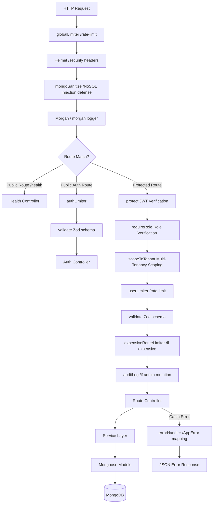
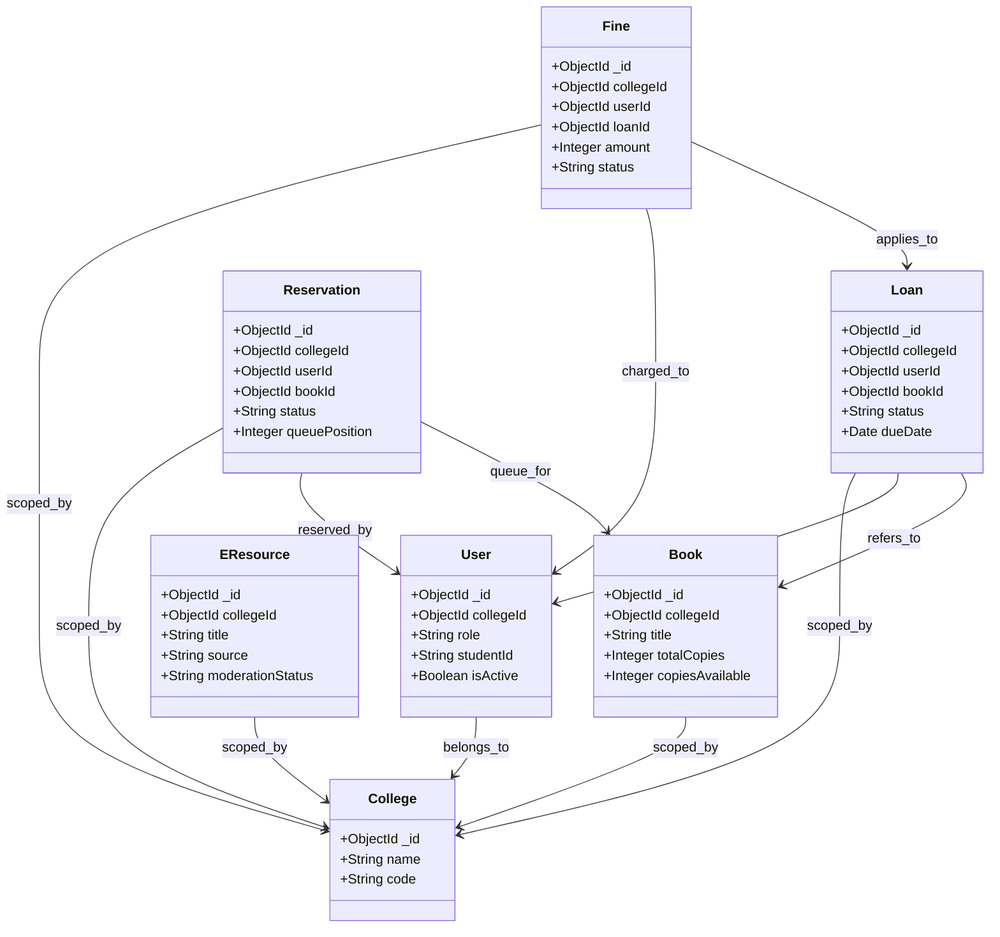
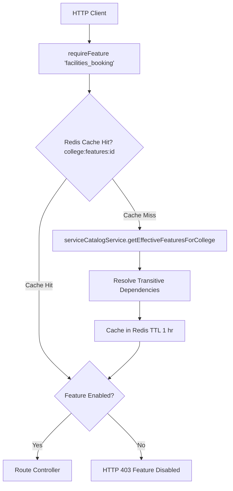

# Backend Design & Architecture

This document describes the design, architecture, and technology of the BookBuddy backend application.

---

## 1. Request Lifecycle & Middleware Pipeline

The backend utilizes a structured middleware pipe to ensure every incoming HTTP request is authenticated, audited, sanitized, rate-limited, and validated before executing business logic.



---

## 2. Folder Structure

The server codebase is modularized under `server/src`:

```
server/src/
├── config/          # Configuration managers (env, database connection, options)
├── controllers/     # Controller layer extracting query inputs and calling service logic
│   └── dashboards/  # Role-specific dashboard controllers (student, college-admin, super-admin)
├── middlewares/     # Middleware layer (auth, rateLimiters, tenant-scoping, audit logging, validation)
├── models/          # Mongoose model schemas, field definitions, and model indexes
├── routes/          # Express route definitions composing middleware gates
│   └── dashboards/  # Sub-routes for dashboards
├── services/        # Service layer containing isolated business rules
├── sockets/         # Socket.io event triggers, room joining, and middleware auth
├── tests/           # Jest integration and E2E test suites
└── utils/           # Shared utility libraries (AppError, timezone calculations, database helper)
```

---

## 3. Authentication & Multi-Tenancy Architecture

Multi-tenancy isolation is enforced at the middleware layer using `scopeToTenant`. 

For non-super-admins, `scopeToTenant` injects `req.tenantFilter = { collegeId: req.user.collegeId }`. All controller database queries must merge or spread `req.tenantFilter` to guarantee tenant isolation.

### Checkout Lifecycle Sequence

Below is the request lifecycle for a college admin checking out a book (`POST /api/dashboards/college-admin/circulation/checkout`):

```mermaid
sequenceDiagram
    autonumber
    actor Admin as College Admin Client
    participant App as Express (app.js)
    participant Auth as protect Middleware
    participant Scope as scopeToTenant Middleware
    participant Audit as auditLog Middleware
    participant Ctrl as collegeAdminController
    participant Svc as loanService
    participant DB as MongoDB
    
    Admin->>App: POST /api/dashboards/college-admin/circulation/checkout (Headers: Authorization: Bearer JWT)
    App->>Auth: Parse & verify Access Token
    Auth-->>App: Set req.user = { id, role: "college-admin", collegeId }
    App->>Scope: Check role and construct filter
    Scope-->>App: Set req.tenantFilter = { collegeId: ObjectId("...") }
    App->>Audit: Record intent to write mutation
    App->>Ctrl: Execute checkoutBookHandler(req)
    Ctrl->>Svc: Call checkoutBook(patronId, bookId, req.tenantFilter)
    
    rect rgb(30, 41, 59)
        Note over Svc,DB: Enforce Tenant-Scoping & Concurrency Safety
        Svc->>DB: Book.findOne({ _id: bookId, ...tenantFilter })
        DB-->>Svc: Book Record
        Svc->>DB: User.findOne({ _id: patronId, ...tenantFilter })
        DB-->>Svc: User Record
        Svc->>DB: Atomic update: Book.findOneAndUpdate({ _id, copiesAvailable > 0 }, { $inc: { copiesAvailable: -1 } })
        DB-->>Svc: Success (copiesAvailable decremented)
        Svc->>DB: Loan.create({ collegeId, userId, bookId, dueDate })
        DB-->>Svc: Loan Record
    end
    
    Svc-->>Ctrl: Return checkout info
    Ctrl->>Audit: Commit audit details
    Ctrl-->>Admin: HTTP 201 Created (JSON Loan details)
```



---

## 4. Domain Model Relationships

BookBuddy's entities are grouped by business domains. All models except `User` (for Super Admins) and `College` are scoped directly with a `collegeId` attribute.

- **Library Operations**: `Book`, `Loan`, `Reservation`, `Fine`, `BookSuggestion`
- **Digital Assets**: `EResource`, `ReadingProgress`, `Bookmark`, `ReadingList`, `SavedSearch`
- **Facilities & Support**: `LabSeat`, `LabBooking`, `Complaint`, `Feedback`
- **Gamification & Engagement**: `Streak`, `StreakReward`, `Sticker`, `UserSticker`
- **Platform Infrastructure**: `User`, `College`, `AuditLog`, `CronRunLog`, `Notification`, `NotificationPreference`



---

## 5. Real-Time Architecture

The backend handles WebSocket connections through **Socket.io** (`server/src/sockets`).

### Room Structure
Upon establishing a WebSocket connection, the socket-level JWT validation middleware verifies credentials and grants connection. The client is then placed inside a **user-specific room**:
- `user:${userId}` (e.g. `user:6a579ebbd0082f48d2e7a4f4`)

### Event Catalog

| Event Name | Namespace / Room | Direction | Payload Shape | Triggered By |
| :--- | :--- | :--- | :--- | :--- |
| `streak:updated` | `user:${userId}` | Server -> Client | `{ currentStreak: Number, maxStreak: Number, freezesAvailable: Number }` | Streak qualifying check-in or cron streak expiry sweep. |
| `notification:new` | `user:${userId}` | Server -> Client | `{ _id: String, type: String, message: String, read: Boolean, createdAt: String }` | `notificationService.notify` call (due reminders, fines issued, queue updates). |

---

## 6. Background Jobs & Scheduled Tasks

Background processing is executed using **node-cron** inside `server/src/services/cronService.js`. For observability, each job run is wrapped and logged into the `CronRunLog` collection.

| Job Name | Cron Expression | Schedule | Business Purpose | Key Database Dependencies |
| :--- | :--- | :--- | :--- | :--- |
| **Overdue Fine Accrual** | `0 0 * * *` | Daily at Midnight | Identifies active overdue loans and increments/applies overdue fines. | `Loan`, `Fine` |
| **Queue Expiry Sweep** | `0 * * * *` | Hourly | Cancels ready-for-pickup holds that exceeded the pickup hour window and promotes the next patron in queue. | `Reservation` |
| **Due Reminders** | `0 9 * * *` | Daily at 9:00 AM | Alerts users of upcoming loan return deadlines. | `Loan` |
| **Streak Expiry Sweep** | `0 * * * *` | Hourly | Resets streaks at user's local midnight if no qualifying activity occurred. Consumes freeze coupon if available. | `Streak` |
| **Streak Reminders** | `0 * * * *` | Hourly | Warns users with active streaks 3 hours before their local midnight if they have not checked in. | `Streak` |

---

## 7. Error Handling & Validation Conventions

### Error Handling
The backend implements centralized error handling. All operational errors inherit from `AppError` class, which takes a message, statusCode, and optional logging metadata.
Uncaught router exceptions are forwarded to the global `errorHandler` middleware.

**Standard Error Response (429 Rate Limit Example):**
```json
{
  "success": false,
  "message": "Too many requests on authIp limiter. Please retry after 15 seconds.",
  "code": 429
}
```

### Validation Factory
Input schema checks are performed using a reusable validation factory middleware `validate` (`server/src/middlewares/validate.js`). It takes a Zod object schema containing `body`, `query`, and `params` specifications, parses inputs, strips unrecognized keys, coerces parameters (e.g. string to numbers), and replaces request objects.

```javascript
const validate = (schema) => (req, res, next) => {
  try {
    const validData = schema.parse({
      body: req.body,
      query: req.query,
      params: req.params,
    });
    // Overwrite with parsed and stripped data
    if (validData.body) req.body = validData.body;
    if (validData.query) req.query = validData.query;
    if (validData.params) req.params = validData.params;
    next();
  } catch (err) {
    const errorMessages = err.errors
      ? err.errors.map((e) => `${e.path.join('.')}: ${e.message}`).join(', ')
      : err.message;
    next(new AppError(`Validation Error: ${errorMessages}`, 400));
  }
};
```

---

## 8. Security Posture

- **Helmet**: Secures application headers to protect against common web vulnerabilities (XSS, clickjacking, mime sniffing).
- **Mongo Sanitize**: Sanitizes user payloads to scrub `$` and `.` characters, defending against NoSQL injection vectors.
- **JWT Authentication**: Incorporates short-lived Access Tokens (15m) and long-lived Refresh Tokens (7d) signed using separate secure cryptographic keys.
- **Tiered Distributed Rate Limiting**:
  - *Global baseline*: Max 100 requests/min, keyed by User ID if token exists (NAT-safe) or IP.
  - *Auth strict*: Max 5 requests/15 mins per combination (IP + identifier) to prevent brute forcing, plus IP-only (max 20) and email-only (max 5) limits.
  - *User baseline*: Max 100 requests/min, keyed by user ID.
  - *Expensive limiter*: Max 10 requests/min for analytics and complex catalog search queries.

---

## 9. Concurrency-Sensitive Code Patterns

To prevent race conditions, the backend uses atomic MongoDB operations (`findOneAndUpdate` with filter constraints) instead of standard read-then-write patterns.

### 1. Book Checkout (Lending)
*Concurrences risk:* Multiple admins checking out the last remaining copy of a book at the same time.
*Atomic Solution:* The `loanService.js` decrements `copiesAvailable` only if it is strictly greater than 0:
```javascript
const book = await Book.findOneAndUpdate(
  { _id: bookId, collegeId, copiesAvailable: { $gt: 0 } },
  { $inc: { copiesAvailable: -1 } },
  { new: true }
);
if (!book) throw new AppError('No copies available for checkout.', 400);
```

### 2. Lab Booking (Reservations)
*Concurrences risk:* Two students reserving the same computer lab seat for the same date and timeslot.
*Atomic Solution:* A unique compound index on `labBookingSchema` enforces unique bookings. The application tries to insert the booking; duplicate requests immediately throw an index conflict exception, preventing double bookings:
```javascript
// Index definition:
labBookingSchema.index({ seatId: 1, date: 1, timeslot: 1, status: 1 }, { unique: true, partialFilterExpression: { status: 'booked' } });
```

### 3. Queue Positioning (Hold Queue)
*Concurrences risk:* Multiple holds getting promoted to the same position, or multiple threads promoting the next hold simultaneously.
*Atomic Solution:* `promoteNextHold` uses atomic Mongoose status transitions (`pending` -> `ready_for_pickup`) and updates position sequences atomically via transaction blocks or filter-locked updates to guarantee sequence numbers don't conflict.

---

## 10. Service Catalog & Tenant Feature Flag Architecture

BookBuddy enforces multi-tenant feature entitlement at the backend routing level using a dynamic Service Catalog and Redis-cached feature flags.



- **Transitive Dependency Resolution**: Enabling a feature automatically activates all required parent services (e.g., `gamification` -> `catalog_management`).
- **Super-Admin Bypass**: Platform Super-Admins bypass feature gating checks to maintain operational administration.

---

## 11. Asynchronous Stream-Parsed Bulk Student Upload Pipeline

To handle high-volume student roster onboarding without blocking the Node.js event loop or HTTP requests, BookBuddy utilizes an asynchronous worker pipeline.

```mermaid
sequenceDiagram
    autonumber
    actor Admin as College Admin
    participant API as POST /api/college/:id/students/bulk-upload
    participant Job as UploadJob Model
    participant Worker as bulkUploadWorker.js
    participant DB as User Collection
    participant Socket as Socket.io Room

    Admin->>API: Upload CSV File (Multipart Form)
    API->>Job: Create UploadJob (status: 'pending')
    API-->>Admin: HTTP 202 Accepted { jobId }
    
    API->>Worker: Trigger processUploadJob(jobId, filePath)
    Worker->>Worker: Stream-parse CSV (csv-parser)
    Worker->>Worker: Validate row fields & tenant scoping
    
    rect rgb(30, 41, 59)
        Note over Worker,DB: Chunked Unordered Ingestion (Chunk Size: 500)
        Worker->>DB: User.insertMany(chunk, { ordered: false })
        Worker->>Socket: Emit bulk-upload:progress { processed, total }
    end

    Worker->>Job: Update status: 'completed', errorReportPath if errors
    Worker->>Socket: Emit bulk-upload:completed { total, successful, failed }
```



---

## 12. Persistent Sessions, Token Rotation & Theft Detection

Session security is anchored by short-lived JWT access tokens (~15m) and Redis-backed refresh tokens stored in `httpOnly`, `SameSite: strict` cookies (~30d).

- **Token Rotation**: Every refresh request revokes the old token, issues a new token pair, and links parentage.
- **Theft Reuse Detection**: If a previously rotated (revoked) refresh token is presented, the system detects a token theft attempt, revokes **all** active session tokens for that user ID, and logs a security audit warning.
- **Multi-Device Logout**: Supports `allDevices: true` to invalidate all sessions across all logged-in devices simultaneously.

