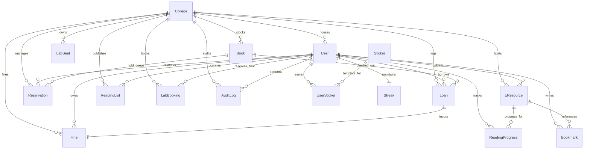

# Database Design & Schema Reference

This document provides a comprehensive reference for BookBuddy's MongoDB database schema, multi-tenancy scoping, database-level indexes, and transactional/integrity mechanisms.

---

## 1. Schema Reference by Domain

Entities in BookBuddy are organized by functional business domain. All models use Mongoose schemas with auto-generated `_id` (ObjectId) and `timestamps: true` (injecting `createdAt` and `updatedAt`) unless otherwise specified.

### Domain A: Platform Infrastructure

#### Collection: `colleges`
Stores institutions registered on the platform.
- `name` (String, required): The full name of the college.
- `code` (String, required, unique): Unique institution shortcode.
- `selectedServices` (Array of Strings): Service keys licensed by tenant.
- `enabledFeatures` (Array of Strings): Active feature flags computed after resolving transitive dependencies.
- `featureLimits` (Object): Custom numerical limits per feature (e.g. `{ maxStudents: 5000 }`).

#### Collection: `services`
Canonical service catalog master table.
- `key` (String, required, unique): Unique service key (e.g. `catalog_management`, `facilities_booking`).
- `name` (String, required): Human-readable service name.
- `category` (String, required): Functional category.
- `dependsOn` (Array of Strings): Array of parent service keys required by this service.
- `isActive` (Boolean, default: true): Platform activation flag.

#### Collection: `uploadjobs`
Tracks asynchronous bulk student CSV upload state and diagnostics.
- `collegeId` (ObjectId, ref: 'College', required, indexed): Tenant association.
- `uploadedBy` (ObjectId, ref: 'User', required): Admin initiating upload.
- `originalFilename` (String, required): Uploaded CSV filename.
- `status` (String, enum: `['pending', 'processing', 'completed', 'failed']`, default: 'pending').
- `totalRecords` (Number, default: 0).
- `processedRecords` (Number, default: 0).
- `successfulRecords` (Number, default: 0).
- `failedRecords` (Number, default: 0).
- `errorReportPath` (String): Path to downloadable error report CSV.

#### Collection: `users`
Represents students, library/college admins, and system super-admins.
- `studentId` (String, required): College registration/card ID (scoped per college).
- `name` (String, required): Full name of the user.
- `email` (String, required): Email address (lowercase, scoped per college).
- `password` (String, required, select: false): Bcrypt hashed password (salt factor 10).
- `status` (String, enum: `['active', 'invited', 'suspended']`, default: 'active').
- `invitedVia` (String, enum: `['manual', 'bulk_upload', 'self_registration']`).
- `invitationToken` (String): Temporary invitation token for bulk-imported accounts.
- `avatar` (String, default: ""): URL to avatar image.
- `collegeId` (ObjectId, ref: 'College', required for non-super-admins, indexed): Tenant association.
- `refreshTokenHash` (String, select: false): Hash of active refresh token.
- `isActive` (Boolean, default: true): Deactivation flag.
- `role` (String, enum: `['student', 'college-admin', 'super-admin', 'general']`, default: 'student').
- `membershipStatus` (String, enum: `['active', 'suspended', 'expired']`, default: 'active').
- `validTill` (Date, default: +4 years): Patron membership expiration date.
- `major` (String): Academic field.
- `savedBookmarks` (Array of ObjectIds, ref: 'Book'): Bookmarked catalog ids.
- `searchHistory` (Array of subdocuments): `{ query: String, timestamp: Date }`.

---

### Index Reference Table Updates

| Targeted Collection | Index Declaration | Index Type | Query Path Served |
| :--- | :--- | :--- | :--- |
| `users` | `{ collegeId: 1, email: 1 }` | Compound, Unique | Multi-tenant user login & duplicate check. |
| `users` | `{ collegeId: 1, studentId: 1 }` | Compound, Unique | Multi-tenant student ID duplicate check. |
| `services` | `{ key: 1 }` | Single-field, Unique | Service catalog lookup. |
| `uploadjobs` | `{ collegeId: 1, status: 1 }` | Compound | Tenant upload job monitoring. |
| `users` | `{ email: 1 }` | Single-field, Unique | Login auth lookup. |
| `users` | `{ studentId: 1 }` | Single-field, Unique | Member registration and circulation identification. |
| `loans` | `{ collegeId: 1, status: 1 }` | Compound | College admin Active vs Overdue loans queues. |
| `loans` | `{ userId: 1, status: 1 }` | Compound | Student loans dashboard lookup. |
| `fines` | `{ userId: 1, status: 1 }` | Compound | Student outstanding fine check (unpaid total). |
| `fines` | `{ loanId: 1 }` | Single-field, Unique | Fine accrual idempotency (ensuring one fine per loan). |
| `reservations` | `{ bookId: 1, status: 1 }` | Compound | Hold queue promotion lookup. |
| `reservations` | `{ userId: 1, status: 1, requestDate: -1 }` | Compound | Student queue active/cancelled view. |
| `labseats` | `{ collegeId: 1, labName: 1, seatNumber: 1 }` | Compound, Unique | Seat registry validation. |
| `labbookings` | `{ seatId: 1, date: 1, status: 1 }` | Compound | Lab availability checker (hourly timeslots). |
| `labbookings` | `{ seatId: 1, date: 1, timeslot: 1, status: 1 }` | Compound, Unique (Partial) | Concurrency lock to prevent double booking. |
| `readingprogresses`| `{ userId: 1, eresourceId: 1 }` | Compound, Unique | Fast progress upsert / reading tracker lookup. |
| `userstickers` | `{ userId: 1, stickerId: 1 }` | Compound, Unique | Award unlocking duplicate prevention. |
| `streaks` | `{ userId: 1 }` | Single-field, Unique | Daily check-in updates and cron tracking. |
- `isbn` (String, required): Standard book number.
- `title` (String, required, indexed): Book title.
- `author` (String, required): Book author.
- `publisher` (String): Publishing press.
- `publishedYear` (Integer): Publication year.
- `genre` (String): Literary style/category.
- `totalCopies` (Integer, required): Copy capacity.
- `copiesAvailable` (Integer, required): Unlent copies in stock.
- `locationShelf` (String): Physical shelving address.

#### Collection: `loans`
Lending tracking.
- `collegeId` (ObjectId, ref: 'College', required, indexed): Tenant scoping.
- `userId` (ObjectId, ref: 'User', required, indexed): Borrower patron.
- `bookId` (ObjectId, ref: 'Book', required, indexed): Loaned book.
- `checkoutDate` (Date, default: Date.now): Borrowing timestamp.
- `dueDate` (Date, required, indexed): Target return deadline.
- `returnDate` (Date): Actual return timestamp.
- `renewalsCount` (Integer, default: 0): Number of extension renewals.
- `status` (String, enum: `['active', 'returned', 'overdue']`, default: 'active', indexed).

#### Collection: `reservations`
Hold queue requests for out-of-stock items.
- `collegeId` (ObjectId, ref: 'College', required, indexed): Tenant scoping.
- `userId` (ObjectId, ref: 'User', required, indexed): Requesting student.
- `bookId` (ObjectId, ref: 'Book', required, indexed): Targeted book.
- `requestDate` (Date, default: Date.now): Timestamp of reservation.
- `status` (String, enum: `['pending', 'ready_for_pickup', 'completed', 'cancelled', 'expired']`, default: 'pending', indexed).
- `queuePosition` (Integer, required): Hold sequence index (1-indexed).
- `readyAt` (Date): Timestamp when copiesAvailable became positive and book went on hold shelf.

#### Collection: `fines`
Financial debts for overdue loans.
- `collegeId` (ObjectId, ref: 'College', required, indexed): Tenant scoping.
- `userId` (ObjectId, ref: 'User', required, indexed): Debtor user.
- `loanId` (ObjectId, ref: 'Loan', required, unique, indexed): Associated loan.
- `amount` (Integer, required): Fine debt accrued.
- `overdueDays` (Integer, required): Days late.
- `status` (String, enum: `['unpaid', 'paid']`, default: 'unpaid', indexed).
- `paymentDate` (Date): Payment completion timestamp.

#### Collection: `booksuggestions`
Patron purchasing requests.
- `collegeId` (ObjectId, ref: 'College', required, indexed): Tenant scoping.
- `userId` (ObjectId, ref: 'User', required): Submitting user.
- `title` (String, required): Requested book title.
- `author` (String, required): Requested book author.
- `reason` (String): Justification.
- `status` (String, enum: `['pending', 'approved', 'rejected']`, default: 'pending').

---

### Domain C: Digital Assets & Personalization

#### Collection: `eresources`
Ebooks, PDFs, and academic papers.
- `collegeId` (ObjectId, ref: 'College', required, indexed): Tenant scoping.
- `title` (String, required): E-resource title.
- `author` (String): Author.
- `description` (String): Summary description.
- `fileUrl` (String, required): File attachment host URL.
- `coverUrl` (String): Thumbnail image URL.
- `format` (String, enum: `['epub', 'pdf']`, required): File type.
- `source` (String, enum: `['internal', 'gutenberg']`, default: 'internal'): Native vs public domain proxy.
- `gutenbergId` (Integer): Proxy catalog ID.
- `moderationStatus` (String, enum: `['pending', 'approved', 'rejected']`, default: 'pending', indexed): Quality gate status.
- `uploadedBy` (ObjectId, ref: 'User', required): Contributor.

#### Collection: `bookmarks`
Reading list selections.
- `userId` (ObjectId, ref: 'User', required, indexed): Owner.
- `eresourceId` (ObjectId, ref: 'EResource', required): Target item.
- `cfi` (String, required): EPUB location string.
- `note` (String): Annotation text.

#### Collection: `readingprogresses`
E-learning completions tracker.
- `userId` (ObjectId, ref: 'User', required, indexed): Reader.
- `eresourceId` (ObjectId, ref: 'EResource', required, indexed): Target.
- `progressPercent` (Integer, default: 0): Completion percentage.
- `lastReadCfi` (String): Last accessed EPUB CFI location.
- `lastReadAt` (Date, default: Date.now): Last checkout activity.

#### Collection: `readinglists`
Curated lists of resources.
- `collegeId` (ObjectId, ref: 'College', required, indexed): Tenant scoping.
- `ownerId` (ObjectId, ref: 'User', required, indexed): List creator.
- `name` (String, required): Title.
- `description` (String): Overview.
- `visibility` (String, enum: `['public', 'private']`, default: 'private', indexed): Scope visible within tenant.
- `items` (Array): Array of ObjectIds of Books or EResources.

---

### Domain D: Facilities, Gamification & Communications

#### Collection: `labseats`
Computer workstation assets in libraries/labs.
- `collegeId` (ObjectId, ref: 'College', required, indexed): Tenant.
- `labName` (String, required): Lab identifier (e.g. "Main Library IT Suite").
- `seatNumber` (Integer, required): Station number.
- `maintenanceStatus` (String, enum: `['operational', 'under_maintenance']`, default: 'operational').

#### Collection: `labbookings`
Timeslot reservations for lab seats.
- `collegeId` (ObjectId, ref: 'College', required, indexed): Tenant.
- `userId` (ObjectId, ref: 'User', required, indexed): Reserving student.
- `seatId` (ObjectId, ref: 'LabSeat', required, indexed): Reserved workstation.
- `date` (Date, required, indexed): Day of booking (midnight local normalized).
- `timeslot` (String, required, indexed): Normalized interval string (e.g. `10:00-11:00`).
- `status` (String, enum: `['booked', 'cancelled']`, default: 'booked', indexed).

#### Collection: `streaks`
Gamified check-ins log.
- `userId` (ObjectId, ref: 'User', required, unique, indexed): User.
- `currentStreak` (Integer, default: 0): Consecutive check-in count.
- `maxStreak` (Integer, default: 0): All-time peak streak count.
- `freezesAvailable` (Integer, default: 0): Buffer streak-freezes.
- `lastQualifyingActionAt` (Date): Last checked-in action.
- `timezone` (String, default: 'Asia/Kolkata'): Normalized timezone for local midnight calculations.
- `lastStreakReminderSentAt` (Date): Daily reminder lock.

#### Collection: `stickers`
Badge templates for milestones.
- `name` (String, required, unique): Badge name.
- `description` (String, required): Achievement logic description.
- `icon` (String, required): Vector glyph string / image url.

#### Collection: `userstickers`
Stickers unlocked by students.
- `userId` (ObjectId, ref: 'User', required, indexed): Unlocked by.
- `stickerId` (ObjectId, ref: 'Sticker', required): Sticker template.
- `unlockedAt` (Date, default: Date.now): Unlock timestamp.

---

## 2. Complete Entity-Relationship (ER) Diagram

---

## 3. Database Indexing Strategy

Indexes are explicitly configured to support target query paths (catalog lookup, dashboards, multi-tenant locks):

| Targeted Collection | Index Declaration | Index Type | Query Path Served |
| :--- | :--- | :--- | :--- |
| `users` | `{ email: 1 }` | Single-field, Unique | Login auth lookup. |
| `users` | `{ studentId: 1 }` | Single-field, Unique | Member registration and circulation identification. |
| `loans` | `{ collegeId: 1, status: 1 }` | Compound | College admin Active vs Overdue loans queues. |
| `loans` | `{ userId: 1, status: 1 }` | Compound | Student loans dashboard lookup. |
| `fines` | `{ userId: 1, status: 1 }` | Compound | Student outstanding fine check (unpaid total). |
| `fines` | `{ loanId: 1 }` | Single-field, Unique | Fine accrual idempotency (ensuring one fine per loan). |
| `reservations` | `{ bookId: 1, status: 1 }` | Compound | Hold queue promotion lookup. |
| `reservations` | `{ userId: 1, status: 1, requestDate: -1 }` | Compound | Student queue active/cancelled view. |
| `labseats` | `{ collegeId: 1, labName: 1, seatNumber: 1 }` | Compound, Unique | Seat registry validation. |
| `labbookings` | `{ seatId: 1, date: 1, status: 1 }` | Compound | Lab availability checker (hourly timeslots). |
| `labbookings` | `{ seatId: 1, date: 1, timeslot: 1, status: 1 }` | Compound, Unique (Partial) | Concurrency lock to prevent double booking. |
| `readingprogresses`| `{ userId: 1, eresourceId: 1 }` | Compound, Unique | Fast progress upsert / reading tracker lookup. |
| `userstickers` | `{ userId: 1, stickerId: 1 }` | Compound, Unique | Award unlocking duplicate prevention. |
| `streaks` | `{ userId: 1 }` | Single-field, Unique | Daily check-in updates and cron tracking. |

> [!WARNING]
> **Duplicate Index Redundancy:** The Mongoose logs report duplicate indexes on `{ loanId: 1 }` in Fine schema and `{ ownerId: 1 }` in ReadingList schema. This is because these fields were defined with `index: true` inside the field configuration *and* declared via `schema.index(...)` at the end of the schema file. While functionally fine, it incurs unnecessary storage and write overhead in MongoDB.

---

## 4. Multi-Tenancy Scoping at Data Layer

Tenant isolation is implemented at the **logical collection schema level**:
- Each tenant-specific document contains a `collegeId` attribute.
- The `scopeToTenant` middleware injects `req.tenantFilter` based on the user's verified token.
- **Transitive Scoping**: Collections like `Bookmark`, `ReadingProgress`, and `UserSticker` do not carry `collegeId` directly. Instead, they scope transitively:
  - `Bookmark` links to an `EResource` (which carries `collegeId`) and a `User` (which carries `collegeId`).
  - Queries for bookmarks are scoped by the querying user's `userId`, which naturally guarantees that they only pull records that belong to the user's tenant.

---

## 5. Data Integrity & Concurrency Controls

1. **Idempotent Fine Accruals**: The unique index on `Fine.loanId` guarantees that only **one** fine record can ever exist per borrowing transaction, protecting the background cron job from creating duplicate fees.
2. **Double-Booking Locks**: The compound index on `labbookings` uses a Mongoose filter constraint (`partialFilterExpression: { status: 'booked' }`). This allows seats to be cancelled and booked again, but prevents two active bookings for the same seat/date/slot.
3. **Atomic Inventory Decrements**: The `Book.findOneAndUpdate` filter lock `{ copiesAvailable: { $gt: 0 } }` ensures the database engine blocks decrements once copies run dry, avoiding negative inventory counts.

---

## 6. Growth & Performance Considerations

1. **High-Growth Tables**: The `notifications`, `auditlogs`, and `cronrunlogs` collections will expand rapidly.
2. **Archival & TTL Indexes**: Currently, there are no TTL (Time-To-Live) indexes or archival processes configured in the schemas. To avoid slow reads, we recommend implementing:
   - A TTL index on `cronrunlogs` to auto-expire logs after 90 days:
     `cronRunLogSchema.index({ createdAt: 1 }, { expireAfterSeconds: 90 * 24 * 60 * 60 });`
   - A TTL index on read notifications or audit records older than 180 days.
3. **Text Indexes**: The `books` schema has a text index to support global catalog searches across titles and authors. High-traffic text searches should be cached or separated from transaction databases in large deployments.
