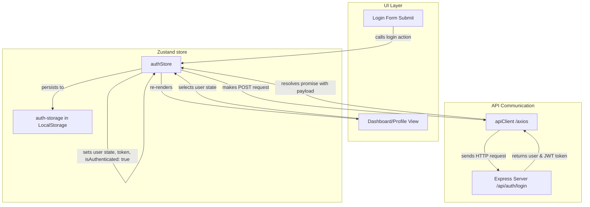
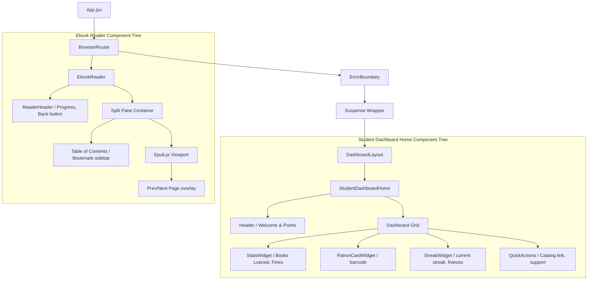

# Frontend Design & Architecture

This document describes the design, architecture, and tech stack of the BookBuddy frontend client application.

---

## 1. Stack & Rationale

BookBuddy's client is a modern SPA (Single Page Application) built with the following core technologies:

| Technology | Role | Rationale |
| :--- | :--- | :--- |
| **React 19** | Core Library | Provides component-based UI rendering, concurrent features, and support for lazy loading. |
| **Vite 8** | Build Tool & Dev Server | Offers near-instantaneous hot module replacement (HMR) and optimized rollup production bundles. |
| **Tailwind CSS v4** | Styling Framework | Enables rapid utility-first styling with modern performance enhancements and native CSS variables support. |
| **Zustand v5** | Global State Management | Simple, hook-based state management that avoids prop drilling and context overhead. Built-in persistence stores state in local storage. |
| **TanStack React Query v5** | Data Fetching & Caching | Handles server-state caching, automatic re-fetching, pagination, loading/error states, and mutations. |
| **React Router v7** | Routing | Manages nested routes, parameterized layouts, role-based route guards, and redirects. |
| **React Hook Form + Zod** | Form Validation | Integrates schema-based validations with Zod to provide strict client-side validation corresponding with backend schemas. |
| **Epub.js** | Digital Reading Engine | Direct client-side epub parsing and rendering for ebook viewing. |
| **Framer Motion & Lenis** | UX & Scroll Performance | Powers smooth micro-interactions, page transitions, and smooth kinetic scrolling. |

---

## 2. Folder Structure

The client codebase is structured logically under `client/src`:

```
client/src/
├── api/             # API client instances (axios configuration and api queries)
├── assets/          # Static assets (images, icons, theme styling)
├── components/      # Common UI and layout components
│   ├── layout/      # Shared layout components (sidebars, headers)
│   ├── ui/          # Low-level UI primitives (buttons, inputs, error boundary, splash screen)
│   └── student/     # Student-specific common components (e.g. PatronCardWidget)
├── context/         # React Contexts (Lenis scroll context, Theme context)
├── features/        # Feature-specific components and sub-modules
│   └── streak/      # Streak gamification widgets and layouts
├── hooks/           # Reusable custom React hooks
├── layouts/         # High-level page layouts (DashboardLayout, AuthLayout)
├── pages/           # High-level view components (lazy-loaded routes)
│   ├── Login.jsx
│   ├── Register.jsx
│   └── dashboards/  # Role-specific dashboard sub-pages (admin-portal, college-admin, general, student)
├── providers/       # Global context providers (QueryProvider)
├── store/           # Zustand state store definitions (authStore.js)
├── utils/           # Utility functions (date formatters, validators)
├── App.jsx          # Route definitions, Error boundary and Suspense wrapper
├── main.jsx         # Application entry point
├── index.css        # Main stylesheet importing Tailwind
└── App.css          # App-wide global utility classes
```

---

## 3. Routing Map

All routes are declared in `client/src/App.jsx` and grouped under layouts with role-based routing guards:

| Route Path | Layout / Wrapper | Access Level (Allowed Roles) | Description |
| :--- | :--- | :--- | :--- |
| `/` | Eagerly Loaded Page | Public (All) | Landing & marketing page. |
| `/auth/login` | `AuthLayout` + `AuthRedirect` | Public (Unauthenticated) | User login. Redirects home if authenticated. |
| `/auth/register` | `AuthLayout` + `AuthRedirect` | Public (Unauthenticated) | Public student signup. |
| `/admin-portal` | `DashboardLayout` + `ProtectedRoute` | `super-admin` | Super Admin Dashboard homepage. |
| `/admin-portal/overview` | `DashboardLayout` + `ProtectedRoute` | `super-admin` | System-wide statistics and metrics. |
| `/admin-portal/college-admins`| `DashboardLayout` + `ProtectedRoute` | `super-admin` | Management of College Admin accounts. |
| `/admin-portal/moderation` | `DashboardLayout` + `ProtectedRoute` | `super-admin` | Moderation tools for reported books/content. |
| `/admin-portal/audit-logs` | `DashboardLayout` + `ProtectedRoute` | `super-admin` | Viewing system-wide actions. |
| `/admin-portal/settings` | `DashboardLayout` + `ProtectedRoute` | `super-admin` | Global platform configurations. |
| `/college-admin` | `DashboardLayout` + `ProtectedRoute` | `college-admin` | College Admin Dashboard homepage. |
| `/college-admin/patrons` | `DashboardLayout` + `ProtectedRoute` | `college-admin` | Management of student/staff patron details. |
| `/college-admin/circulation` | `DashboardLayout` + `ProtectedRoute` | `college-admin` | Book checkouts and returns. |
| `/college-admin/cataloging` | `DashboardLayout` + `ProtectedRoute` | `college-admin` | Creating, updating and deleting books/e-resources. |
| `/college-admin/facilities` | `DashboardLayout` + `ProtectedRoute` | `college-admin` | Managing booking parameters and timetables. |
| `/college-admin/helpdesk` | `DashboardLayout` + `ProtectedRoute` | `college-admin` | Responding to complaints and suggestions. |
| `/college-admin/analytics` | `DashboardLayout` + `ProtectedRoute` | `college-admin` | View statistics for circulation, bookings, fines. |
| `/general-dashboard` | `DashboardLayout` + `ProtectedRoute` | `general` | General discovery homepage. |
| `/student-dashboard` | `DashboardLayout` + `ProtectedRoute` | `student` | Student main dashboard. |
| `/catalog` | `DashboardLayout` + `ProtectedRoute` | `student` | Book catalog searching and reservation. |
| `/loans` | `DashboardLayout` + `ProtectedRoute` | `student` | Viewing active/past loans and renewing books. |
| `/fines` | `DashboardLayout` + `ProtectedRoute` | `student` | Viewing unpaid/paid fines and links to pay. |
| `/patron-card` | `DashboardLayout` + `ProtectedRoute` | `student` | Accessing digital virtual patron card barcode. |
| `/e-resources` | `DashboardLayout` + `ProtectedRoute` | `student` | Listing and searching digital files. |
| `/reading-lists` | `DashboardLayout` + `ProtectedRoute` | `student` | Student bookmark and reading lists manager. |
| `/recommendations` | `DashboardLayout` + `ProtectedRoute` | `student` | AI-suggested books based on loan history. |
| `/saved` | `DashboardLayout` + `ProtectedRoute` | `student` | Bookmarks, saved searches and alerts. |
| `/lab-booking` | `DashboardLayout` + `ProtectedRoute` | `student` | Reserving computer lab seats. |
| `/support` | `DashboardLayout` + `ProtectedRoute` | `student` | Submitting feedback, complaints, suggestions. |
| `/eresources/read/:id`| Fullscreen layout | `student`, `general` | EPUB Reader viewer. |

---

## 4. State Management Architecture

Global client state is managed using **Zustand** in `client/src/store/authStore.js` and server state is cached using **React Query**.



---

## 5. API Communication Layer

Frontend API requests are centralized using **Axios** in `client/src/api/client.js`. 

- **Base URL**: Defaults to `http://localhost:5000/api` or configured via `VITE_API_URL`.
- **Request Interceptor**: Extracts the JSON Web Token from `localStorage.getItem('token')` and appends it as a `Bearer` token inside the `Authorization` header.
- **Response Interceptor**: Automatically catches `401 Unauthorized` responses, removes the `'auth-storage'` Zustand object from `localStorage` to wipe the session, and redirects the client to `/auth/login`.

> [!NOTE]
> **Design / Security Observation:** There is a minor mismatch in `client.js` where the request interceptor attempts to fetch the token directly from `localStorage.getItem('token')`, but `authStore.js` persists state inside `'auth-storage'` (JSON string). The token is parsed correctly under Zustand hooks, but directly checking `'token'` in `client.js` can result in header exclusion unless explicitly written to `token` key during login.

---

## 6. Real-time Layer

The real-time client layer is configured in `client/src/services/socketClient.js` using the `socket.io-client` package.

- **Socket Host**: Configured via `VITE_SOCKET_URL` (defaults to `http://localhost:5000`).
- **Connection Logic**: Instantiated with `{ autoConnect: false }` to delay initialization. The application connects to Socket.io manually once the user completes login and authentication.
- **Scaffolding Note**: The socket connection configuration is established, but it is currently scaffolded. Frontend components do not yet actively subscribe to real-time events (like `streak:updated` or `notification:new`) directly in the client components.

---

## 7. Component Architecture Patterns

1. **Lazy Loading**: Route pages are imported using `React.lazy()` and rendered inside a `<Suspense>` boundary using a CSS spinner page loader. This keeps initial bundle size small and improves page load speed.
2. **Global Error Boundaries**: The root route is wrapped in an `ErrorBoundary` component that catches uncaught React rendering runtime errors and displays a friendly error recovery page.
3. **Form Handling**: Integrated using `react-hook-form` along with `@hookform/resolvers/zod` to bind input validation schemas directly to form components (e.g. `Login.jsx` and `Register.jsx`).

---

## 8. Component Tree (Ebook Reader / Student Home)



---

## 10. Single-Screen Zero-Scroll Architecture

BookBuddy adopts a zero-scroll, fixed-frame layout paradigm across all public and general user portals.

```
┌─────────────────────────────────────────────┐
│ Page header (title, subtitle)                │  fixed
├─────────────────────────────────────────────┤
│ Sticky control bar: search + filters/tabs +   │  fixed
│ sort + view toggle + active-filter chips +     │
│ compact stat summary                          │
├─────────────────────────────────────────────┤
│                                               │
│   Content area — grid of compact cards,       │  fills remaining
│   virtualized, internally scrollable          │  viewport height,
│                                               │  own scrollbar
└─────────────────────────────────────────────┘
```

- **Outer Container**: `height: calc(100vh - 4rem)`, `overflow: hidden`.
- **Sticky Controls**: Search inputs, sort dropdowns, and category tabs remain permanently visible at top.
- **Internal Virtualized Scroll**: Only the content area scrolls internally via `VirtualizedCardGrid` (`flex-1 min-h-0 overflow-y-auto`).

---

## 11. Shared Reusable Component Suite

- **`StickyControlBar`**: Debounced search input, tab/filter slots, sort options, view mode toggle (Grid/List), and ARIA live region.
- **`ActiveFilterChips`**: Removable filter pills with single-chip and clear-all removal.
- **`StatSummaryStrip`**: Compact inline summary row giving at-a-glance result counts (Available, On Hold, Checked Out, Category breakdowns).
- **`VirtualizedCardGrid`**: Fixed-height internally-scrolling container (`flex-1 min-h-0 overflow-y-auto`) with responsive grid columns (1 / 2 / 3 columns).
- **`MobileFilterSheet`**: Accessible slide-over / bottom-sheet modal for faceted filtering with search-within-facet capability.
- **`SparklineChart`**: Lightweight SVG inline trend visualizer.
- **`DonutChart`**: Compact SVG category breakdown chart.
- **`AnnouncementTicker`**: Slim auto-advancing priority-color-coded notice banner.

---

## 12. Vite Bundle Splitting & Production Performance

`vite.config.js` is optimized for production bundle loading using explicit manual vendor chunk splitting:

```javascript
build: {
  chunkSizeWarningLimit: 1000,
  rollupOptions: {
    output: {
      manualChunks: {
        'vendor-react': ['react', 'react-dom'],
        'vendor-router': ['react-router-dom'],
        'vendor-lucide': ['lucide-react'],
        'vendor-tanstack': ['@tanstack/react-query'],
        'vendor-framer': ['framer-motion'],
        'vendor-epubjs': ['epubjs'],
        'vendor-pdfjs': ['pdfjs-dist'],
      },
    },
  },
}
```

This ensures vendor libraries are cached efficiently by browsers, avoiding large single-bundle downloads on initial page load.

